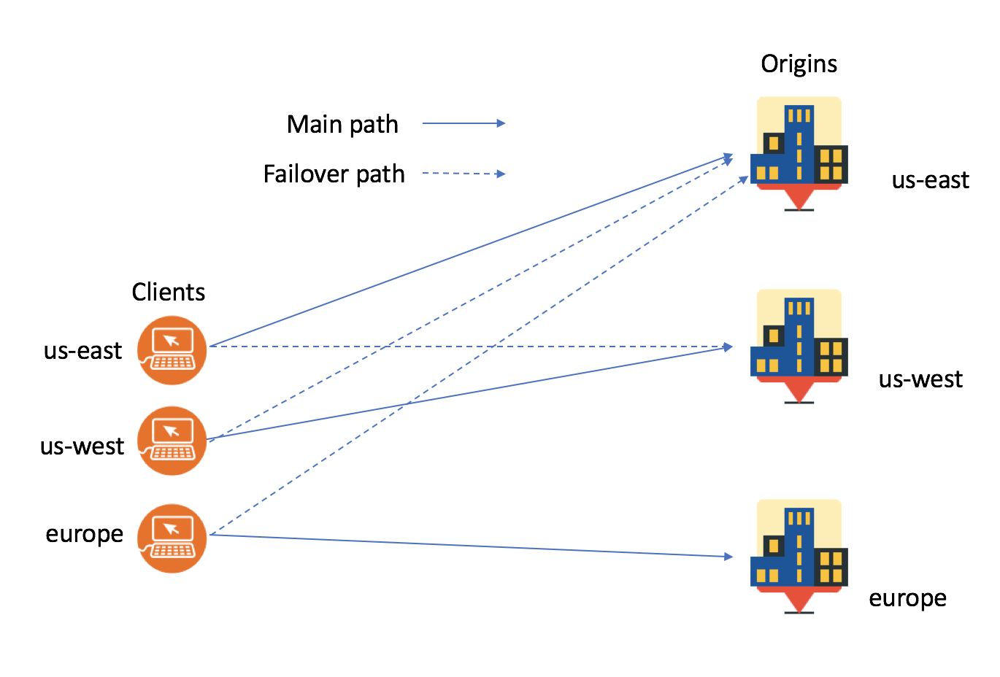

---

copyright:
  years: 2018, 2020
lastupdated: "2020-06-25"

keywords: Caching, IBM Cloud Internet Services, Web Application Firewall

subcollection: cis

---

{:shortdesc: .shortdesc}
{:new_window: target="_blank"}
{:codeblock: .codeblock}
{:pre: .pre}
{:screen: .screen}
{:term: .term}
{:tip: .tip}
{:note: .note}
{:important: .important}
{:deprecated: .deprecated}
{:external: target="_blank" .external}
{:generic: data-hd-programlang="generic"}
{:download: .download}
{:DomainName: data-hd-keyref="DomainName"}

# About {{site.data.keyword.cis_full_notm}}
{:#about-ibm-cloud-internet-services-cis}

{{site.data.keyword.cis_full}}, powered by Cloudflare, provides a fast, highly performant, reliable, and secure internet service for customers running their business on {{site.data.keyword.cloud_notm}}.
{:shortdesc}

IBM {{site.data.keyword.cis_short_notm}} gets you started quickly by establishing defaults for you, which you can change easily using the UI or API.

## Security features
{:#cis-security-features}

Proxy your [DNS records](/docs/cis?topic=cis-dns-concepts#dns-concepts-proxying-dns-records) or a [global load balancer](/docs/cis?topic=cis-global-load-balancer-glb-concepts) to use the security features. This allows traffic to flow through our servers and you can monitor the data.

### TLS
{: #tls-feature}
Protect your site and control your Transport Layer Security (TLS) settings. Manage the certificates used to secure traffic to your site.

### Origin
{: #origin-feature}
Manage the TLS certificates encrypting traffic between your origin server and your users.

### Rate limiting
{: #rate-limiting-feature}
Use rate limiting rules to protect your site or API from malicious traffic by blocking client IP addresses that match a URL pattern or exceed a defined threshold.

### Web Application Firewall (WAF)
{:#cis-web-application-firewall}

WAF is implemented through two rule sets: [OWASP](/docs/cis?topic=cis-owasp-rule-set-for-waf) and [{{site.data.keyword.cis_short_notm}}](/docs/cis?topic=cis-waf-settings#cis-ruleset-for-waf).

### IP firewall
{:#cis-ip-firewall}

{{site.data.keyword.cis_full_notm}} offers several tools for controlling your traffic so that you protect your domains, URLs, and directories against volumes of traffic, certain groups of requesters, and particular requesting IPs. This section details the tools that are available.

#### IP rules
{:#cis-ip-rules}

IP rules allow you to control access for specific IP addresses, IP ranges, specific countries, specific ASNs, and certain CIDR blocks. Available actions on incoming requests are:
  * Allowlist
  * Block
  * Challenge (Captcha)
  * JavaScript challenge (IUAM challenge)

For example, if you notice that a particular IP is causing malicious requests, you can block that user by IP address.

IP rules apply to TCP, HTTP, and HTTPS [Range](/docs/cis?topic=cis-cis-range) apps, because IP rules are applied to Open System Interconnection (OSI) Layer 3 and Layer 4.
{:note}

#### User-agent blocking rules
{:#user-agent-blocking-rules}

User-agent blocking rules allow you to act on any user-agent string you select. This capability works like domain lockdown, except that the block examines the incoming user-agent string instead of the IP. You can choose how to handle a matching request with the same list of actions that you established in the IP rules (block, challenge, and JS challenge). User-agent blocking applies to your entire zone. You cannot specify subdomains in the same manner as you can with a domain lockdown.

This tool is useful for blocking any user-agent strings that you deem suspicious.

#### Domain lockdown
{:#cis-domain-lockdown}

Domain lockdown allows you allowlist-specific IP addresses and IP ranges, such that all other IPs are blocklisted. Domain lockdown supports the following items.

* Specific subdomains - For example, you can allow IP `1.2.3.4` access to the domain `foo.example.com` and allow IP `5.6.7.8` access to domain `bar.example.com`, without allowing the reverse.
* Specific URLs - For example, you can allow IP `1.2.3.4` access to directory `example.com/foo/*` and allow IP `5.6.7.8`  access to directory `example.com/bar/*`, but not allow the reverse.

This capability is useful when you need more granularity in your access rules because, with IP rules, you can either apply the block to all subdomains of the current domain, or all domains on your account. You cannot specify URIs.

### Firewall rules
{: #firewall-rules-feature}
Create rules that examine incoming HTTP traffic against a set of filters to block, challenge, log, or allow matching requests.

In general, firewall rules are designed for properties exposed in OSI Layer-7 (HTTP), such as request headers and body content characteristics. Therefore, firewall rules apply to HTTP/HTTPS [Range](/docs/cis?topic=cis-cis-range) apps.
{:note}

### Events
{: #events-feature}
View events that are triggered by an active web application firewall rule. For each event, you can change the triggered action based on the requesting IP address, or the requesting region as a whole.

### Range
{: #range-feature}
Extend the power of {{site.data.keyword.cis_short_notm}} DDoS, TLS and IP firewall to your web servers and your TCP-based services using Range applications, keeping them online and secure.

### Advanced security
{: #advanced-security-feature}
Advanced security settings include the following features, which you can change, enable, or disable.

* **Browser integrity check** - The browser integrity check looks for HTTP headers that are commonly abused by spammers. It denies traffic with those headers access to your page. It also blocks or challenges visitors that do not have a user agent, or who add a non-standard user agent. This tactic is commonly used by abuse bots, crawlers, or APIs.
* **Challenge passage** - Controls how long a visitor that passed a challenge (or JavaScript challenge) gains access to your site before being challenged again. This is based on the visitor's IP and, therefore, does not apply to challenges presented by WAF rules because they are based on an action that the user performs on your site.
* **Security level** - Sets the security level of your website to determine which visitors receive a challenge page.
* **Always use HTTPS** - Redirects all visitors to the HTTPS version.
* **Email obfuscation** - Prevents spam from harvesters and bots that try to access email addresses on your pages.
* **Automatic HTTPS rewrites** - Helps fix mixed content by changing `http` to `https` for all resources (or links) on your website that can be served with HTTPS.
* **Opportunistic encryption** - Allows browsers to benefit from the improved performance of HTTP/2 by letting them know that your site is available over an encrypted connection.
* **Universal SSL** - Activates universal SSL certificates from your zone to the edge.
* **True client IP header** - Sends the end user's IP address in the True-Client-IP header.

### Security standards and platform
{:#security-standards-and-platform}

 * TLS (SHA2 and SHA1)
 * IPv6
 * HTTP/2 and SPDY

### Network attacks and mitigation
{:#network-attacks-and-mitigation}

Generally, attacks fall into two categories:

| Layer-3 or Layer-4 attacks | Layer-7 attacks |
|------------------------------|-----------------|
|These attacks consist of a flood of traffic at ISO Layer 3 (the network layer), such as ICMP floods), or at Layer 4 (the transport layer), such as TCP SYN floods or reflected UDP floods). |These are attacks that send malicious ISO Layer-7 requests (the application layer), such as GET floods.  |
| Automatically blocked at our edge | {{site.data.keyword.cis_short_notm}} handles these with Defense Mode, WAF, and security-level settings. |

### Unlimited DDoS mitigation
{:#cis-unlimited-ddos-mitigation}

DDoS mitigation is typically an expensive service that can grow in cost when under attack. Unlimited DDoS mitigation is included with {{site.data.keyword.cis_short_notm}} at no additional cost.

## Reliability features
{:#cis-reliability-features}

### Global load balancing features
{:about-glb-features}

The global load balancing service distributes your traffic across multiple servers with a combination of origin pools, health checks, and a load balancer. Global load balancing features the following:
   * Proxy and non-proxy options for load balancing
   * Origin pools and health checks

#### Global anycast network
{:global-anycast-network}

The available health check regions are based on the [Cloudflare Global Anycast Network](https://www.cloudflare.com/network/){:external}.

### DNS features
{:about-dns-features}

DNS within {{site.data.keyword.cis_short_notm}} has the following features:
   * DNS management - Manage your DNS records, control proxying, and enable DNS security.
   * DNSSEC: DNS security cryptographically signs a zone to ensure that the DNS records provided to the user are the same as the DNS records published on the DNS server.

## Performance features
{:#cis-performance-features}

### Caching
{:caching-features}

Control how {{site.data.keyword.cis_short_notm}} manages your cached assets.

### Page rules
{:page-rule-features}

Fine-tune your cache behavior and create content optimization.

###Routing
{:routing-features}

Eliminate excess latency by analyzing and optimizing routing decisions across the global internet using real-time network connections.

###Advanced performance
{:advanced-performance}

Apply Brotli compression and restrict upload sizes in the advanced performance section.
