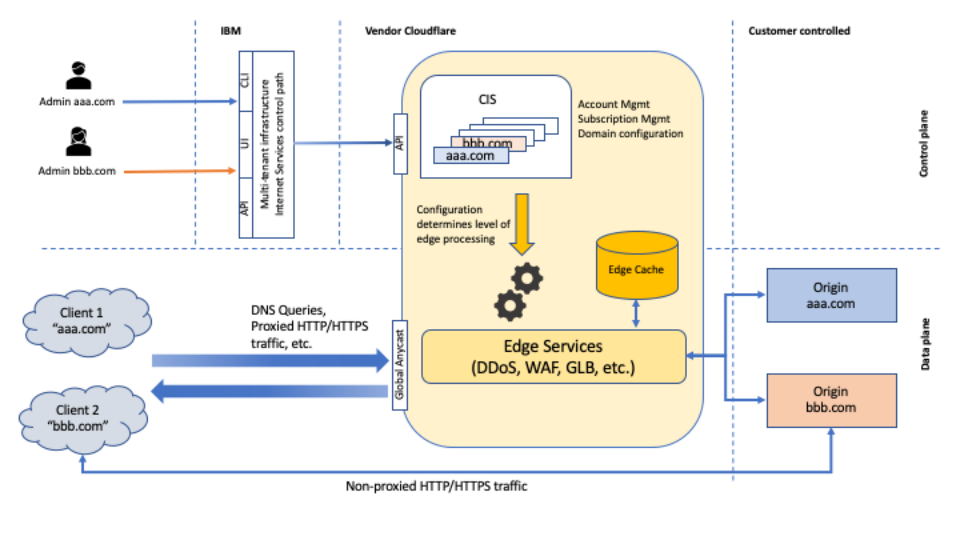

---

copyright:
  years: 2020, 2024
lastupdated: "2024-07-17"

keywords: public isolation for cloud internet services, compute isolation for cloud internet services, cis architecture, workload isolation in cis

subcollection: cis

---

{{site.data.keyword.attribute-definition-list}}

# Learning about {{site.data.keyword.cis_short_notm}} architecture and workload isolation
{: #compute-isolation}

Review the following sample architecture for {{site.data.keyword.cis_full}}, and learn about different isolation levels so that you can choose the solution that best meets the requirements of the workloads that you want to run in the cloud.
{: shortdesc}

## {{site.data.keyword.cis_short_notm}} architecture and workload isolation
{: #architecture}

{{site.data.keyword.cis_short}} is a public, global, multitenant service offered in partnership with Cloudflare. It offers DNS name resolution, global load balancing, and security and CDN services, for zones or domains delegated to this service.

In the control plane, you can configure your zone and the services that are applied to traffic to your site through the UI, CLI, or API. All access authorization and authentication to your zone or domain is managed through Identity and Access Management (IAM) access policies.

All configuration requests eventually reach the multitenant {{site.data.keyword.cis_short}} control plane on {{site.data.keyword.cloud}} as API calls to an SSL-secured API endpoint. The control plane interacts with the platform IAM service to authenticate the user and authorize the action. The original request targets the customer's {{site.data.keyword.cis_short}} instance. Each {{site.data.keyword.cis_short}} instance is uniquely mapped to an anonymized subaccount in Cloudflare's system. The request is converted to a Cloudflare API request that targets the subaccount and is delivered via HTTPS to the Cloudflare API endpoint. Zones and domains from different customers are isolated and maintained in separate subaccounts within the {{site.data.keyword.cis_short}} account at Cloudflare. Access to the account at Cloudflare is strictly controlled and limited. Access to the {{site.data.keyword.cis_short}} control plane infrastructure is also strictly controlled and limited to essential maintenance personnel only.

Data that is stored at Cloudflare is encrypted except when it is required to be publicly accessible. For example, in the case of DNS records, the control plane is separate from the data plane.

The data plane for your site is handled exclusively by Cloudflare. All proxied traffic is resolved to an IP address owned by Cloudflare and routed through Cloudflare's Anycast network to the nearest data center capable of processing the request. The request is processed by Cloudflare based on the zone's configuration. After all configured services (such as firewall rules, WAF rules, rate limits, global load balancing, and so on) are applied, Cloudflare replies to the request from its cache, or by requesting the necessary resources from the website's origin, which is controlled by the customer.

Non-proxied requests go directly from the client to the requested resource's origin. In this case, only DNS resolution is done by Cloudflare. The request data flows through the public internet.

{: caption="Figure 1. {{site.data.keyword.cis_short}} Architecture overview" caption-side="bottom"}

## {{site.data.keyword.cis_short_notm}} workload isolation and deployment model
{: #workload-isolation}

{{site.data.keyword.cis_short_notm}} is a public multitenant solution. Both control and data plane are shared between tenants, and accessed through public endpoints. Some data is required to be publicly accessible. In all other cases data is encrypted, at rest and in transit, using TLS.

## Dependencies to other {{site.data.keyword.cloud_notm}} services
{: #dependencies-ibmcloud}

Review the {{site.data.keyword.cloud_notm}} services that {{site.data.keyword.cis_full}} connects to or uses.
{: shortdesc}

### Critical dependencies
{: #ibmcloud-critical-dependencies}

The following dependencies of {{site.data.keyword.cis_full_notm}} are considered critical. Any loss of connectivity or service of one of these dependencies results in a functional impact to the customer on {{site.data.keyword.cis_full_notm}}.

| Service name | Description |
| ------------ | -----------------------|
| IBM Cloud Resource Controller API and IBM Cloud catalog API | Used to load required information about your service instance and offering plan. |
| Global Search and Tagging (Ghost) | Used to look up information about other {{site.data.keyword.cloud_notm}} services. For example, if you set up a job to push edge logs to your own {{site.data.keyword.cos_full_notm}} bucket, the available instances and buckets are searched with `Ghost`. |
| IBM Cloud Kubernetes Service | Provides the infrastructure that {{site.data.keyword.cis_full_notm}} is running on.
| Business Support Services for {{site.data.keyword.cloud_notm}} (BSS) |	Used to access information about the {{site.data.keyword.cloud_notm}} account, service subscription, service usage, and billing. |
| {{site.data.keyword.cloud_notm}} Command Line (CLI) | Used to run commands from a command prompt. When {{site.data.keyword.cis_full_notm}} runs commands, the service connects to the service API endpoint over the public service endpoint. |
| {{site.data.keyword.la_full_notm}} | {{site.data.keyword.cis_full_notm}} sends service logs to {{site.data.keyword.la_full_notm}}. The service team uses these logs for analysis to identify issues and malicious activity.  |
| {{site.data.keyword.cloudaccesstraillong_notm}} | {{site.data.keyword.cis_full_notm}} integrates with {{site.data.keyword.at_full_notm}} to forward auditable events to the {{site.data.keyword.at_full_notm}} service instance that is set up and owned by the user. For more information, see [Auditing events for {{site.data.keyword.cis_short_notm}}](/docs/cis?topic=cis-at_events#at_events). This service is also use by {{site.data.keyword.cis_full_notm}} to store auditable events. |
| Identity and Access Management (IAM) | {{site.data.keyword.cis_full_notm}} authenticates requests and determines authorization for all user actions based on platform and service access roles and policies in IAM. To learn more, see [Managing access for CIS](/docs/cis?topic=cis-iam-and-cis#iam-and-cis). |
| {{site.data.keyword.cos_short}} (COS) | Used to store edge logs for a customer's data path traffic. YOu can also use this service to store operational logs of {{site.data.keyword.cis_full_notm}} itself. |
{: caption="Table 1. Critical dependencies" caption-side="bottom"}

### Other dependencies
{: #ibmcloud-other-dependencies}

| Service name | Description |
| ------------ | -----------------------|
| {{site.data.keyword.cloudcerts_short}} | Used to store the TLS certificates for {{site.data.keyword.cis_full_notm}}. |
| {{site.data.keyword.registrylong_notm}} | Used to store the images that {{site.data.keyword.cis_full_notm}} uses to run the service. |
| {{site.data.keyword.mon_full_notm}} | {{site.data.keyword.cis_full_notm}} sends service metrics to {{site.data.keyword.mon_full_notm}}. The service team uses these metrics to identify capacity and performance issues of the service and monitor the operational health of the service.|
{: caption="Table 2. Other dependencies" caption-side="bottom"}

## Dependencies to third-party services
{: #dependencies-3rd-party}

Review the list of third-party services that {{site.data.keyword.containerlong_notm}} connects to over the public network.
{: shortdesc}

### Critical dependencies
{: #3rd-critical-dependencies}

| Service name | Description |
| ------------ | -----------------------|
| Cloudflare | Cloudflare is the third party provider for all data path services that are offered by {{site.data.keyword.cis_full_notm}}, such as WAF, DDoS protection, and global load balancing. |
{: caption="Table 3. Critical third party dependencies" caption-side="bottom"}

### Other dependencies
{: #3rd-other-dependencies}

| Service name | Description |
| ------------ | -----------------------|
| PagerDuty | PagerDuty is used to notify on-call support of emergency and non-emergency issues that are related to operating {{site.data.keyword.cis_full_notm}} or its support.|
{: caption="Table 4. Other third party dependencies" caption-side="bottom"}
