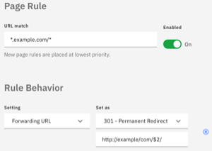
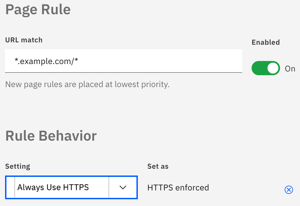
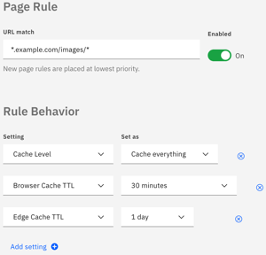

---
copyright:
  years: 2018
lastupdated: "2018-03-12"
---

{:shortdesc: .shortdesc}
{:new_window: target="_blank"}

# Use Page Rules with Caching

Page Rules give you the ability to take various actions based on the page's URL, such as creating redirects, fine-tuning caching behavior, or enabling and disabling services.

A Page Rule takes effect on a given URL pattern that matches the following format:

`<scheme>://<hostname><:port>/<path>`

For example:

`https://www.example.com:80/image.png`

The `scheme` and `port` components are optional. If the `scheme` component is omitted, the format accepts `http://` and `https://` protocols. If the `port` is not specified, the rule matches all ports. You can perform basic wildcard matches by using a `*` symbol in your rule pattern, allowing it to match a series of similar patterns.

**Important things to remember with Page Rules:**

 * Only one Page Rule takes effect on any given request.
 * Page Rules are given priority in an order from top to bottom. Once a URL matches a rule, only that rule is applied; that is, if a Page Rule has triggered already on a request, any subsequent rules that also match the URL pattern will not take effect. 
 * As a general rule, we recommend ordering your rules from most specific to least specific.
 * Page Rules can be disabled, in which case they will take no action but can still be seen in the list and edited. Setting the *Enabled* toggle to "Off" creates a Page Rule that is disabled initially.

## Forwarding (URL Redirection)
Redirects one URL to another using an HTTP 301 or 302 redirect. The contents of any section of a URL that a wildcard matches can be referenced using `$X` syntax. The `X` indicates the index of a glob in the pattern: `$1` is replaced with the first wildcard match,  `$2` with the second wildcard match, and so on.

For example, suppose you set the following rule:

Here, a request to "www.example.com/stuff/things" will be redirected to "http://example.com/stuff/things".

**Note:** Be careful not to create a redirect in which the domain points to itself as a destination. This mistake can cause an infinite redirect error, and the affected URLs will not be able to resolve.

## Redirecting to HTTPS
If you want to redirect your visitors to use HTTPS, use the **Always Use HTTPS** setting instead:

## Custom Caching
Sets caching behavior for any URL matching the Page Rule pattern, using any of our standard cache levels. Setting **Cache Level** to **Cache Everything** caches any content, even if it is not one of our default static file types. Setting **Cache Level** to the **Bypass** setting prevents caching on that URL.

When specifying cache level using Page Rules, you can set an **Edge Cache TTL**, which controls how long CIS will retain files in our cache.

**Browser Cache TTL** controls how long resources cached by client browsers remain valid. If a browser requests a resource again and the TTL has not expired, the browser receives an `HTTP 304 (Not Modified)` response. You can set TTLs ranging from 30 minutes to 1 year.

Not all default caching behaviors are strictly RFC-compliant. Setting **Origin Cache Control** by means of Page Rules uses a newer set of caching rules that seeks to adhere more closely to RFCs, primarily with respect to revalidation. For example, our default behavior with `max-age=0` is to not cache at all, whereas setting **Origin Cache Control** caches, but it always revalidates.

The following example sets a Page Rule to cache everything found in the `/images` folder. Cached resources expire in 30 minutes in the user's browser, and they expire after one day in the IBM CIS datacenters:

