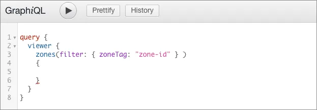
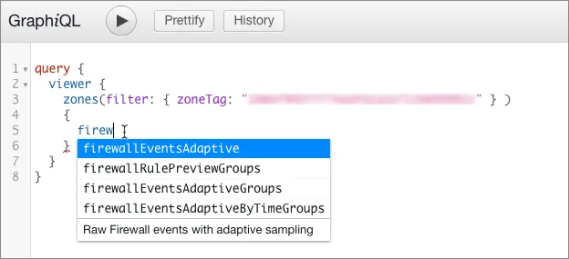
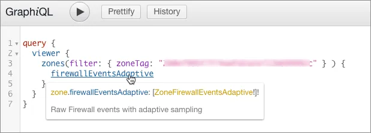
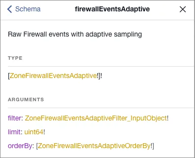
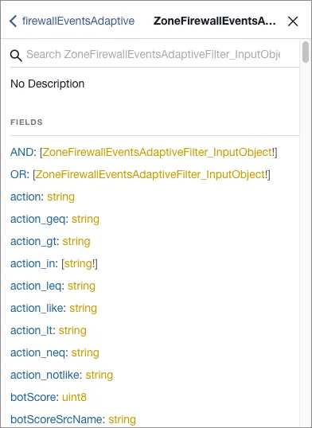
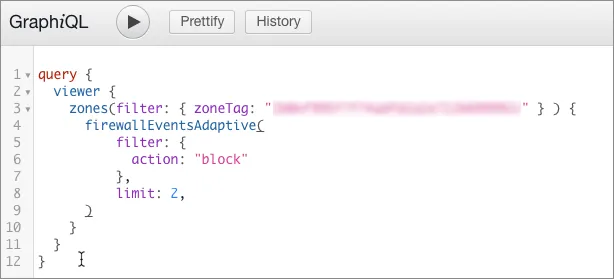
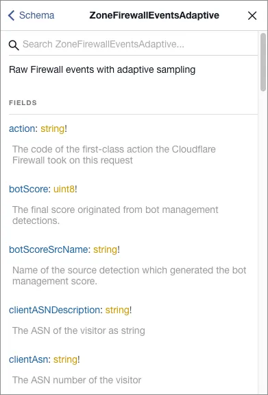
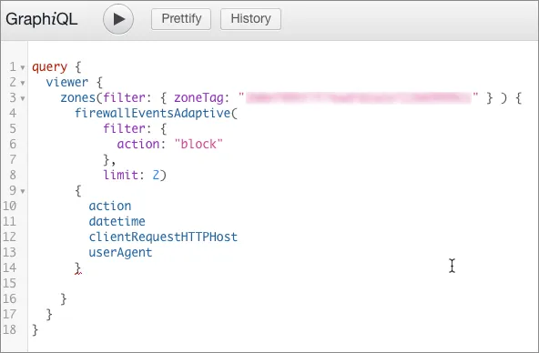
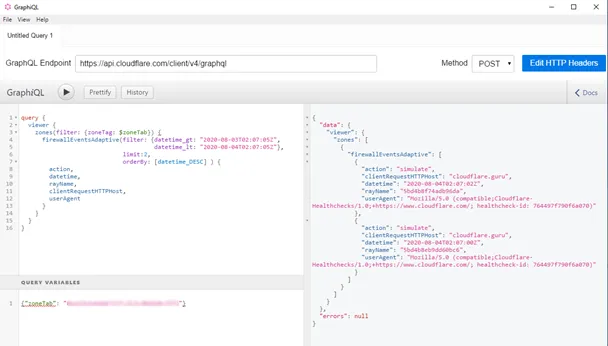
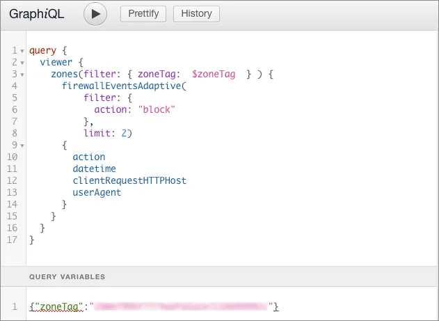

---

copyright:
  years: 2023, 2025
lastupdated: "2025-02-24"

keywords:

subcollection: cis

---

{{site.data.keyword.attribute-definition-list}}

# Composing a query in GraphiQL
{: #compose-query-graphiql}

You can use a GraphiQL client to compose and execute a GraphQL query.
{: shortdesc}

## Setting up a query and choosing a dataset
{: #set-up-query-dataset}

Click the editing pane of GraphiQL and add the following depicted base query, replacing `zone-id` with your Cloudflare zone ID:

{: caption="Adding a base query in the GraphiQL pane" caption-side="bottom"}

To find the zone's tag, log in to your Cloudflare account and select the site for which you want to obtain the tag. In the Cloudflare dashboard **Overview** page, scroll to the **API** section in the right sidebar. This displays your zone and account tags.
{: tip}

To assist query building, the GraphiQL client has word completion. Insert your cursor in the query, in this case on the line below `zones`, and start entering a value to engage the feature. For example, when you type `firewall`, a popup menu displays the datasets that return firewall information:

{: caption="GraphiQL word completion assistant to query building"}

The text at the bottom of the list displays a short description of the data that the node returns.

Select the dataset you want to query and insert it. Either select the item in the list, or scroll using arrow keys and press **Return**.

## Supply required parameters
{: #supply-required-parameters}

Hover your mouse over a field to display a tooltip that describes the dataset. In this example, hovering over the `firewallEventsAdaptive` node displays the description depicted here:

{: caption="Hovering the mouse over a field to display its description" caption-side="bottom"}

To display information about the dataset, including required parameters, select the dataset name (blue text). The **Documentation Explorer** opens and displays details about the dataset:

{: caption="Documentation Explorer window displaying dataset details" caption-side="bottom"}

The `filter` and `limit` arguments are required, as indicated by the exclamation mark (`!`) after their type definitions (gold text). In this example, the `orderBy` argument is not required, though when used it requires a value of type `ZoneFirewallEventsAdaptiveOrderBy`.
{: tip}

To browse a list of supported filter fields, select the filter type definition (gold text) in the Documentation Explorer. In this example, the type is `ZoneFirewallEventsAdaptiveFilter_InputObject`:

{: caption="Browsing GraphiQL filter fields" caption-side="bottom"}

The following example query shows the required `filter` and `limit` arguments for `firewallEventsAdaptive` (as well as for the rest of GraphQL nodes):

{: caption="Example of GraphiQL query arguments" caption-side="bottom"}

## Define the fields used by your query
{: #define-query-fields}

To browse the fields you can use with your query, hover your cursor over the dataset name and in the tooltip that displays. Then select the data type definition (gold text):

{: caption="Hovering the mouse over a dataset to display available fields" caption-side="bottom"}

The Documentation Explorer opens and displays a list of fields:

{: caption="Documentation Explorer window displaying list of fields" caption-side="bottom"}

To add the data fields that you want to read, type an opening brace (`{`) after the closing parenthesis for the parameters, then start typing the name of a field that you want to fetch. Use word completion to choose a field.

The following example query returns the `action`, `datetime`, `clientRequestHTTPHost`, and `userAgent` fields:

{: caption="Example query with return fields" caption-side="bottom"}

Once you have entered all the fields you want to query, select the **Play** button to submit the query. The response pane will contain the data fetched from the configured GraphQL API endpoint:

{: caption="GraphiQL response pane" caption-side="bottom"}

## Variable substitution
{: #variable-substitution}

The GraphiQL client allows you to use placeholders for value and supply them through the `variables` part of the payload.

Placeholder names should start with the `$` character, and you do not need to wrap placeholders in quotes when you use them in the query.

Values for placeholders should be provided in JSON format, in which placeholders are addressed without the `$` character. As an example, for a placeholder `$zoneTag`, the GraphQL API will read a value from the `zoneTag` field of the supplied variables object.

To supply a value for a placeholder, select the **Query Variables** pane and edit a JSON object that defines your variables.

This example query uses the `zoneTag` query variable to represent the zone ID:

{: caption="Example of GraphiQL query variables" caption-side="bottom"}
