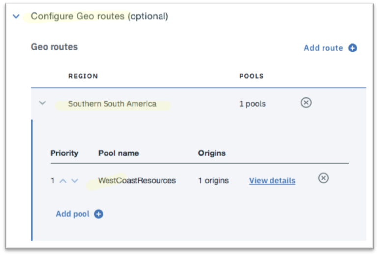

---

copyright:
  years: 2017
lastupdated: "2018-06-20"

---

{:shortdesc: .shortdesc}
{:codeblock: .codeblock}
{:screen: .screen}
{:new_window: target="_blank"}
{:pre: .pre}
{:table: .aria-labeledby="caption"}

# Define the global load balancer

Define your global load balancer configuration by specifying a hostname, adding and adjusting your origin pools and defining additional rules to control how traffic is served to clients.

1. Create your Global load balancer by clicking Create load balancer button on right.  

2. Specify the hostname for your domain, and adjust the TTL value if desired (the default is 60 seconds) and use **Add Pool** to add your Origin Pools. 

   
   
   **NOTE:** Hostnames combined with Domain names form fully-qualified domain names (FQDN) for your application. Your end-users connect to your application using this FQDN. 
   
3. Adjust the relative priorities of your origin pools by clicking the up and down arrows on the left of the pool. The application requests from end-users are serviced in round-robin fashion by these origin pools. 
   
      
   
4. Optionally, you can define additional rules to control how traffic is served to clients from different geographical regions. In the example below, clients arriving from the southern South America region are routed to the US West Coast origin pool. You may use these rules to direct clients to their closet possible region. If any of these region fails, then the requests are routed to other available healthy locations, so that that end-users are not affected by downtime. 

      
   
5. Click **Provision Resources** to complete the configuration of your global load balancer. 
6. Finally, verify connectivity to your application by typing `FQDN URL` in a mobile browser window. You will see a welcome message if you can connect.
