---

copyright:
  years: 2018
lastupdated: "2018-03-13"

---

{:shortdesc: .shortdesc}
{:new_window: target="_blank"}
{:codeblock: .codeblock}
{:pre: .pre}
{:screen: .screen}
{:tip: .tip}
{:download: .download}

# Set up your Domain Name System (DNS) for IBM CIS

This document contains some specific instructions about how to configure your IBM CIS DNS records, including how to configure Secure DNS.

## Secure DNS

**DNSSec** is a technology to digitally 'sign' DNS data so you can be assured it is valid. To eliminate vulnerability from the internet, DNSSec must be deployed at each step in the lookup, from root zone to final domain name (for example, www.icann.org).

## Configuring and managing your secure DNS 

DNSSec adds a layer of authentication to the internet's DNS infrastructure, which otherwise is not secure. Secure DNS guarantees that visitors are directed to **your** web server when they type your domain name into a web browser.  All you need to do is enable DNSSec in your DNS page from your IBM CIS account and add the DS record to your registrar.

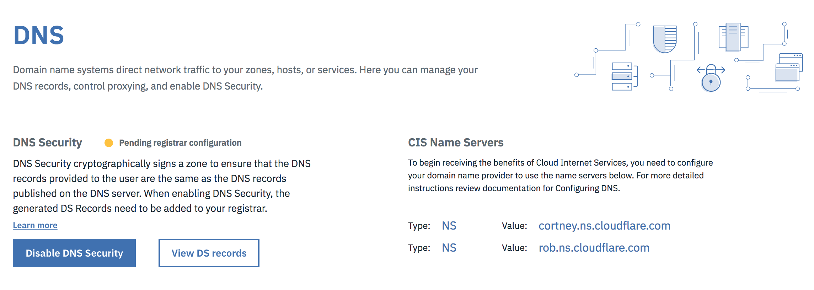

You can select **View DS records** button to open a dialog box that explains how to add the DS record to your registrar. You must copy parts of the DS record and paste them into your registrar’s dashboard. Every registrar is different, and your registrar may only require you to enter information for some of the available fields.

## Adding DNS records

You can use the **Type** dropdown to select the type of record you want to create. Each DNS record type has a Name and Time-To-Live (TTL) associated with it. 

Whatever is entered into the Name field will have domain name appended to it unless domain name is manually appended in the field already (e.g. if `www` or `www.example.com` is typed into the field, the API will handle both as `www.example.com`). If the exact domain name is typed into the name field, then it won't be appended on itself (e.g. `example.com` will be handled as `example.com`). However, the list of DNS records will only show the names without the domain name being tacked on, so `www.example.com` is shown as `www` and `example.com` will be shown as `example.com`. The TTL will have a default value of `Automatic`, but can be changed by the user. A proxied DNS record will always have a TTL of `Automatic`, so a newly proxied record will change to this configuration during this change.

### A Type record

To add this record type, valid values must exist in the **Name** and **IPv4 Address** fields. A **TTL** also can be specified from the dropdown menu, with a default value of 'Automatic'.

    Required Fields: Name, IPv4 Address
    Optional Field: TTL (Default value is Automatic)

### AAAA Type record

To add this record type, valid values must exist in the **Name** and **IPv6 Address** fields. A **TTL** also can be specified from the dropdown menu, with the default value of 'Automatic'.

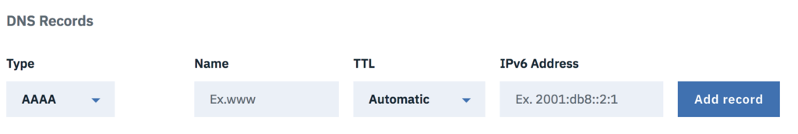

    Required Fields: Name, IPv6 Address
    Optional Field: TTL (Default value is Automatic)

### CNAME Type record

To add this record type, a valid value must exist in the **Name** field and a fully qualified domain name must be in the **Domain Name** (FQDN) field. A **TTL** also can be specified from the dropdown menu, with the default value of 'Automatic'.

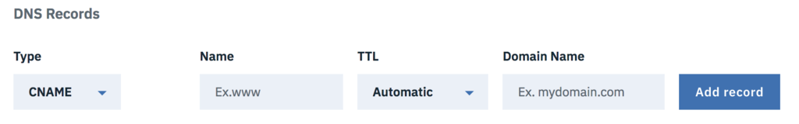

    Required Fields: Name, Domain Name (for CNAME)
    Optional Field: TTL (Default value is Automatic)

### MX Type record

To add this record type, a valid value must exist in the **Name** field and a valid address must exist in the **Mail Server** field. A **TTL** also can be specified from the dropdown menu, with the default value of 'Automatic'.

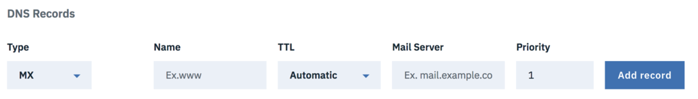

    Required Fields: Name, Mail Server
    Optional Fields: TTL (Default value is Automatic), Priority (Default value is 1)

### LOC Type record

To add this record type, a valid value must exist in the **Name** field. If you need more specific information, select the **Configure LOC options** button. A **TTL** also can be specified from the dropdown menu, with the default value of 'Automatic'.

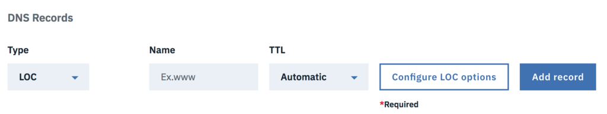

    Required Fields: Name
    Optional Fields: LOC options (click the button to configure)

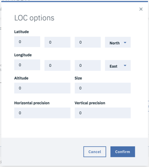

### CAA Type record

To add this record type, valid values must exist in the **Name** and **Value** fields. The Value field will correlate to the value of the **Tag** dropdown field, which defaults to "Send violation reports to URL". A **TTL** can also can be specified from the dropdown, with the default value of 'Automatic'.

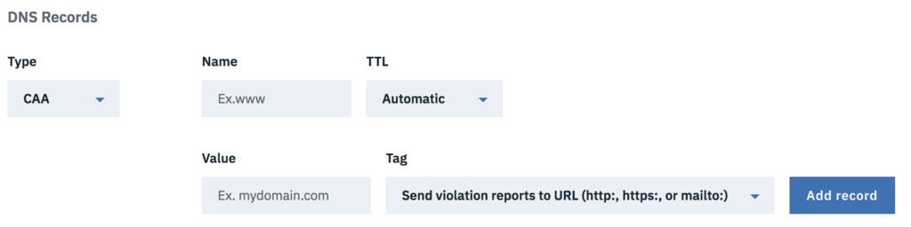

    Required Fields: Name, Value (associated to tag)
    Optional Fields: TTL (Default value is Automatic), Tag (default is to send violation reports to URL)

### SRV Type record

To add this record type, valid values must exist in the **Name**, **Service Name** and **Target** fields. Use the dropdown menu to select a **protocol**, which defaults to the UDP protocol. Additionally, you can specify **Priority**, **Weight** and **Port**. These three fields default to a value of 1. A **TTL** also can be specified from the dropdown menu, with the default value of 'Automatic'.

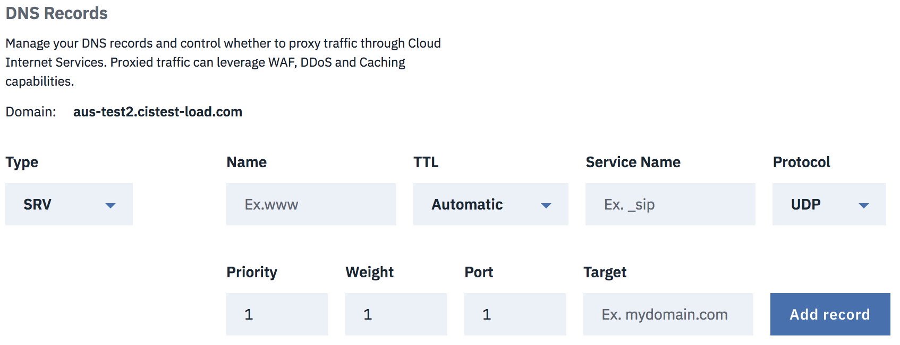

    Required Fields: Name, Service Name, Target
    Optional Fields: TTL (Default value is Automatic), Protocol (Defaulted to UDP), Priority (Defaulted to 1), Weight (Defaulted to 1), Port (Defaulted to 1)

### SPF Type record

To add this record type, valid values must exist in the **Name** and **Content** fields. A **TTL** also can be specified from the dropdown menu, with the default value of 'Automatic'.

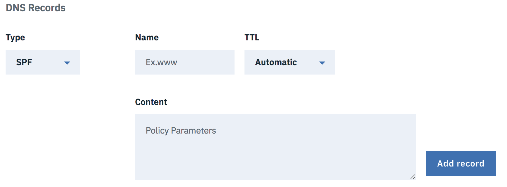

    Required Fields: Name, Content
    Optional Field: TTL (Default value is Automatic)

### TXT Type record

To add this record type, valid values must exist in the **Name** and **Content** fields. A **TTL** also can be specified from the dropdown menu, with the default value of 'Automatic'.

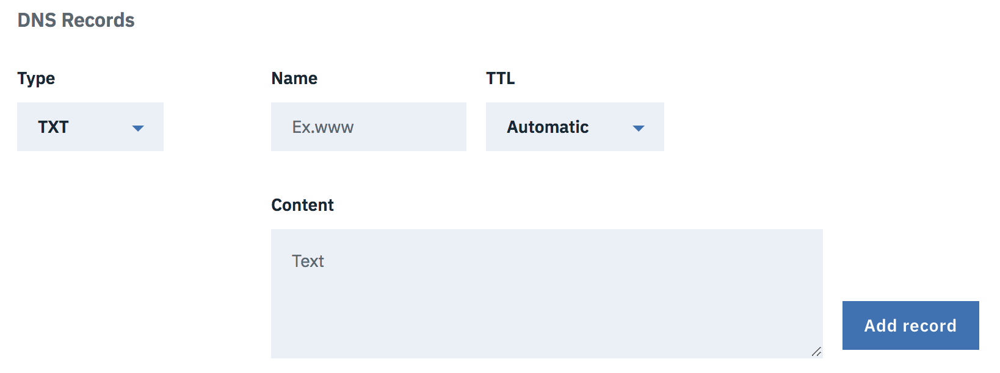

    Required Fields: Name, Content
    Optional Field: TTL (Default value is Automatic)

### NS Type record

To add this record type, valid values must exist in the **Name** and **Name Server** fields. A **TTL** also can be specified from the dropdown menu, with the default value of 'Automatic'.

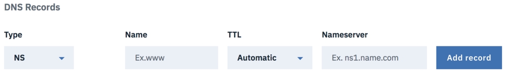

    Required Fields: Name, Name Server
    Optional Field: TTL (Default value is Automatic)

## Updating DNS records

In each record row, you can click the **Edit record** option from the menu, which will open a dialog box, which you can use to update the record.

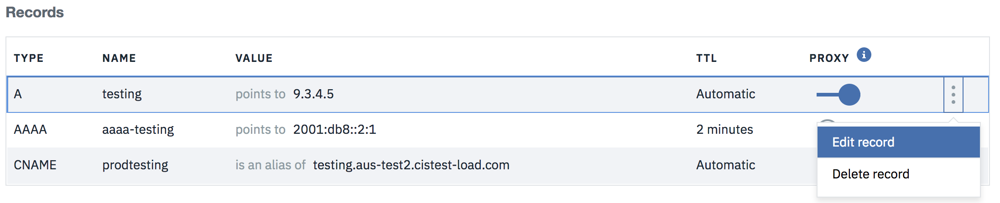

For example, this is the update dialog for **A** type record. Once you are finished making your changes, select **Update record** to save them.

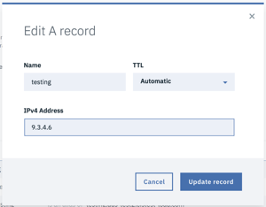

## Deleting records

In each record row, you can select the **Delete record** option from the menu, which opens a dialog box to confirm the delete process.

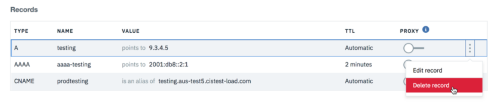

You can select the **Delete** button to confirm your delete action. Select **Cancel** if you don't want to delete.

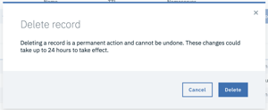

## Import and export records
DNS records can be imported into and exported from CIS. All files are imported and exported as .txt files in BIND format. More information on [BIND format](https://en.wikipedia.org/wiki/Zone_file).
Click the overflow menu and select import or export records.
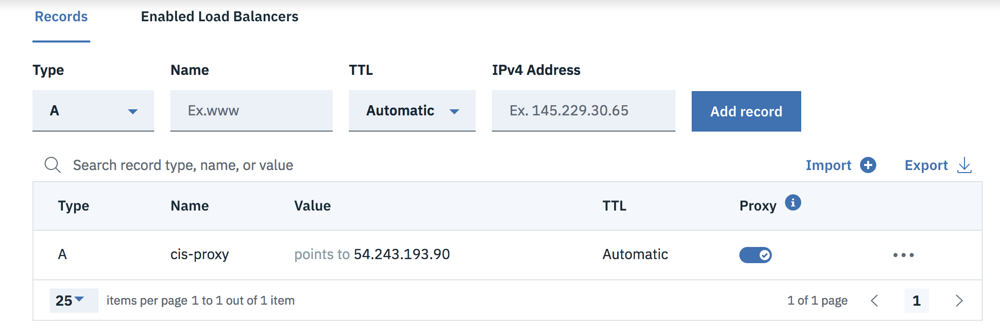

### Import records
By default, a total of 3500 DNS records are allowed (imported and created on CIS). You can import multiple files, one at a time, as long as the total number of records is under the max limit. After importing, you are shown a summary with the number of records successfully added and the number that failed, along with the reason why each record failed.
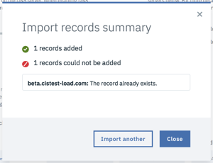

### Export records
Use `Export records` to create a backup of your zone file, or export it to use with another DNS provider. When this menu option is clicked, the records are downloaded to the location specified by your browser settings (typically the Downloads folder). To select another folder location, change your browser's settings to prompt you for a location with each download.
