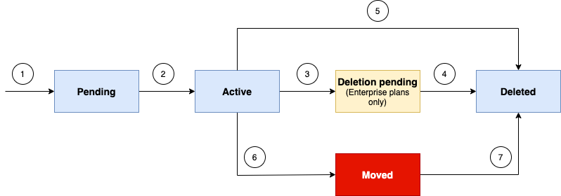

---

copyright:
  years: 2021, 2025
lastupdated: "2025-05-28"

keywords:

subcollection: cis

---

{{site.data.keyword.attribute-definition-list}}

# Domain lifecycle and state transitions
{: #domain-lifecycle-concepts}

Domains configured in {{site.data.keyword.cis_short_notm}} begin in `pending` state, and become `active` after the authoritative name servers assigned to the domain are configured correctly at the DNS provider or registrar.
{: shortdesc}

The following diagram shows a sample domain lifecycle, with labels that correspond to the list of domain state transitions.

{: caption="Domain lifecycle" caption-side="bottom"}

Domain state transitions:

1. Adding a domain to a {{site.data.keyword.cis_short_notm}} instance puts the domain in `pending` state. Authoritative name servers are assigned but have not yet been configured at the DNS provider or registrar.
1. Configuring name server records for the authoritative name servers of the domain at the DNS provider or registrar activates the domain.
1. (Enterprise only) Deleting the domain marks the domain as `Deletion pending`. An Enterprise plan level domain will not be deleted immediately and can take up to 24 hours to actually be removed.
1. (Enterprise only) After a period of time, the domain is deleted.
1. (Standard) A Standard plan level instance can be deleted immediately.
1. The name server configuration of a domain is monitored. A change to the configuration of the authoritative name server at the DNS provider or registrar marks the domain `moved`. This can be the result of an update to the name servers if the domain is moved to a different {{site.data.keyword.cis_short_notm}} instance, or it can be a sign of a bad name server configuration.

   A `moved` domain might stop serving traffic, and could potentially be deleted. If your domain is in `moved` state and you believe this is in error, [contact IBM Support](/docs/cis?topic=cis-gettinghelp).
   {: important}

1. `Moved` domains could potentially be deleted automatically, or by the user.

## Domain lifecycle states
{: #domain-lifecycle-states}

You might encounter any of the following domain lifecycle states:

- **Pending**: The zone has been added to a {{site.data.keyword.cis_short_notm}} instance, and the DNS configuration is being verified at the DNS provider or registrar to activate the domain. After confirmation that the correct name servers (or CNAME validation records) have been configured the domain is transitioned to active. The domain remains pending otherwise.
- **Active**: The DNS configuration has been verified and the domain is actively serving traffic, taking advantage of the Cloudflare products. 
- **Moved**: The zone was active, but DNS validation detected that the domain is no longer configured for the assigned authoritative name servers only, for a number of repeated checks. There is an implication that the DNS could be pointed back, but this state is the start of a zone deprovision. The domain stays in a `moved` state for 7 days, or indefinitely if there is an active subscription on the zone. If the same domain becomes `active` or `pending` in a different account, this domain will no longer serve traffic because `pending` or `active` zones take precedence.
- **Deletion pending**: (Enterprise only) The customer initiated the deletion of this domain from the {{site.data.keyword.cis_short_notm}} instance. Enterprise domains can take up to 24 hours to be completely removed.
- **Deleted**: Removed from a customers dashboard and services deprovisioned, but not removed from the Cloudflare database.
