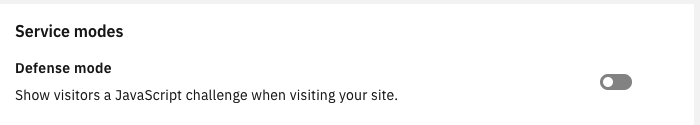

---
copyright:
  years: 2018
lastupdated: "2018-07-17"
---

{:shortdesc: .shortdesc}
{:new_window: target="_blank"}

# FAQ

## What happened to the Early Access Plan that used to be in the catalog?
The Early Access Plan was removed from the Catalog on May 31, 2018. It was replaced by the Standard paid plan, and a new 30-day Free Trial plan. If you have an instance of Early Access Plan, upgrade to the Standard plan right away to avoid data loss; you will not be allowed to create a Free Trial instance if you participated in the Early Access beta.

## What do I get with a Free Trial Plan?
The Free Trial plan, by design, allows only one zone per account. It is recommended that only one instance be created per account and the zone name be verified. It is critical that the zone name be verified before it is added. If a zone is deleted, another zone or the same zone cannot be added during the Free Trial Plan.

## How many Free Trial instances can I have?
You can have at most one Free Trial instance per account, for the lifetime of the account. If you already have a free trial instance, or if you delete a free trial instance, or if the free trial expires, you will not be allowed to creat another free trial instance. You can, however, create instances of other paid plan types (e.g., Standard), independent of any free trials you may have created.

## I have a service instance that is subscribed to the Early Access Plan. Can I change it to a Free Trial?
No. Early Access Plan can only be upgraded to a paid plan, which is the Standard plan at this time.

## I had an Early Access instance that I (may or may not have) deleted. Can I create a Free Trial instance now?
No. Each account is entitled to only one free instance. Both the Early Access Plan and the Free Trial plan that replaced it count as free plans. This also means that you can have at most one Free Trial instance.

## Can I downgrade from Standard to Free Trial?
No. This is not allowed.

## My Free Trial has expired. What are my options?
To avoid any data loss you must upgrade from Free Trial to Standard prior to the expiration date. Once the Free Trial expires, your data may be deleted at any time. We may not clean up expired Free Trials immediately. However, we will not provide any guarantees or support for expired trial plans.

## I added a user to my account and gave that user permission to manage Internet Services instance(s). Why is that user facing authentication issues?
It is possible that you did not assign "service access roles" to the user. Note that there are two separate sets of roles: "platform access" and "service access". Platform access roles are required to create and manage service instances, but service access roles are required to perform service-specific operations on service instances. In the console, these settings can be updated by selecting **Manage > Security > Identity and Access**.

## Why is my domain in Pending state? How do I activate it?
When you add a domain to CIS, we give you a couple of nameservers to configure at your registrar (or at your DNS provider, if you are adding a subdomain). The domain or subdomain remains in pending state until you configure the nameservers correctly. Make sure you add both the nameservers to your registrar or DNS provider. We periodically scan the public DNS system to check whether the nameservers have been configured as instructed. As soon as we are able to verify the nameserver change (this may take up to 24 hours), we activate your domain. You can submit a request to recheck nameservers by clicking on **Recheck nameservers** in the overview page.

## Who is the registrar for my domain?
Consult https://whois.icann.org/ for this information. **Note**: You must have the administrative privilege to edit your domain's configuration at the registrar to update or add the nameservers provided for your domain when you add it to CIS. If you don't know who the registrar is for the domain you're trying to add to CIS, it is unlikely you have the permission to update your domain's configuration at the registrar. Work with the owner of the domain in your organization to make the necessary changes.

## I want to keep my current DNS provider for my domain (example.com). Can I delegate a subdomain (subdomain.example.com) from my current DNS provider to CIS?
Yes. The process is similar to adding a domain, but instead of the registrar, you work with the DNS provider for the higher level domain. When you add a subdomain to CIS, you are given two nameservers to configure, as usual. You configure a Name Server (NS) record for each of the two nameservers as DNS records within your domain being managed by the other DNS provider. When we are able to verify that the required NS records have been added, we activate your subdomain. If you do not manage the higher level domain within your organization, you must work with the owner of the higher level domain to get the NS records added.

## What is TLS?
TLS is a standard security protocol for establishing encrypted links between a web server and a browser in an online communication. A TLS certificate is necessary to create a TLS connection with a website, and comprises of the domain name, the name of the company, and additional data such as company address, city, state, and country. The certificate also shows the expiration date, and details of the issuing Certificate Authority (CA).

## How Does TLS Work?
When a browser initiates a connection with a TLS secured website, it first retrieves the site's TLS Certificate to check whether the certificate is still valid. It verifies that the CA is one that the browser trusts, and that the certificate is being used by the website for which it has been issued. If any of these checks fail, you'll get a warning indicating that the website is not secured by a valid certificate.

When a TLS certificate is installed on a web server, it enables a secure connection between the web server and the browser that connects to it. The website's URL is prefixed with "https" instead of "http" and a padlock is shown on the address bar. If the website uses an extended validation (EV) certificate, the browser may also show a green address bar.

## Why do I see a privacy warning?
The TLS certificates issued by IBM Cloud CIS cover the root domain (`example.com`) and one level of subdomain (`*.example.com`). If you’re trying to reach a second-level subdomain (`*.*.example.com`) you will see a privacy warning in your browser, because these host names are not added to the SAN.

Also, please allow up to 15 minutes for one of our partner Certificates Authorities (CAs) to issue a new certificate. You’ll see a privacy warning in your browser if your new certificate has not yet been issued.

## What is DDoS?
A distributed denial-of-service (DDoS) attack is an attempt to make an online service unavailable by overwhelming it with traffic from multiple sources. In a DDoS attack, multiple compromised computer systems attack a target such as a server, website, or other network resource, and which affects users of the targeted resource.

The flood of incoming messages, connection requests, or malformed packets to the target system forces it to slow down or even crash and shut down, thereby denying service to legitimate users or systems. DDoS attacks have been carried out by diverse threat actors, ranging from individual criminal hackers to organized crime rings and government agencies.

## What do I do if I’m under a DDoS attack?

**Step 1:** Turn on “Defense mode" in the **Overview** screen. 



**Step 2:** Set your DNS records for maximum security.

**Step 3:** Do not rate-limit or throttle requests from IBM CIS, we need the bandwidth to assist you with your situation.

**Step 4:** Block specific countries and visitors if necessary.

## I got a 522 error, what do I do now?

A 522 error indicates we weren't able to establish a connection with your origin server (that is, your host). After about 15 seconds of failing to connect, we close the connection and display a 522 error page.

This issue usually is caused by firewall or security software that accidentally blocks our IP addresses. Because CIS acts as a reverse proxy, connections to your site will appear to come from a range of CIS IPs. This behavior can cause certain firewalls to block these connections, which prevents us from serving content to your site visitors properly.

To fix this issue, ask your host to whitelist all of the CIS IP ranges, which are listed [here](whitelisted-ips.html).

All of these IPs must be whitelisted to avoid 522 errors. It's also worth checking to see if any IPs in these ranges are blocked.

522 errors can also be caused by network connectivity issues, so confirm that your server and network is generally healthy and not overloaded.

If after taking the above steps you still receive errors, contact IBM CIS support and confirm the following:

* You've whitelisted our IP ranges
* Your server/network is online and generally healthy

If you contact our support team, please provide a ray ID from a recent 522 error. We can use this to determine which CIS Datacenter you were hitting and run further tests.

## What is a proxied record and why do I need them?

Proxied records are records that proxy their traffic through IBM CIS. Only proxied records receive CIS benefits, such as IP masking, where a CIS IP is substituted for your origin IP to protect it:

```
$ whois 104.28.22.57 | grep OrgName
OrgName:        IBM
```

If you would rather bypass CIS on a domain (we will still resolve DNS), then non-proxying the record is a possible solution.

## I got a DNS Validation error: 1004; now what can I do?

For page rules to work, DNS needs to resolve for your zone. As a result, you must have a proxied DNS record for your zone. 

## Can I add a CNAME for a root record?

Yes. IBM CIS supports a feature called "CNAME Flattening" which allows our users to add a CNAME as a root record. Our authoritative DNS servers enumerate the CNAME target's records and respond with those records instead of the CNAME itself, effectively hiding the fact that the user configured a CNAME at the root of the domain.

## What is the default health check timeout?

The default health check timeout for the Free Trial and Standard plans is 60 seconds.

## Can health checks be configured for non-HTTP/HTTPS traffic?

No, they can only be configured with HTTP/HTTPS.

## Can GLB be configured for non-HTTP/HTTPS traffic?

No, they can only be configured with HTTP/HTTPS.

## Will disabling all of my origins in an origin pool disable the entire origin pool itself?

Yes, if the origin pool is being used in a load balancer, the traffic is routed to the next highest priority pool or the fallback pool.

## I have an error in my Kubernetes Ingress, what do I do?

The hostname in a Kubernetes ingress must consist of lower case alphanumeric characters, '-' or '.', and must start and end with an alphanumeric character. Using `_` in the load balancer name, though permitted, can cause an ingress error in Kubernetes clusters. We recommend that you not use `-` in the load balancer name to avoid issues with Kubernetes clusters.
