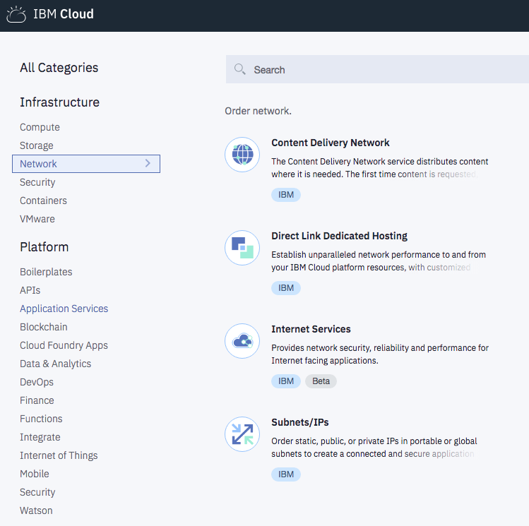

---
copyright:
  years: 2018
lastupdated: "2018-03-19"
---

{:shortdesc: .shortdesc}
{:new_window: target="_blank"}

# Getting Started with IBM Cloud Internet Services (CIS)

IBM Cloud Internet Services (CIS) offers three main capabilities to enhance your workflow: [security](/docs/infrastructure/cis/managing-for-security.html), [reliability](/docs/infrastructure/cis/managing-for-reliability.html), and [performance](/docs/infrastructure/cis/managing-for-performance.html). Each area of capability is represented in the left-hand navbar of your screen, once you've opened the IBM CIS application.

For each capability, IBM CIS helps you tune its features to suit your specific needs, including:

 * Authoritative DNS servers
 * Global and Local Load Balancing
 * Web Application Firewall (WAF)
 * DDoS Protection
 * Caching and page rules

## Before you begin
Before you begin using IBM CIS, you'll first need an [IBMid](https://www.ibm.com/account/us-en/signup/register.html). Then you can order your services through your IBM Cloud Account, or through the new [IBM Cloud Internet Services Portal](https://console.bluemix.net/catalog/services/internet-services), depending on your preference.

If you need assistance in obtaining an account to use IBM Cloud Internet Services, [contact your IBM sales representative](https://www.ibm.com/cloud-computing/bluemix/contact-us) for additional guidance on getting started.

If you have an existing Softlayer account, you can [link your account](https://console.bluemix.net/docs/account/softlayerlink.html#unifyingaccounts) with your IBMid. 

## Process overview

You can start using IBM CIS for your internet traffic with just a few steps.

 * Open the IBM CIS application from your IBM Cloud dashboard.
 * Add the domain you want to manage.
 * Configure your DNS information with the name servers we've provided.
 * Continue getting started with IBM CIS, by following a tutorial or by setting up other features.

### Step 1: Open the IBM CIS application

Open your [IBM Cloud dashboard](https://console.bluemix.net/catalog/). Then navigate to the IBM CIS application icon by selecting the **Platform -> Network** category in the left-hand navigation bar of the dashboard. Open the IBM Cloud Internet Services application by clicking the icon that you'll see near the middle of your screen. 

**The Overview Screen**

Once the IBM CIS application starts up, you'll see the IBM CIS **Overview** screen, and you'll find the tabs for **Security**, **Reliability**, and **Perfomance** on the left area of the UI display.

**What plan do I choose?**

For the _Early Access_ release, there is only one plan you can choose, and it is free. Click the **Create** button at the lower left of your **Overview** screen to begin provisioning your account.

**Begin Provisioning**

You'll see the first screen of the IBM CIS application, where you'll select the **Add Domain** button to begin.

|**Note that the Early Access program is limited to one instance per account.** |
|-------------------------------------------------------------------|
| After you've created a resource instance and added a domain to it, you are not permitted to add new resource instances for IBM CIS. This restriction is enforced even if you delete a trial domain and then attempt to add a domain again to the same resource instance. You'll encounter an error if you attempt to do so.|

### Step 2. Add and configure your Domain.

Begin protecting and improving the performance of your web service by entering your domain or a subdomain.

**Note:** Please specify DNS zones. You can configure the nameservers for these domains or subdomains at the domain's registrar or DNS provider. Do not use CNAMEs.

The Overview screen will show your domain in `Pending` status.

**Note:** The IBM CIS instance cannot be deleted after a domain has been added. To delete the instance, please delete the domain from the instance first.

### Step 3. Configure your Name Servers with the Registrar or existing DNS Provider.

To begin receiving the benefits of IBM CIS, configure your registrar or domain name provider to use the name servers listed. If you're delegating a domain (something like `example.com`), configure the listed name servers in your domain's settings, where they are managed by your registrar (for example, on the registrar's web portal). If you delegate a subdomain (for instance, `subdomain.example.com`) from another DNS provider, you must add a Name Server (NS) record for each of the listed name servers.

After you've configured your registrar or DNS provider, it may require up to 24 hours for the changes to take effect.

### Step 4. Ensure that IBM Cloud Internet Services is resolving the domain information for your application, hostname, or website.

To proceed, select the **Reliability** tab from your left-hand navbar, then select the **DNS** option. Be sure to add the appropriate _DNS Records_. Add the **A Record** and any **AAAA** or **MX** entries that are populated. If you forget to add these records before the registrar's delegation is complete, IBM Cloud Internet Services cannot resolve the domain information for your internet-facing applications.  

### Step 5. In the meantime, you can begin managing other IBM CIS functions and features.

For more details about managing other functions and features, please see the [step-by-step instructions](how-to.html).
