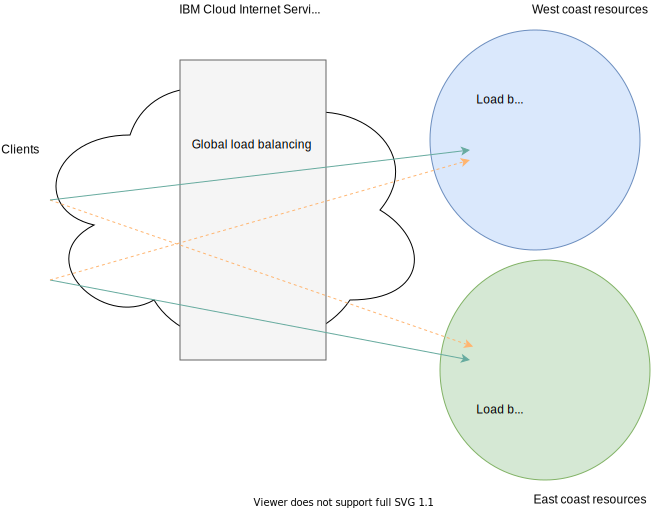

---

copyright:
  years: 2020
lastupdated: "2020-09-23"

keywords: 

subcollection: cis

---

{:shortdesc: .shortdesc}
{:new_window: target="_blank"}
{:codeblock: .codeblock}
{:pre: .pre}
{:screen: .screen}
{:term: .term}
{:tip: .tip}
{:note: .note}
{:important: .important}
{:deprecated: .deprecated}
{:external: target="_blank" .external}
{:generic: data-hd-programlang="generic"}
{:download: .download}
{:DomainName: data-hd-keyref="DomainName"}

# Configuring a global load balancer
{:#glb-use-case}

If you have an e-commerce website, or are hosting an application that must always be accessible to your users, then you're likely concerned about 24 x 7 availability and performance of your application.

The global load-balancing capabilities available with {{site.data.keyword.cis_full_notm}} ({{site.data.keyword.cis_short_notm}}) can help improve reliability and scalability of your applications while delivering the best possible user experience. This guide provides a walkthrough of the global load-balancing configuration.
{:shortdesc}

In this step-by-step demo, learn how to configure a setup similar to the following diagram.

{: caption="Figure 1. Diagram of global load balancer example" caption-side="bottom"}

In this example, the application resources are deployed in two data center locations, one in US West and the other in US East. Users might be accessing this application from all over the world.

## Step 1: Configure your global load balancer
{:#begin-global-load-balancer-configuration}

Configure your global load balancer.

1. Navigate to the **Reliability** section to begin working with global load balancers.
2. Scroll to the **Health Checks** section and click **Create health check** to define a custom health check.

   This configuration is optional. If you do not define any custom health checks, the system uses `/` as your default health check path.
   {:note}

3. Provide the path that you want to conduct your health checks on. You can use either HTTP or HTTPS protocols for your health checks.
4. When you expand the **Advanced options** menu, you can customize other parameters, such as the health check interval, the number of retries, or the request method and response body.
5. Click **Create** to complete your health check configuration.

## Step 2: Identify your application resources
{:#identify-your-application-resources}

Identify your application's resources, such as origin pools and health check mechanisms.

1. Navigate to the **Origin Pools** section, and click **Create pool** to define a new origin pool.

   Origin pools are server resources delivering applications to your clients.
2. Assign a name to your origin pool, and select the health check mechanism that was defined earlier. Add your application server as your origin. You can add one or more origins by clicking **Add Origin**.

   If your application servers are sitting behind a local load balancer, such as an {{site.data.keyword.cloud_notm}} load balancer, then add your load balancer’s FQDN or virtual IP as your origin instead of adding your individual servers.
   {:note}

3. Click **Create** to complete the creation of your origin pool.  

   The origin pool initially appears as **Unhealthy**. This state changes to **Healthy** after a successful health check by the system. You might need to refresh your browser to see the state change.

   If you have multiple origins within your origin pool, then use the healthy origin threshold to specify the minimum number of origins that must be healthy before declaring the pool healthy.
   {:note}

4. Define as many origin pools as the number of application farms that you have. These farms might be within the same or different geographic regions. In our example, we create two origin pools representing an application farm in the United States West and East coasts.

## Step 3: Define the global load balancer
{:#define-the-global-load-balancer}

Define your global load balancer configuration by specifying a hostname, adding and adjusting your origin pools, and defining additional rules to control how traffic is served to clients.
{: shortdesc}

1. Click **Create load balancer**.  
2. Specify the hostname for your domain, and adjust the TTL value if wanted (the default is 60 seconds) and use **Add Pool** to add your origin pools.

   Hostnames that are combined with domain names form fully-qualified domain names (FQDN) for your application. Your users connect to your application using this FQDN.
   {:note}

3. Adjust the relative priorities of your origin pools by clicking the up and down arrows in the Priority column. The application requests from users are serviced in round-robin fashion by these origin pools.
4. Optionally, you can define additional rules to control how traffic is served to clients from different geographical regions. You can use these rules to direct clients to their closet possible region. If any of these regions fail, then the requests are routed to other available healthy locations, so that users are not affected by downtime.
5. Click **Create** to complete the configuration of your global load balancer.
6. Finally, verify connectivity to your application by trying to connect to the FQDN URL from a browser.
