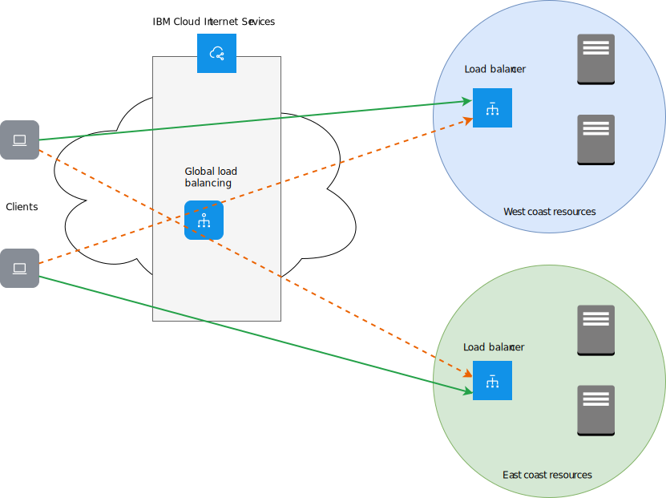

---

copyright:
  years: 2018, 2025
lastupdated: "2025-02-24"

keywords:

subcollection: cis

---

{{site.data.keyword.attribute-definition-list}}

# Configuring a global load balancer
{: #configure-glb}

If you have an e-commerce website, or are hosting an application that must always be accessible to your users, then you're likely concerned about 24 x 7 availability and performance of your application.

The global load-balancing capabilities available with {{site.data.keyword.cis_full_notm}} ({{site.data.keyword.cis_short_notm}}) can help improve reliability and scalability of your applications while delivering the best possible user experience.
{: shortdesc}

On your dashboard, you'll see three lists that show the [load balancers](#x2788902){: term}, origin pools, and [health checks](#x4571658){: term}. The lists display the new or updated global load balancer, or one of its components after you've provisioned or updated it. Initially, the lists are empty, and before you create a load balancer you must take a few actions.

{{site.data.keyword.cis_short_notm}} can support load balancer pools that use a private IP address, but there are limitations:
- you cannot use proxy services or health checks.
- you can only use DNS-based load balancing.
{: important}

Refer to the [Quick setup](#global-load-balancer-quick-setup) if you already know what to do!

In this step-by-step demo, learn how to configure a setup similar to the following diagram.

{: caption="Diagram of global load balancer example" caption-side="bottom"}

In this example, the application resources are deployed in two data center locations, one in US West and the other in US East. Users might be accessing this application from all over the world.

## Step 1: Configure your global load balancer
{: #begin-global-load-balancer-configuration}

Configure your global load balancer.

1. Navigate to the **Reliability** section to begin working with global load balancers.
2. Scroll to the **Health Checks** section and click **Create health check** to define a custom health check.

   This configuration is optional. If you do not define any custom health checks, the system uses `/` as your default health check path.
   {: note}

3. Provide the path that you want to conduct your health checks on. You can use either HTTP or HTTPS protocols for your health checks.
4. When you expand the **Advanced options** menu, you can customize other parameters, such as the health check interval, the number of retries, or the request method and response body.
5. Click **Create** to complete your health check configuration.

## Step 2: Identify your application resources
{: #identify-your-application-resources}

Identify your application's resources, such as origin pools and health check mechanisms.

1. Navigate to the **Origin Pools** section, and click **Create pool** to define a new origin pool.

   Origin pools are server resources delivering applications to your clients.
2. Assign a name to your origin pool, and select the health check mechanism that was defined earlier. Add your application server as your origin. You can add one or more origins by clicking **Add Origin**.

   If your application servers are sitting behind a local load balancer, such as an {{site.data.keyword.cloud_notm}} load balancer, then add your load balancer’s FQDN or virtual IP as your origin instead of adding your individual servers.
   {: note}

3. Click **Create** to complete the creation of your origin pool.

   The origin pool initially appears as **Unhealthy**. This state changes to **Healthy** after a successful health check by the system. You might need to refresh your browser to see the state change.

   If you have multiple origins within your origin pool, then use the healthy origin threshold to specify the minimum number of origins that must be healthy before declaring the pool healthy.
   {: note}

4. Define as many origin pools as the number of application farms that you have. These farms might be within the same or different geographic regions. In our example, we create two origin pools representing an application farm in the United States West and East coasts.

## Step 3: Define the global load balancer
{: #define-the-global-load-balancer}

Define your global load balancer configuration by specifying a hostname, adding and adjusting your origin pools, and defining additional rules to control how traffic is served to clients.
{: shortdesc}

1. Click **Create load balancer**.
2. Specify the hostname for your domain, and adjust the TTL value if wanted (the default is 60 seconds) and use **Add Pool** to add your origin pools.

   Hostnames that are combined with domain names form fully-qualified domain names (FQDN) for your application. Your users connect to your application using this FQDN.
   {: note}

3. Adjust the relative priorities of your origin pools by clicking the up and down arrows in the Priority column. The application requests from users are serviced in round-robin fashion by these origin pools.
4. Optionally, you can define additional rules to control how traffic is served to clients from different geographical regions. You can use these rules to direct clients to their closet possible region. If any of these regions fail, then the requests are routed to other available healthy locations, so that users are not affected by downtime.
5. Click **Create** to complete the configuration of your global load balancer.
6. Finally, verify connectivity to your application by trying to connect to the FQDN URL from a browser.

## Global load balancer details
{: #glb-details}

### Global load balancer quick setup
{: #global-load-balancer-quick-setup}

You can directly create pools and health checks from the **Create Load Balancer** menu option. Navigate to **Reliability > Global Load Balancer > Create load balancer > Add pool**, then select **Create New** from the Origin pool list.

Input a pool name, [origins](#x2210603){: term}, and select a health check. You can create a new health check here by choosing **Create New** in the **Health Check** list menu, and entering the information to create the health check.

### Adding a health check
{: #add-a-health-check}

Health checks are optional attachments for origin pools. They use a custom repeating interval to probe for a specific response body, or for a status code, to monitor the pool's health. After you create a health check, you can add it to a new or existing origin pool. Navigate to **Reliability > Global Load Balancer > Health Check Events** to see a table of health check events. You can filter by date, health of the pool or origin, pool name, and origin name.

Health check fields:
* **Monitor type**: The protocol to use for the health check (defaults to HTTP).
* **Path**: The endpoint path against which to perform the health check (defaults to `/`).
* **Port**: Click the arrow buttons to increase or decrease the port number.
* **Description**: Health check description.

Expand the **Advanced options** section to see more settings.

* **Test interval**: The interval (in seconds) between each health check. Shorter intervals can improve failover time, but increase load on the origins as checks come from multiple locations (defaults to 60).
* **Method**: The HTTP method to use for the health check (defaults to GET).
* **Timeout**: The time (in seconds) before marking the health check as failed (defaults to 5).
* **Number of retries**: The number of retries to attempt in case of a timeout before marking the origin as unhealthy. Retries are attempted immediately (defaults to 2).
* **Expected Response Code**: The expected HTTP response code or code range of the health check. This value must be between 200-299 with wildcards denoted by an 'x'.
* **Response Body**: A case-insensitive sub-string to match against in the response body. If this string is not found, the origin is marked as unhealthy.

Expand the **Configure request headers** section to add and configure HTTP request headers to send in the health check.
It is recommended that you set a Host header by default. The `User-Agent` header cannot be overridden.

### Adding a pool
{: #add-a-pool}

At least one pool is required for each provisioned load balancer. Pools group your origins for the load balancer to use.

When creating a pool, two fields are required:
* **Name**: A short name (tag) for the pool. Only alphanumeric characters, hyphens, and underscores are allowed.
* **Origins**: The list of origins within this pool. Traffic directed at this pool is balanced across all currently healthy origins, provided the pool itself is healthy.

Additional optional fields:
* **Health Check**: The health check to use for checking origins within this pool. (defaults to no health check)
* **Healthy Origin Threshold**: The minimum number of origins that must be healthy for this pool to serve traffic. If the number of healthy origins falls below this number, the pool is marked unhealthy and fails over to the next available pool. (defaults to 1)
* **Health check region**: Region from which the health check performs monitoring.

   IBM's geographic regions differ from Cloudflare's regions. For details about the geographic regions Cloudflare uses, see "Geo Steering" in [Traffic steering](https://developers.cloudflare.com/load-balancing/understand-basics/traffic-steering/steering-policies/geo-steering/){: external}.
   {: note}

* **Enabled**: Whether to enable (the default) this pool. Disabled pools do not receive traffic and are excluded from health checks. Disabling a pool causes any load balancers using it to failover to the next pool, if any (default to true).

### Adding a global load balancer
{: #add-a-load-balancer}

Load balancers help to distribute your proxied traffic across multiple origin pools using a round-robin distribution.
{: shortdesc}

When creating a load balancer, the required fields are:
* **Balancer hostname**: The DNS hostname to associate with your load balancer. If this hostname already exists as a DNS record in IBM's DNS, the load balancer takes precedence and the DNS record is not used.
* **Default origin pools**: A list of pool IDs. The list is ordered by their failover priority. Pools defined here are used by default, or when region pools are not configured for a given region.

Optionally, you can configure the following fields:
* **Proxy**: Route traffic through IBM's performance and metrics service.
* **Session Affinity**: Always route through the same performance and metrics instance. This option is available only if proxy is enabled.
* **TTL**: Time-to-live (TTL) of the DNS entry for the IP address returned by this load balancer. This option applies only to unproxied load balancer; otherwise, it defaults to `Automatic`.
* **Geo routes**: A mapping of region or country codes to a list of pools (ordered by their failover priority) for the given region. Any regions not explicitly defined fall back to using the default pools.

   IBM's geographic regions differ from Cloudflare's regions. For details about the geographic regions Cloudflare uses, see "Geo Steering" in [Traffic steering](https://developers.cloudflare.com/load-balancing/understand-basics/traffic-steering/#geo-steering){: external}.
   {: note}

### Editing or deleting a global load balancer
{: #edit-delete-load-balancer}

To edit or delete a load balancer, or one of its components, click the Actions menu  located on the right of the row, and select the action you want to take from the list.
