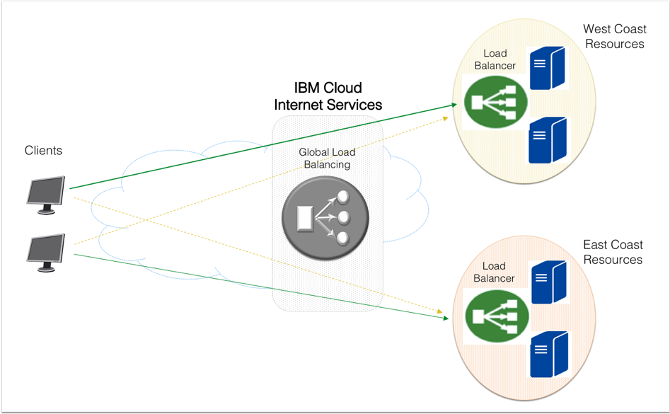

---

copyright:
  years: 2018, 2020
lastupdated: "2020-05-11"

keywords: health checks, origin pools, load balancers, IBM CIS

subcollection: cis

---

{:shortdesc: .shortdesc}
{:new_window: target="_blank"}
{:codeblock: .codeblock}
{:pre: .pre}
{:screen: .screen}
{:term: .term}
{:tip: .tip}
{:note: .note}
{:important: .important}
{:deprecated: .deprecated}
{:external: target="_blank" .external}
{:generic: data-hd-programlang="generic"}
{:download: .download}
{:DomainName: data-hd-keyref="DomainName"}

# Working with global load balancers
{:#set-up-and-configure-your-load-balancers}

{{site.data.keyword.cis_full}} provides global load balancing as a service.
{: shortdesc}

## Global load balancer dashboard
{:#glb-dashboard}

On your dashboard, you'll see three lists that show the [load balancers](#x2788902){: term}, origin pools, and [health checks](#x4571658){: term}. The lists display the new or updated global load balancer or one of its components after you've provisioned or updated it. Initially the lists are empty, and before you create a load balancer you must take a few actions.

Refer to the [Quick setup](#global-load-balancer-quick-setup) if you already know what you need to do!

### Create
{:#create-health-check}

`*` indicates this step is optional
{:note}

1) `*`Create a [health check](#add-a-health-check) by clicking **Create health check**, entering the following information, and then clicking **Create**.
   * **Monitor type**: The protocol to use for the health check.
   * **Path**: The endpoint path to health check against.
   * **Port**: Click the arrow buttons to increase or decrease the port number.
   * **Description**: User provided description.

2) Create a [pool](#add-a-pool), by clicking **Create pool**, entering the following information, and then clicking **Create**.
   * **Name**: User provided name.
   * **Health Check**: Path of the attached health check, if any.
   * **Healthy Origin Threshold**: The number of origins that must be healthy for the pool to be available.
   * **Health check region**: The region of the health check. The available health check regions are based on [the Cloudflare Global Anycast Network](https://www.cloudflare.com/network/){:external}. You can find more details about service disruption and specific locations at their link.
   * **Notification email**: Enter an email address to receive email notifications.
   * **Origins**: Add origins.
     * **Origin name**: Enter an origin name.
     * **Origin address**: Enter an origin address.
     * **Weight**: Assign a weight to your origin.
     * **Enabled/Disabled**: Enable or disable the origin with this toggle. 
  
3) Create a [load balancer](#add-a-load-balancer), by clicking **Create load balancer**, entering the following information, and then clicking **Create**.
   * **Balancer hostname**: Name prepended to the domain name.
   * **Proxy**: Enable or disable proxy traffic flow.
   * **TTL**: Time To Live.
   * **Default origin pools**: List of healthy pools. You can add pools here.
   * **Configure geo routes**: Expand this section if you want to add geo routing to your pools. Click **Add route**, select a region, and click **Add** to define which pools receive load balancing based on the origin of the request.

IBM's geographic regions differ from Cloudflare's regions. For details about the geographic regions Cloudflare uses, see [Load Balancing: Geographic Regions](https://developers.cloudflare.com/load-balancing/understand-basics/traffic-steering/#geo-steering-enterprise-plans-only){:external}.  
{:note}

{{site.data.keyword.cis_short_notm}} does not support load balancer pools that use a private IP address or a record that resolves to a private IP address.
{:tip}

### Edit/Delete
{:#edit-delete-load-balancer}

To edit or delete a load balancer or one of its components click the horizontal overflow menu button  located on the far right side of each row.

The following options are provided for each list.

* Health Check
  * **View health check**: This option shows a short summary of the health check, with a link that takes you to the edit flow.
  * **Edit health check**: This option redirects the user to the edit flow.
  * **Delete health check**: This option brings up the confirmation dialog box for the deletion flow.

* Origin Pools
  * **View pool details**: This option brings up a modal dialog box with information about the pool.
  * **Edit pool**: This option redirects the user to the edit flow.
  * **Delete pool**: This option brings up the confirmation dialog box for the deletion flow.

* Load Balancers
  * **Edit load balancer**: Redirects to the edit flow.
  * **Delete load balancer**: Brings up the confirmation dialog box for the deletion flow.

## Adding a health check
{:#add-a-health-check}

Health checks are optional attachments for origin pools. They use a custom repeating interval to probe for a specific response body, or for a status code, to monitor the pool's health. Once created, health checks can be added to a new or an existing origin pool. Navigate to **Reliability > Global Load Balancer > Health Check Events** to see a table of Health Check Events. You can filter by date, health of the pool or origin, pool name, and origin name by selecting the filter parameters from the list menus. Columns within the table are sortable by clicking on the column name.

Health check fields:
 * **Monitor type**: The protocol to use for the health check (defaults to HTTP)
 * **Path**: The endpoint path against which to perform the health check (defaults to `/`).
 * **Port**: Click the arrow buttons to increase or decrease the port number.
 * **Description**: Health check description.
 
Expand the **Advanced options** section to see more settings.
 * **Test interval**: The interval (in seconds) between each health check. Shorter intervals may improve failover time, but increase load on the origins as checks come from multiple locations (defaults to 60).
 * **Method**: The HTTP method to use for the health check (defaults to GET).
 * **Timeout**: The time (in seconds) before marking the health check as failed (defaults to 5).
 * **Number of retries**: The number of retries to attempt in case of a timeout before marking the origin as unhealthy. Retries are attempted immediately (defaults to 2).
 * **Expected Response Code**: The expected HTTP response code or code range of the health check. This value must be between 200-299 with wildcards denoted by an 'x'.
 * **Response Body**: A case-insensitive sub-string to match against in the response body. If this string is not found, the origin is marked as unhealthy.
 
Expand the **Configure request headers** section to add and configure HTTP request headers to send in the health check. 
It is recommended you set a Host header by default. The `User-Agent` header cannot be overridden.

## Adding a pool
{:#add-a-pool}

At least one pool is required for each provisioned load balancer. Pools group your origins for the load balancer to use.

When creating a pool, two fields are required:
 * **Name**: A short name (tag) for the pool. Only alphanumeric characters, hyphens, and underscores are allowed.
 * **Origins**: The list of origins within this pool. Traffic directed at this pool is balanced across all currently healthy origins, provided the pool itself is healthy.

Additional optional fields:
 * **Health Check**: The health check to use for checking origins within this pool. (defaults to no health check)
 * **Healthy Origin Threshold**: The minimum number of origins that must be healthy for this pool to serve traffic. If the number of healthy origins falls below this number, the pool is marked unhealthy and will fail over to the next available pool. (defaults to 1)
 * **Health check region**: Region from which the health check will perform monitoring.
   IBM's geographic regions differ from Cloudflare's regions. For details about the geographic regions Cloudflare uses, see [Load Balancing: Geographic Regions](https://developers.cloudflare.com/load-balancing/understand-basics/traffic-steering/#geo-steering-enterprise-plans-only){:external}.
   {:note}
 * **Notification Email**: The email address that should receive health status notifications. This address can be an individual mailbox or a mailing list.
 * **Enabled**: Whether to enable (the default) this pool. Disabled pools do not receive traffic and are excluded from health checks. Disabling a pool causes any load balancers using it to failover to the next pool, if any (default to true).
 
## Adding a global load balancer
{:#add-a-load-balancer}

Load balancers help to distribute your proxied traffic across multiple origin pools using a round-robin distribution.

When creating a load balancer, the required fields are:
 * **Balancer hostname**: The DNS hostname to associate with your Load Balancer. If this hostname already exists as a DNS record in IBM's DNS, the Load Balancer takes precedence and the DNS record will not be used.
 * **Default origin pools**: A list of pool IDs. The list is ordered by their failover priority. Pools defined here are used by default, or when region pools are not configured for a given region.

Optionally, the following fields can be configured:
 * **Proxy**: Route traffic through IBM's performance and metrics service.
 * **Session Affinity**: Always route through the same performance and metrics instance. This option is available only if proxy is enabled.
 * **TTL**: Time to live (TTL) of the DNS entry for the IP address returned by this load balancer. This option applies only to unproxied load balancers, otherwise it defaults to `Automatic`.
 * **Geo routes**: A mapping of region or country codes to a list of pools (ordered by their failover priority) for the given region. Any regions not explicitly defined will fall back to using the default pools.

   IBM's geographic regions differ from Cloudflare's regions. For details about the geographic regions Cloudflare uses, see [Load Balancing: Geographic Regions](https://developers.cloudflare.com/load-balancing/understand-basics/traffic-steering/#geo-steering-enterprise-plans-only){:external}.
   {:note}
   
### Global load balancer quick setup
{:#global-load-balancer-quick-setup}

You can directly create pools and health checks from the **Create Load Balancer** menu option. Navigate to **Reliability > Global Load Balancer > Create load balancer > Add pool**, and select the option to **Create New** from the Origin pool list.
{: shortdesc}

Input a pool name, [origins](#x2210603){:term}, and select a health check. You can create a new health check here by choosing **Create New** in the **Health Check** list menu, and entering the information to create the health check.
   
## Demo: Configuring a global load balancer
{:#improving-application-reliability-and-scalability-with-global-load-balancing-from-ibm-cloud-internet-services}

If you have an e-commerce website or are hosting an application that needs to be accessible to your end-users at all times, then you're likely concerned about 24*7 availability and performance of your application.

The global load balancing capabilities available with the {{site.data.keyword.cis_full_notm}} ({{site.data.keyword.cis_short_notm}}) can help improve reliability and scalability of your applications while delivering the best possible end-user experience. This guide provides a walkthrough of the global load balancing configuration.
{:shortdesc}

In this step-by-step demo you will learn how to configure a setup similar to the following illustration.

In this example, the application resources are deployed in two data center locations, one in US West and the other in US East Coast. The end-users may be accessing this application from all over the world.

### Step 1: Create your {{site.data.keyword.cis_short_notm}} instance
{:#create-your-cis-instance}

Begin by creating your {{site.data.keyword.cis_short_notm}} instance using the {{site.data.keyword.cloud_notm}} console. To do so, follow these steps: 

1. From your browser, open the [{{site.data.keyword.cloud_notm}} console](https://{DomainName}/){: new_window} and log into your account.
1. Click **Catalog** in the top navigation menu, and from the **Services** section, check the **Networking** category. Then click the **Internet Services** tile.
1. Choose which plan you want from the list.
1. Specify the name for your service instance, and identify the resource group you’d like to place this service in. The default resource group is `default`. Review the plan summary and click **Create**.

A setup flow appears on the Overview page for a quick review of the service.

### Step 2: Input information about your domain
{:#input-information-about-your-domain}

Input information about the domain you wish to protect and provide global load balancing for.
{: shortdesc}

1. Click **Overview** on the left side navigation menu of the Getting Started screen, and then click **Let's get started**. 
1. Input your Domain Name (or Sub-domain Name) and click **Connect and continue**.
   The IBM Cloud Internet Service is not a DNS registrar, so this domain (or sub-domain) must have been previously created.
   {:note}

   In the **Domain** section, notice that the newly-added domain initially shows as a **Pending** state.    

1. Navigate to the administration page for your domain with your respective DNS registrar, and delegate your domain/sub-domain to IBM name servers by defining NS records.

You might have to wait up to 24 hours for your information to replicate in the DNS database. After it does, your domain state changes to **Active**.

### Step 3: Start configuring your global load balancer
{:#begin-global-load-balancer-configuration}

Start configuring your global load balancer.
{: shortdesc}

1. Navigate to the **Reliability** section to begin working with global load balancers.
2. Scroll to the **Health Checks** section and click **Create health check** to define a custom health check.

   This configuration is optional. If you do not define any custom health checks, the system will use `/` as your default health check path.
   {:note}

3. Provide the path you wish to conduct your health checks on. You may use either HTTP or HTTPS protocols for your health checks.
4. When you expand the **Advanced options** menu, you can customize other parameters, such as the health check interval, the number of retries, the request method and response body.
5. Click **Create** to complete your health check configuration.

### Step 4: Identify your application resources
{:#identify-your-application-resources}

Identify the your application's resources, such as origin pools and health check mechanisms.
{: shortdesc}

1. Navigate to the **Origin Pools** section, and click **Create pool** to define a new origin pool.

   Origin pools are server resources delivering applications to your clients.

2. Assign a name to your Origin Pool, and select the health check mechanism defined earlier. Add your application server as your Origin. You may add one or more Origins by clicking **Add Origin**.

   If your application servers are sitting behind a local load balancer such as an IBM Cloud Load Balancer, then add your load balancer’s FQDN or virtual IP as your Origin instead of adding your individual servers.
   {:note}

3. Click **Create** to complete the creation of your Origin Pool.  

   The Origin Pool initially appears as **Unhealthy**. This state changes to **Healthy** after a successful health check by the system. You might need to refresh your browser to see the state change.

   If you have multiple origins within your origin pool, then use the healthy origin threshold to specify the minimum number of origins that must be healthy before declaring the pool healthy.
   {:note}

4. Define as many origin pools as the number of application farms you have. These farms may be within the same or different
geographic regions. In our example, we create two origin pools representing an application farm in the United States west and east coasts.

### Step 5: Define the global load balancer
{:#define-the-global-load-balancer}

Define your global load balancer configuration by specifying a hostname, adding and adjusting your origin pools and defining additional rules to control how traffic is served to clients.
{: shortdesc}

1. Create your global load balancer by clicking **Create load balancer**.  

2. Specify the hostname for your domain, and adjust the TTL value if desired (the default is 60 seconds) and use **Add Pool** to add your Origin Pools.

   Hostnames combined with Domain names form fully-qualified domain names (FQDN) for your application. Your end-users connect to your application using this FQDN.
   {:note}

3. Adjust the relative priorities of your origin pools by clicking the up and down arrows in the Priority column. The application requests from end-users are serviced in round-robin fashion by these origin pools. 

4. Optionally, you can define additional rules to control how traffic is served to clients from different geographical regions. You can use these rules to direct clients to their closet possible region. If any of these region fails, then the requests are routed to other available healthy locations, so that end-users are not affected by downtime. 

5. Click **Provision Resources** to complete the configuration of your global load balancer.
6. Finally, verify connectivity to your application by typing `FQDN URL` in a mobile browser window. If the connection is successful, a welcome message appears.

