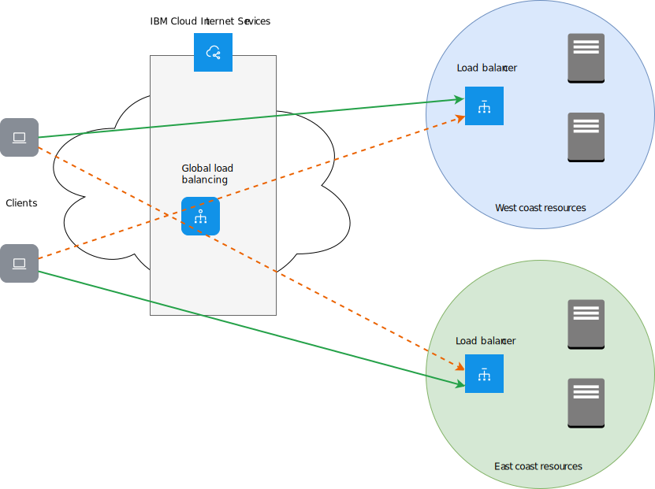

---

copyright:
  years: 2018, 2026
lastupdated: "2026-02-25"

keywords:

subcollection: cis

---

{{site.data.keyword.attribute-definition-list}}

# Creating global load balancers
{: #configure-glb}

If you have an e-commerce website, or are hosting an application that must always be accessible to your users, then you're likely concerned about 24 x 7 availability and performance of your application.

The global load-balancing capabilities available with {{site.data.keyword.cis_full_notm}} ({{site.data.keyword.cis_short_notm}}) can help improve reliability and scalability of your applications while delivering the best possible user experience.
{: shortdesc}

You can configure a global load balancer by using the console, CLI, or API.

## Before you begin
{: before-you-create-glbs}

* Provision a {{site.data.keyword.cis_short_notm}} instance.
* Configure your domain in {{site.data.keyword.cis_short_notm}}.
* Identify the IP addresses or FQDNs of your application origins.

{{site.data.keyword.cis_short_notm}} can support load balancer pools that use a private IP address. However, for these private IP pools, you cannot use proxy services or health checks; only DNS-based load balancing is supported. For pools with public IPs, health checks can be configured as described in the following procedure (step 1).
{: important}

## Quick setup
{: #quick-setup}
{: ui}

If you already know your pools and health checks, you can create them inline while creating a load balancer:

1. Navigate to **Reliability > Global Load Balancer > Create Load Balancer > Add Pool**.
1. Select **Create New** from the Origin Pool list.
1. Input a pool name, origins, and select a health check.
1. You can create a new health check here by choosing **Create New** in the Health Check list menu and entering the information to create the health check.

This is a shortcut for advanced users. The following steps provide the full procedure for creating health checks, pools, and the global load balancer.

## Configuring a global load balancer in the console
{: #configure-load-bal-ui}
{: ui}

On the CIS console, you'll see three lists that show the [load balancers](#x2788902){: term}, origin pools, and [health checks](#x4571658){: term}. The lists display the new or updated global load balancer, or one of its components after you've provisioned or updated it.

In the following step-by-step procedure, learn how to configure a setup similar to the following diagram:

{: caption="Diagram of global load balancer example" caption-side="bottom"}

In this example, the application resources are deployed in two data center locations, one in US West and the other in US East. Users might be accessing this application from all over the world.

To create and configure a global load balancer in the console, follow these steps:

### Step 1: Create a health check (Optional)
{: #create-health-check}

Health checks are optional attachments for origin pools. They use a custom repeating interval to probe for a specific response body, or for a status code, to monitor the pool's health. After you create a health check, you can add it to a new or existing origin pool.

If you do not define any custom health checks, the system uses `/` as your default health check path.
{: note}

1. Navigate to **Reliability > Health Checks**.
1. Click **Create health check**.
1. Configure the following fields:

   * **Monitor type**: The protocol to use for the health check (defaults to `HTTP`).
   * **Path**: The endpoint path against which to perform the health check (defaults to `/`).
   * **Port**: Click the arrow buttons to increase or decrease the port number.
   * **Description**: Optional health check description.

1. Expand **Advanced options** to configure:

   * **Test interval**: The interval (in seconds) between each health check. Shorter intervals can improve failover time, but increase load on the origins as checks come from multiple locations (default: 60).
   * **Method**: The HTTP method to use for the health check (default: `GET`).
   * **Timeout**: The time (in seconds) before marking the health check as failed (default: 5).
   * **Number of retries**: The number of retries to attempt in case of a timeout before marking the origin as unhealthy. Retries are attempted immediately (default: 2).
   * **Expected Response Code**: The expected HTTP response code or code range of the health check. This value must be between 200-299 with wildcards denoted by an `x`.
   * **Response Body**: A case-insensitive sub-string to match against in the response body. If this string is not found, the origin is marked as unhealthy.

1. Expand **Configure request headers** to add and configure HTTP request headers to send in the health check.

   It is recommended that you set a Host header by default. The `User-Agent` header can't be overridden.

1. Click **Create** to complete your health check configuration.

To see health check events, navigate to
**Reliability > Global Load Balancer > Health Check Events**. You can filter by date, health of the pool or origin, pool name, and origin name.

## Step 2: Create an origin pool
{: #create-origin-pool-glb}

At least one pool is required for each provisioned load balancer. Pools group your origins for the load balancer to use.

1. Navigate to **Reliability > Origin Pools**.
1. Click **Create pool**.
1. Configure the required fields:

   * **Name**: A short name (tag) for the pool. Only alphanumeric characters, hyphens, and underscores are allowed.
   * **Origins**: The list of origins within this pool. Traffic directed at this pool is balanced across all currently healthy origins, provided the pool itself is healthy.

   If your application servers are sitting behind a local load balancer, such as an {{site.data.keyword.cloud_notm}} load balancer, then add your load balancer’s FQDN or virtual IP as your origin instead of adding your individual servers.
   {: note}

1. Configure optional fields as needed:

   * **Health Check**: The health check to use for checking origins within this pool. (defaults to no health check)
   * **Healthy Origin Threshold**: The minimum number of origins that must be healthy for this pool to serve traffic. If the number of healthy origins falls below this number, the pool is marked unhealthy and fails over to the next available pool. (defaults to 1)
   * **Health check region**: Region from which the health check performs monitoring.

     IBM's geographic regions differ from Cloudflare's regions. For details about the geographic regions Cloudflare uses, see "Geo Steering" in [Traffic steering](https://developers.cloudflare.com/load-balancing/understand-basics/traffic-steering/steering-policies/geo-steering/){: external}.
     {: note}

   * **Enabled**: Whether to enable this pool (default: true). Disabled pools do not receive traffic and are excluded from health checks. Disabling a pool causes any load balancers using it to failover to the next pool, if any (default to true).

1. Click **Create** to complete origin pool configuration.

The origin pool initially appears as **Unhealthy**. This state changes to **Healthy** after a successful health check by the system. You might need to refresh your browser to see the state change.
{: note}

Define as many origin pools as the number of application farms that you have. These farms might be within the same or different geographic regions.

### Step 3: Configure the global load balancer
{: #global-load-balancer-configuration}

Load balancers help to distribute your proxied traffic across multiple origin pools using a round-robin distribution.

1. Navigate to **Reliability > Global Load Balancer**.
1. Click **Create load balancer**.
1. Configure the required fields:

   * **Balancer hostname**: The DNS hostname to associate with your load balancer. If this hostname already exists as a DNS record in IBM's DNS, the load balancer takes precedence and the DNS record is not used.
   * **Default origin pools**: A list of pool IDs. The list is ordered by their failover priority. Pools defined here are used by default, or when region pools are not configured for a given region.

1. Configure optional fields as needed:

   * **Proxy**: Route traffic through IBM's performance and metrics service.
   * **Session Affinity**: Always route through the same performance and metrics instance. This option is available only if proxy is enabled.
   * **TTL**: Time-to-live (TTL) of the DNS entry for the IP address returned by this load balancer. This option applies only to unproxied load balancer; otherwise, it defaults to `Automatic`.
   * **Geo routes**: A mapping of region or country codes to a list of pools (ordered by their failover priority) for the given region. Any regions not explicitly defined fall back to using the default pools.

     IBM's geographic regions differ from Cloudflare's regions. For details about the geographic regions Cloudflare uses, see "Geo Steering" in [Traffic steering](https://developers.cloudflare.com/load-balancing/understand-basics/traffic-steering/steering-policies/geo-steering/){: external}.
     {: note}

1. Click **Create** to complete the global load balancer configuration.

### Step 4: Verify connectivity
{: #global-load-balancer-verify-connectivity}

Finally, verify connectivity to your application by trying to connect to the FQDN URL from a browser.

### Editing or deleting global load balancers in the console
{: #edit-delete-load-balancer-console}

To edit or delete a load balancer, or one of its components, click the Actions menu  located on the right of the row, and select the action you want to take from the list.
