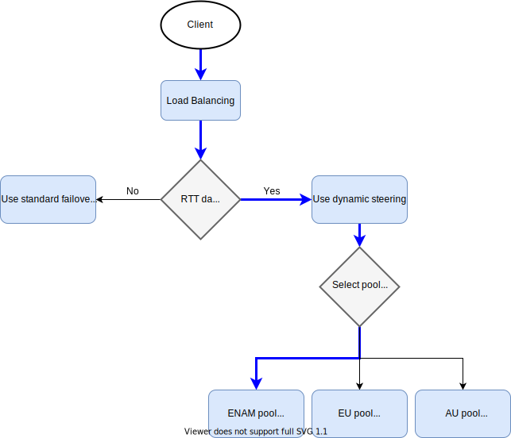

---

copyright:
  years: 2020
lastupdated: "2020-10-30"

keywords:

subcollection: cis

---

{:shortdesc: .shortdesc}
{:new_window: target="_blank"}
{:codeblock: .codeblock}
{:pre: .pre}
{:screen: .screen}
{:term: .term}
{:tip: .tip}
{:note: .note}
{:important: .important}
{:deprecated: .deprecated}
{:external: target="_blank" .external}
{:generic: data-hd-programlang="generic"}
{:download: .download}
{:DomainName: data-hd-keyref="DomainName"}

# Optimizing traffic steering
{: #traffic-steering}

Load balancing provides several traffic steering modes, which allow customers to optimize how load balancers route traffic. 
{: shortdesc}

You can configure traffic steering from the load balancing dashboard, in the **Edit Load Balancer** panel. You can also configure traffic steering via the {{site.data.keyword.cis_short_notm}} API. Available steering options include standard failover (steering disabled), dynamic steering, and geo steering.

## Standard failover
{: #standard-failover}

Standard failover directs traffic from unhealthy pools to the next healthy pool in the configuration, using the pool order to determine failover priority (the failover order).

If all pools are marked unhealthy, the load balancer directs traffic to the fallback pool. The default fallback pool is the last pool listed in the load balancer configuration.

To nominate a specific fallback pool through the {{site.data.keyword.cis_short_notm}} API, use the **Update Load Balancers** command and set the `fallback_pool` parameter. If no monitors are attached to the load balancer, it directs traffic to the primary pool exclusively.

## Dynamic steering
{: #dynamic-steering}

Dynamic steering uses health check data to identify the fastest pool for a {{site.data.keyword.cis_short_notm}} region or point of presence (PoP).

Dynamic steering creates Round Trip Time (RTT) profiles based on an exponential weighted moving average (EWMA) of RTT to determine the fastest pool. If there is no current RTT data for your pool in a region or colocation center, {{site.data.keyword.cis_short_notm}} directs traffic to the pools in failover order.

Allow 10 minutes for {{site.data.keyword.cis_short_notm}} to build an RTT profile the first time you enable dynamic steering for a server pool.

If you are terminating TCP at a cloud provider edge location, the calculated latency might not reflect the true latency to the origin for TCP health checks.

The following diagram shows how {{site.data.keyword.cis_short_notm}} routes traffic to the pool with the lowest EWMA among three regions: Eastern North America, Europe, and Australia. In this case, the ENAM pool is selected, because it has the lowest RTT.

{: caption="Figure 1. Traffic steering in {{site.data.keyword.cis_short_notm}}" caption-side="top"}

## Geo Steering
{: #geo-steering}

Geo steering directs traffic to pools based on the client’s region or PoP. Only domains on Enterprise plans can perform geo steering by PoP. Users specify the pools to which the load balancer directs traffic for a geographical region or PoP. You can assign multiple pools to the same region, and the load balancer uses them in failover order. If there is no configuration for a region or pool, the load balancer uses the default failover order.

Our partners at Cloudflare have 13 geographic regions. The region of a client is determined by the region of the Cloudflare data center that answers the client’s DNS query. These regions are listed in the following table, along with their region codes.

|Region Code| Region|
|----|----|----|
|WNAM|Western North America|
|ENAM|Eastern North America|
|WEU|Western Europe|
|EEU|Eastern Europe|
|NSAM|Northern South America|
|SSAM|Southern South America|
|OC|Oceania|
|ME|Middle East|
|NAF|Northern Africa|
|SAF|Southern Africa|
|SAS|Southern Asia|
|SEAS|Southeast Asia|
|NEAS|Northeast Asia|
{: caption="Table 1. Geographic regions and codes" caption-side="bottom"}
