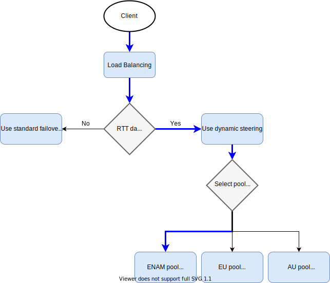

---

copyright:
  years: 2020, 2026
lastupdated: "2026-06-05"

keywords:

subcollection: cis

---

{{site.data.keyword.attribute-definition-list}}

# Configuring traffic steering 
{: #traffic-steering}

Load balancing provides several traffic steering modes, which allow customers to optimize how load balancers route traffic.
{: shortdesc}

You can configure traffic steering from the load balancing dashboard, in the **Edit Load Balancer** panel. You can also configure traffic steering via the {{site.data.keyword.cis_short_notm}} API. Available steering options include standard failover (steering disabled), dynamic steering, and geo steering.

## Standard failover
{: #standard-failover}

Failover (Off) routes traffic to the highest-priority healthy pool. When a pool becomes unhealthy, traffic fails over to the next healthy pool according to pool priority.

If all primary pools become unhealthy, traffic is directed to the configured fallback pool.

In this mode:

* Traffic is sent to the highest-priority healthy pool.
* Lower-priority pools are used only when higher-priority pools become unhealthy.
* The fallback pool receives traffic only when all other pools are unhealthy.

This configuration is useful when you want strict active-passive failover behavior.

## Dynamic steering
{: #dynamic-steering}

Dynamic steering uses health check data to identify the fastest pool for a {{site.data.keyword.cis_short_notm}} region or point of presence (PoP).

Dynamic steering creates Round Trip Time (RTT) profiles based on an exponential weighted moving average (EWMA) of RTT to determine the fastest pool. If there is no current RTT data for your pool in a region or colocation center, {{site.data.keyword.cis_short_notm}} directs traffic to the pools in failover order.

Allow 10 minutes for {{site.data.keyword.cis_short_notm}} to build an RTT profile the first time you enable dynamic steering for a server pool.

If you are terminating TCP at a cloud provider edge location, the calculated latency might not reflect the true latency to the origin for TCP health checks.

The following diagram shows how {{site.data.keyword.cis_short_notm}} routes traffic to the pool with the lowest EWMA among three regions: Eastern North America, Europe, and Australia. In this case, the ENAM pool is selected, because it has the lowest RTT.

{: caption="Traffic steering in {{site.data.keyword.cis_short_notm}}" caption-side="bottom"}

## Geo steering
{: #geo-steering}

Geo steering directs traffic to pools based on the client’s region or PoP. Only domains on Enterprise plans can perform geo steering by PoP. Users specify the pools to which the load balancer directs traffic for a geographical region or PoP. You can assign multiple pools to the same region, and the load balancer uses them in failover order. If there is no configuration for a region or pool, the load balancer uses the default failover order.

Cloudflare defines 13 geographic regions for geo steering. The region of a client is determined by the region of the Cloudflare data center that answers the client’s DNS query. These regions are listed in the following table, along with their region codes.

|Region Code|Region|
|----|----|
|WNAM|Western North America|
|ENAM|Eastern North America|
|WEU|Western Europe|
|EEU|Eastern Europe|
|NSAM|Northern South America|
|SSAM|Southern South America|
|OC|Oceania|
|ME|Middle East|
|NAF|Northern Africa|
|SAF|Southern Africa|
|SAS|Southern Asia|
|SEAS|Southeast Asia|
|NEAS|Northeast Asia|
{: caption="Geographic regions and codes" caption-side="bottom"}

## Traffic steering modes and fallback behavior
{: #traffic-steering-fallback}

Traffic steering determines how incoming traffic is distributed across origin pools. The selected steering mode affects how healthy pools and fallback pools are used during request routing.

The following table describes how traffic is routed for each steering mode and how fallback pools participate in traffic distribution.

| Traffic steering mode | Traffic distribution behavior | Fallback pool behavior |
| --------------------- | ----------------------------- | ----------------------- |
| Failover (Off) | Traffic is routed to the highest-priority healthy pool. Lower-priority pools are used only if higher-priority pools become unhealthy. | The fallback pool receives traffic only when all higher-priority pools are unhealthy. |
| Random | Traffic is distributed randomly across healthy pools. | The fallback pool receives traffic even when other pools are healthy. |
| Dynamic | Traffic is routed to the pool with the best observed latency. | The fallback pool participates in traffic steering when it is healthy. |
| Geo steering | Traffic is routed according to the configured regional or PoP mapping. | The fallback pool participates in traffic steering when it is healthy. |
{: caption="Traffic steering modes and fallback behavior" caption-side-"bottom"}

### Example: fallback pool behavior
{: #example-fallback-pool-behavior}

You configure the following pools:

| Pool | Priority | Purpose |
| --- | --- | --- |
| `Pool A` | 1 | Primary application |
| `Pool B` | 2 | Maintenance page (fallback pool) |
{: caption="Fallback pool example" caption-side="bottom"}

Behavior depends on the selected traffic steering mode:

* If traffic steering is set to `Random`, traffic can be routed to `Pool B` even when `Pool A` is healthy.
* If traffic steering is set to `Failover (Off)`, traffic is routed to `Pool B` only when `Pool A` becomes unhealthy.

With Random steering, the maintenance page can receive production traffic even when Pool A is healthy.

This behavior makes sure that the selected steering mode aligns with your availability and traffic distribution requirements.
