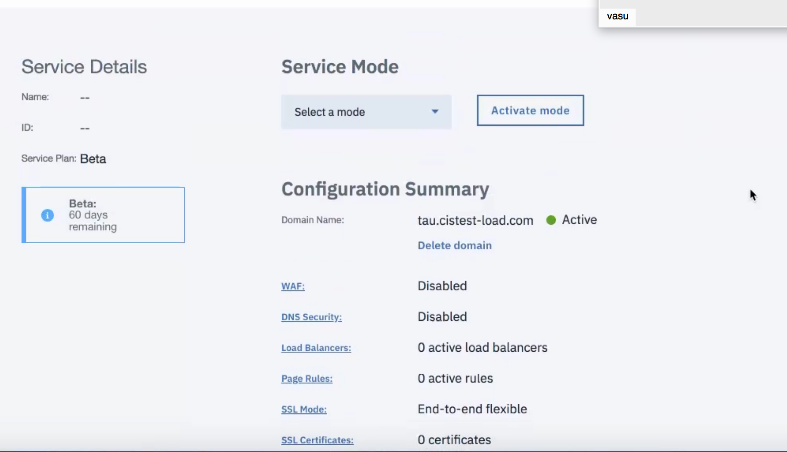
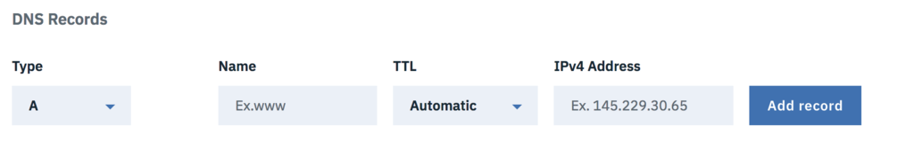
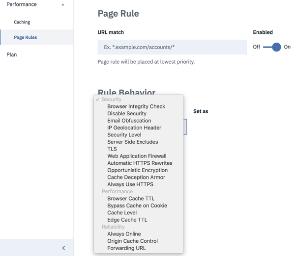
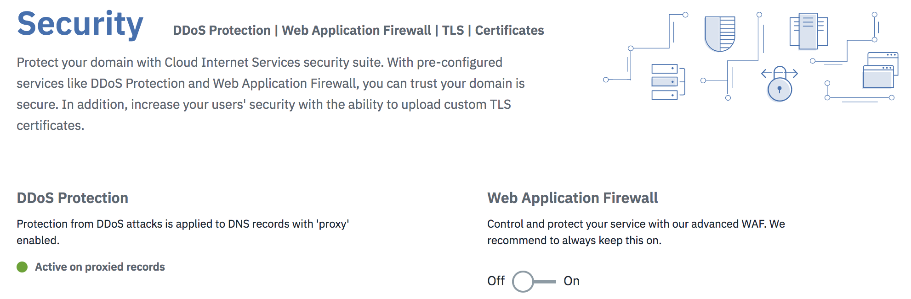
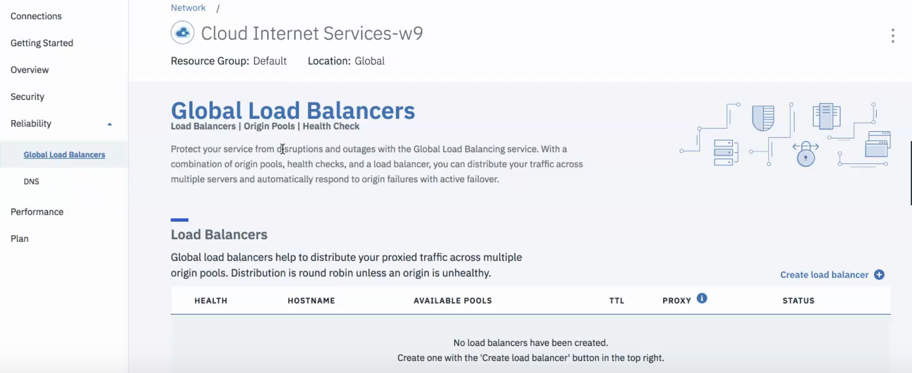
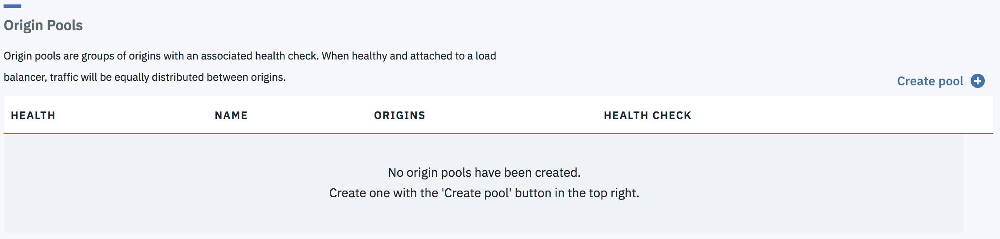
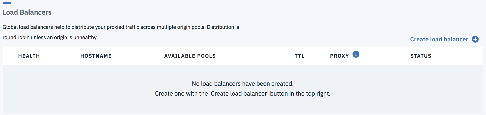

---
copyright:
  years: 2018
lastupdated: "2018-03-17"
---

{:shortdesc: .shortdesc}
{:new_window: target="_blank"}

# Manage your IBM Cloud Internet Services (CIS) deployment

You'll begin by using the Overview screen as your working base of operations. It shows all of the current parameters for your deployment.

Once you've set up your DNS and configured it, you are ready to go!

## Using the Overview screen

Using  the Overview screen, you can see the status of all your selections. You can change the settings directly from the Overview screen, just click on the underlined name of the setting you'd like to change, for example, you could click on the `Load Balancers` field to add a Load Balancer.

On the Overview screen, you may see that your domain name configuration is in **Pending** status, or in **Active** status as shown in the following figure.

## Configuring and managing your DNS

Go to your DNS page and add a record (most likely an A record). Type in the information about your DNS record and then click `Add record` to implement your changes.

## Set up and manage your caching

Next, you can set up caching. 

You have the option of 3 types of caching, available from the caching screen dropdown menu: 

 * No query string :  Only delivers resources from cache when there is no query string.
 * Query string independent : Delivers the same resource to everyone independent of the query string. (Note: The **Ignore Query String** setting applies only to static file extensions. This setting removes the query string when generating the cache key, so that a request for `style.css?something` is normalized to `style.css` when serving from the cache.)
 * Query string dependent : Delivers a different resource each time the query string changes.
  
## Purge Cache
 
You can purge your cache to prepare for updates at any time, just by entering the URL into the purge cache field. You can purge a single file or multiple files (up to 30 at a time).
 
 ## Browser Expiration
 
You can use the dropdown menu to select the time of browser expiration that you require, for example 8 hours, or 1 day.
 
 ## Using Development Mode
 
**Development mode** is intended for use when major updates or new file uploads are required, or any time you do not want the end users to work from the cache at all, but to retrieve files directly from the origin servers. To begin using **Development Mode**, toggle the switch to `Enabled` position. To stop using **Development Mode**, toggle the switch to `Disabled` position. **Development mode** expires automatically after 3 hours. 

## Managing your Page Rules
 
You can enable up to 50 Page Rules. Use the dropdown menus to configure the Page Rule. The rule settings are divided into three categories: **Security**, **Performance**, and **Reliability**.

Notice that when certain rules are enabled, other options become grayed out, if those options are in conflict with the other rules you've just selected. After you've selected the Page Rules you desire, click **Provision** to enable them. The new rules take effect immediately, and they can be viewed immediately on the Page Rules screen.
 
 
 
You also can enable or disable your Page Rules from the table displayed in the Page Rules screen. See [Using Page Rules](using-page-rules.html) for more information.
 
 ## Security settings
 
By default, DDoS protection is enabled for any DNS records with proxy on, which can be done from the **Records** table on the DNS page. Turn on WAF using the toggle. When you toggle the rules on or off, the changes are applied immediately.

## Certificates

When you deploy into a Zone, IBM CIS automatically deploys a universal certificate for that zone. Thus, you don't need to do anything to have certificate-based protection in that zone. If you desire, you can upload your own certificate. You'll need a separate certificate for each zone, and you'll see an error message if the certificate you are uploading does not match your zone.

 
 ## Set up and configure your load balancers
 
 IBM CIS provides global load balancing as a service.

### GLB Dashboard
On your dashboard, you'll see three lists that show the load balancers, origin pools, and health checks. The lists display the new or updated global load balancer or one of its components after you've provisioned or updated it. Initially the lists are empty, and before you create a load balancer you must take a few actions.

#### Create
**Note**: `*` indicates this step is optional

1) `*`Create a health check, click "Create health check".
  
    <ul>
      <li>* **Path**: The endpoint path to health check against.</li> 
      <li>* **Type**: The protocol to use for the health check.</li>
      <li>* **Description**: User provided description.</li>
    </ul>

2) Create a pool, click "Create pool". 
  
    <ul>
      <li>* **Health**: Status of the pool.</li>
      <li>* **Name**: User provided name.</li>
      <li>* **Origins**: Count of healthy origins in the pool.</li>
      <li>* **Health Check**: Path of the attached health check, if any.</li>
    </ul>

3) Create a load balancer, click "Create load balancer".
  
    <ul>
      <li>* **Health**: Status of the load balancer.</li>
      <li>* **Hostname**: Name prepended to the domain name.</li>
      <li>* **Available Pools**: Count of healthy pools.</li>
      <li>* **TTL**: Time To Live.</li>
      <li>* **Proxy**: Enable or disable proxy traffic flow.</li>
      <li>* **Status**: Enable or disable the load balancer.</li>
    </ul>

#### Edit/Delete
To edit or delete a load balancer or one of its components click the overflow menu button located on the far right of each row.

Overflow menu button:

The following options are provided for each list.

* Health Check
    * **Edit health check**: This option redirects the user to the edit flow. 
    * **Delete health check**: This option brings up the confirmation dialog box for the deletion flow.

* Pool
    * **View pool details**: This option brings up a modal dialog box with information about the pool.
    * **Edit pool**: This option redirects the user to the edit flow.
    * **Delete pool**: This option brings up the confirmation dialog box for the deletion flow.

* Load Balancer
    * **Disable/Enable**: Enable or disable a load balancer.
    * **Edit load balancer**: Redirects to the edit flow. 
    * **Delete load balancer**: Brings up the confirmation dialog box for the deletion flow.

### Add a Health Check

Health checks are optional attachments for origin pools. They use a custom repeating interval to probe for a specific response body, or for a status code, to monitor the pool's health. Once created, health checks can be added to a new or an existing origin pool.

When creating a health check, only one field is required:
 * **Reponse Code**: The expected HTTP response code or code range of the health check. This value must be between 200-299 with wildcards denoted by an 'x'.

Additional optional fields:
 * **Path**: The endpoint path against which to perform the health check (defaults to /).
 * **Type**: The protocol to use for the health check (defaults to HTTP).
 * **Description**: Health check description.
 * **Interval**: The interval (in seconds) between each health check. Shorter intervals may improve failover time, but increase load on the origins as checks come from multiple locations (defaults to 60).
 * **Method**: The HTTP method to use for the health check (defaults to GET).
 * **Timeout**: The time (in seconds) before marking the health check as failed (defaults to 5).
 * **Retries**: The number of retries to attempt in case of a timeout before marking the origin as unhealthy. Retries are attempted immediately (defaults to 2).
 * **Response Body**: A case-insensitive sub-string to match against in the response body. If this string is not found, the origin is marked as unhealthy.
 * **Request Headers**: The HTTP request headers to send in the health check. It is recommended you set a Host header by default. The `User-Agent` header cannot be overridden.

### Add a Pool

At least one pool is required for each provisioned load balancer. Pools group your origins for the load balancer to use.

When creating a pool, two fields are required:
 * **Name**: A short name (tag) for the pool. Only alphanumeric characters, hyphens, and underscores are allowed.
 * **Origins**: The list of origins within this pool. Traffic directed at this pool is balanced across all currently healthy origins, provided the pool itself is healthy.

Additional optional fields:
 * **Description**: A human-readable description of the pool.
 * **Enabled**: Whether to enable (the default) this pool. Disabled pools do not receive traffic and are excluded from health checks. Disabling a pool causes any load balancers using it to failover to the next pool, if any (default to true).
 * **Healthy Origin Threshold**: The minimum number of origins that must be healthy for this pool to serve traffic. If the number of healthy origins falls below this number, the pool is marked unhealthy and will fail over to the next available pool. (defaults to 1)
 * **Health Check Regions**: Region from which the health check will perform monitoring.
 * **Health Check**: The health check to use for checking origins within this pool. (defaults to no health check)
 * **Notification Email**: The email address that should receive health status notifications. This address can be an individual mailbox or a mailing list.

 ### Add a Load Balancer

Load balancers help to distribute your proxied traffic across multiple origin pools using a round-robin distribution.

When creating a load balancer, the required fields are:
 * **Name**: The DNS hostname to associate with your Load Balancer. If this hostname already exists as a DNS record in IBM's DNS, the Load Balancer takes precedence and the DNS record will not be used.
 * **Default Pools**: A list of pool IDs. The list is ordered by their failover priority. Pools defined here are used by default, or when region pools are not configured for a given region.

Optionally, the following fields can be configured:
 * **Proxy**: Route traffic through IBM's performance and metrics service.
 * **Session Affinity**: Always route through the same performance and metrics instance. This option is available only if proxy is enabled.
 * **TTL**: Time to live (TTL) of the DNS entry for the IP address returned by this load balancer. This option  applies only to unproxied load balancers, otherwise it defaults to `Automatic`.
 * **Region Pools**: A mapping of region or country codes to a list of pools (ordered by their failover priority) for the given region. Any regions not explicitly defined will fall back to using the default pools.
