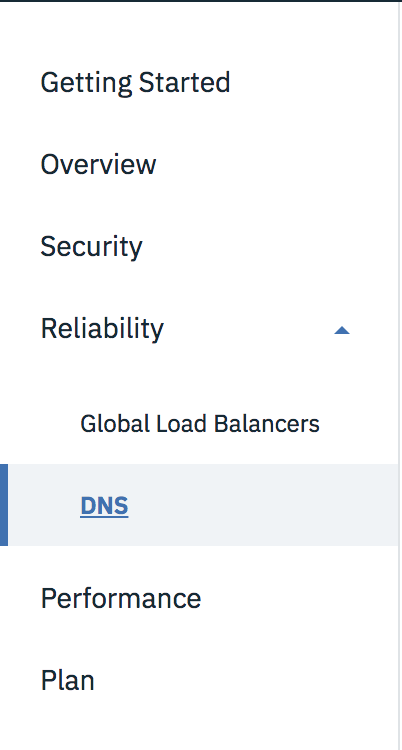

---
copyright:
  years: 2018
lastupdated: "2018-04-23"
---

{:shortdesc: .shortdesc}
{:new_window: target="_blank"}

# Manage your IBM CIS deployment for optimal reliability

To achieve optimal reliability for your IBM CIS deployment, you can set up a helpful DNS configuration and you can set up Global Load Balancers. For additional reliability, you can use our Page Rules to be sure that your web content is delivered to your customers, even if your origin server or the cache has a problem. This document gives details about some best practices for making your IBM CIS deployment optimally reliable.

Generally, our recommended best practices are these:

 * Set up your DNS to take advantage of IBM CIS proxy servers and other features
 * Use one or more Global Load Balancers to distribute your site traffic evenly
 * Set up appropriate Page Rules to manage your caching and other options

Each of these items provides certain functionality you can use to create a more reliable CIS deployment.

Notice that the CIS interface is organized into sections for *security*, *reliability*, and *perfomance*. The main navigation menu is shown in the following figure, with the Global Load Balancers and DNS menu items revealed:




## Setting up DNS
 
 To get started setting up your DNS configuration, select **DNS** from the navigation menu, as shown previously.
 
 For detailed information about setting up and managing your DNS for reliability, please [refer to this document](dns.html#setting-up-your-domain-name-system-dns-for-ibm-cis).


## Setting up Global Load Balancers


To get started setting up your Global Load Balancers, select **Global Load Balancers** from the navigation menu.

For detailed information about setting up and managing your Global Load Balancers, please [refer to this document](glb.html#global-load-balancer-glb-concepts).

## Using Page Rules to increase reliability

Here are some recommended Page Rule settings to give your site maximum reliability:

 * Serve Stale Content
 * Origin Cache Control
 * Forwarding URL

## Serve Stale Content

You can use the **Serve Stale Content** Page Rule setting to keep a limited version of your site online if your server goes down.

With **Serve Stale Content**, when your server goes down, IBM CIS serves pages from our cache, so your visitors still see some of the pages they are trying to visit. Your visitors see a message at the top of the page telling them that they are in offline browsing mode. Serve Stale Content returns an HTTP status 503, however, 503 is also used by many other web applications. When your server comes back online, IBM CIS will bump users back to regular browsing seamlessly.

If IBM CIS does not have the requested page in its cache, your visitor sees an error page letting them know that the website page they are requesting is offline.

### How to set up Serve Stale Content

To enable **Serve Stale Content**, follow these steps:

 * Use the navigation menu to select Page Rules under Performance.
 * Create a Page Rule with the URL pattern of your domain.
 * Add the **Serve Stale Content** setting with the toggle on.
 * Select Provision Resource.

### Limitations of Serve Stale Content

 * **Serve Stale Content** caches the first 10 links from your root HTML, then just the first links from each of those pages, and finally the first links from each of those subsequent pages. This means that only some pages on your site are viewable when your origin server goes down.

 * Recently added sites don't have a large cache of their site available, which means that **Serve Stale Content** may not work if you only added the site a few days ago.

 * CIS does not show private content or handle form submission (POSTs) if your server is down. Visitors are shown an `error on checkout` page or `items require a login to view`.

 * To trigger **Serve Stale Content**, your web server must be returning a standard HTTP Error code of 502 or 504 timeout. Serve Stale Content also works when we encounter issues contacting your origin (Errors 521 & 523), timeouts (522 & 524), SSL errors (525 & 526) or an unknown error (520). **Serve Stale Content** is not triggered for other HTTP response codes, such as 404s, 500, 503, database connection errors, internal server error, or empty replies from server.

 * **Serve Stale Content** does not work if a "Cache Everything" page rule is enabled with the "Edge Cache Expire TTL" lower than the caching frequency, because the "Edge Cache Expire TTL" causes the **Serve Stale Content** cache to be purged in the corresponding interval.

## Origin Cache Control

You can use the **Origin Cache Control** Page Rule setting to determine what content is cached from your origin and how often the content is updated, which has an effect on reliability and on performance. By default, if no settings are changed and no headers that prevent caching are sent from your origin server, IBM CIS caches all static content with certain extensions. These types of content include images, CSS, and JavaScript. This caching is primarily for performance reasons.

To set up **Origin Cache Control** use Page Rules to turn on specific headers that give the desired behavior with respect to each resource of your content. To understand how to use **Origin Cache Conrol**, some more general explanation of Page Rules and overall caching behavior for CIS is required to provide context, which is covered in the next several sections. Three methods exist that you can use to control caching in general, and **Origin Cache Control** is the second one.

Setting **Origin Cache Control** invokes caching rules that seek to adhere closely to internet best practices and RFCs, primarily with respect to revalidation. For example, the CIS default behavior with `max-age=0` is not to cache at all, whereas setting **Origin Cache Control** caches, but it always revalidates.

### How to set up Origin Cache Control

 * Use the navigation menu to select Page Rules under Performance.
 * Create a Page Rule with the URL pattern that references your domain.
 * Add the **Origin Cache Control** setting with the toggle on.
 * Select Provision Resource.

### Page Rule precedence

Two specific Page Rules take precedence for caching overall:

 * If a Page Rule has **Cache Level** set to `Bypass`, the resources that match that Page Rule are not cached. IBM CIS still acts as a proxy, and our other performance features remain active. However, your content is fetched from your origin server directly, instead of served from our cache.

 * If a Page Rule has **Cache Level** set to `Cache everything`, resources that match the Page Rule are cached. **Using this Page Rule setting is the only way to tell us to cache resources beyond what we consider static, including HTML.**

If no Page Rule is set, we use the `Standard` caching mode, which is based the extension of the resource. We cache static resources only.

### Origin cache-control headers

The second way to alter what IBM CIS caches is through caching headers sent from the origin. CIS respects these settings, but you can override them by specifying an **Edge Cache TTL** Page Rule setting. Here are the headers we consider when deciding what resources to cache from your origin:

 * If the **Cache-Control** header is set to `private`, `no-store`, `no-cache`,  or `max-age=0`, or if there is a cookie in the response, then IBM CIS will not cache the resource. Note that sensitive material should not be cached, so you might consider using one of these headers in that case.

 * If the **Cache-Control** header is set to `public` and the `max-age` is greater than 0, or if the `Expires` headers are set any time in the future, we will cache the resource.

**Note:** As per RFC rules, `Cache-Control: max-age` trumps `Expires` headers. If we see both and they do not agree, `max-age` wins.

### Using the 's-maxage' header

The third way to control caching behavior and browser caching behavior together is by using the `s-maxage` Cache-Control header.

Normally we respect the `max-age` directive:

`Cache-Control: max-age=1000`

But if you want to specify a cache timeout that's different from the browser, we can use `s-maxage`. Here's an example that tells IBM CIS to cache the object for 200 seconds and the browser to cache the object for 60 seconds.

`Cache-Control: s-maxage=200, max-age=60`

Basically `s-maxage` is intended to be followed ONLY by reverse proxies (so the browser should ignore it) whilst on the other hand we (IBM CIS) give priority to `s-maxage` if it is present. We respect whichever value is higher: the browser cache setting or the `max-age` header.

### Summary on cache control headers and Page Rules for reliability

To sum up, here are some main areas to consider for reliability with regard to caching:

 * Check your origin's caching headers to make sure there are no overriding headers for cacheable resources (`Cache-Control` and `Expires`).

 * CIS always caches static content by default, with the following TTL depending on the return code:

```
200 301    120m;
302 303    20m;
403        5m; for reliability
404        5m;
any        0s;
```

 * To cache more, create a Page Rule with **Cache Level** set to `Cache everything` on the desired URL (if your webserver returns a 404 when requesting this URL, we will cache this result for 5m only).

 * To avoid caching on a URL, create a Page Rule with **Cache Level** set to `Bypass`.


## Forwarding URL

To ensure that your content is always available, create a Page Rule with the **Forwarding URL** setting used, in case your site is unavailable.

 **Note:** When you enable a **Forwarding URL**, all of your other settings are disabled becuase you are sending all of your traffic to another URL.

### How to set up a Forwarding URL

 * Use the navigation menu to select Page Rules under Performance.
 * Create a Page Rule with the URL pattern that references your domain.
 * Add the **Forwarding URL** setting.
 * Select the forwarding type and enter the destination URL.
 * Select Provision Resource.

### Forwarding examples:

Imagine you want to make it easy for anyone coming to reach a URL such as:

    *www.example.com/+

    *example.com/+

This pattern matches:

    http://example.com/+
    http://www.example.com/+
    https://www.example.com/+
    https://blog.example.com/+
    https://www.blog.example.com/+
    Etc...

It does not match:

    http://www.example.com/blog/+  [extra directory before the +]
    http://www.example.com+  [no trailing slash]


Once you've created the pattern that matches what you want, add the **Forwarding URL** setting and select the forwarding type and enter the destination URL. For example:

    https://plus.google.com/yourid

Select Provision Resource. Within a few seconds any requests that match the pattern are forwarded to the new URL with the specified redirect.

### Advanced forwarding options:

If you use a basic redirect, such as forwarding the root domain to `www.yourdomain.com`, you lose anything else in the URL. For example, you could set up the pattern:

    example.com

And have it forward to:

    `http://www.example.com`

But then if someone entered:

    `example.com/some-particular-page.html`

Then they are redirected to:

    `www.example.com`

instead of

    `www.example.com/some-particular-page.html`

The solution is to use variables. Each wildcard corresponds to a variable that can be referenced in the forwarding address. The variables are represented by a `$` followed by a number. To refer to the first wildcard you'd use `$1`, to refer to the second wildcard you'd use `$2`, and so on. To fix the forwarding from the root to `www` in the previous example, use the same pattern:

    `example.com/*`

Then set up the following URL for traffic to forward to:

    `http://www.example.com/$1`

In this case, if someone went to:

    `example.com/some-particular-page.html`

They are redirected to:

    `http://www.example.com/some-particular-page.html`
