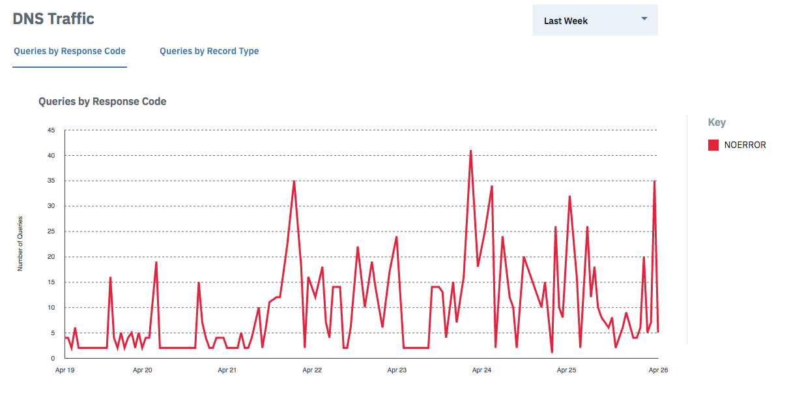

---

copyright:
  years: 2018, 2019
lastupdated: "2019-03-14"

keywords: CIS Metrics Tools, Web Traffic, DNS metrics

subcollection: cis

---

{:shortdesc: .shortdesc}
{:new_window: target="_blank"}
{:DomainName: data-hd-keyref="DomainName"}
{:note: .note}
{:important: .important}
{:deprecated: .deprecated}
{:generic: data-hd-programlang="generic"}

# How to use the {{site.data.keyword.cis_short_notm}} Metrics Tools
{:#how-to-use-the-cis-metrics-tools}

You can use the {{site.data.keyword.cis_full}} Metrics tools (from the side navigation bar) to display information about Domain and DNS metrics in easy-to-digest charts and tables.
{: shortdesc}

The {{site.data.keyword.cis_short_notm}} Metrics tools suite contains these tools:
 * **Domain Metrics**, which consists of Web Traffic, Performance, and Security tools
 * **DNS Metrics**, which consists of three traffic tools

**Notes:**

 * The smallest viewable increment for {{site.data.keyword.cis_short_notm}} Metrics is 6 hours.
 * Each chart displays only the top ten items. You can click on any item in the key to toggle the display of that item.

## Domain Metrics
{:#domain-metrics}
The **Domain Metrics** tools are a series of charts, tables, and graphs that show web traffic, performance, and security information.

**Domain Metrics** can retrieve up to 90 days at one time, but retrieving 3 different 30-day ranges is quicker.
{:note}

### Web Traffic
{:#domain-metrics-web-traffic}
The **Web Traffic** tool is a set of five tabs that show you helpful information about the traffic to your website.
* **Requests** shows cached and uncached requests made on the domain.
* **Bandwidth** shows cached and uncached bandwidth in bytes.
* **Unique Visitors** shows the number of unique visitors to the site.
* **Threats** shows the total number of threats that are blocked.
* **Status Codes** shows the different HTTP status codes returned to the end users.

### Performance
{:#domain-metrics-performance}
The **Performance** tool can help you optimize your site's performance.

* **Fewer Servers Needed** is shown as a percentage, which is a rough estimate of how much less capacity you need for handling your site’s traffic. It's based on the number of requests and bandwidth you've saved by using {{site.data.keyword.cis_short_notm}}. It is intended to help you see how much less web traffic is going to your Origin server.

* **Bandwidth Saved** is a percentage that shows how much bandwidth you've saved by using {{site.data.keyword.cis_short_notm}}. It is used in calculating the **Fewer Servers Needed** metric.

### Security
{:#domain-metrics-security}
The **Security** tool is a chart that shows the number of threats stopped.

## DNS Metrics
{:#dns-metrics}
The **DNS Metrics** tool provides a series of charts that cover DNS traffic and the top-queried DNS records.

### Traffic
{:#dns-metrics-traffic}
The Traffic section consists of two tabs that display **Queries by Response Code** and **Queries by Record Type**. Use the dropdown menu to select the date range displayed.

### Top queried DNS records
{:#dns-metrics-top-queried-dns-records}
This table contains a paginated list of the most-queried DNS records, in descending order. It shows the name and type of the record, and the number of queries received.

### Top DNS records returning NXDOMAIN
{:#dns-metrics-top-dns-records-returning-nxdomain}
This table contains a paginated list of the requests made to non-existent internet domains, in descending order. It shows the name and type of the record, and the number of queries received. If there are no NXDOMAIN responses, this chart will be empty.
