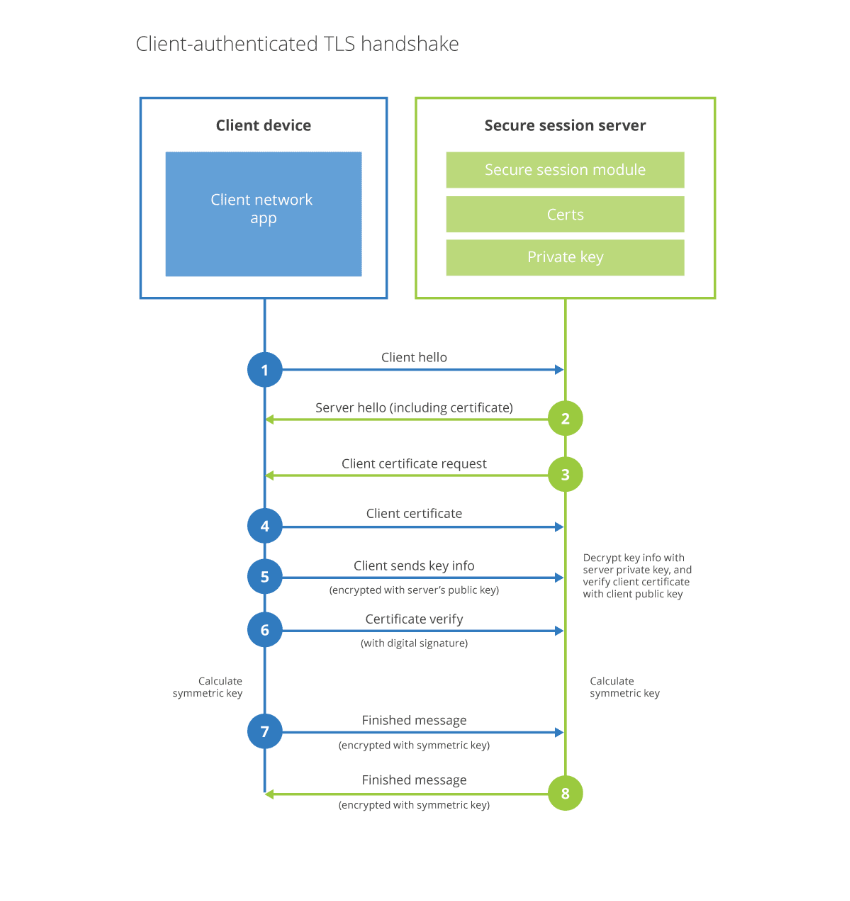

---

copyright:
  years: 2020, 2025
lastupdated: "2025-07-24"

keywords:

subcollection: cis

---

{{site.data.keyword.attribute-definition-list}}

# Using mutual TLS
{: #mtls-features}

Mutual Transport Layer Security (mTLS) authentication ensures that traffic is both secure and trusted in both directions between a client and server. It is only available for customers at the Enterprise or Security plan level.
{: shortdesc}

When mTLS is configured, access is granted only to requests with a corresponding client certificate. When a request reaches the application, CIS responds with a request for the client certificate. If the client fails to present the certificate, the request is not allowed to proceed. Otherwise, the key exchange proceeds.

{: caption="Diagram of an mTLS handshake" caption-side="bottom"}

## Configuring mutual TLS
{: #configure-mtls}

Mutual TLS is not enabled by default. It is an additional service that requires prior authorization and enablement.

To obtain authorization, you must submit an IBM Support case.

After mTLS is turned on for your account, take the following steps to enable it.
1. Navigate to the **Security** page in the CIS UI.
1. Select the **Mutual TLS** tab.
1. Click **Enable** to enable the feature.

After mTLS is enabled, it can't be disabled.
{: tip}

To set up mTLS authentication in the IBM Cloud Internet Services UI for a particular endpoint:
1. In the Root certificates table, click **Add** to define a new root certificate.
1. Paste the certificate content into the content field, provide a name for the Root CA, and add one or more fully qualified domain names (FQDN) of the endpoints that you want to use this certificate.
   These FQDNs are the hostnames that are used for the resources being protected by the application policy. You must associate the Root CA with the FQDN that the application being protected uses.
1. Click **Save**.

   If your zone is using an intermediate certificate in addition to the root certificate, upload the entire chain.
   {: note}

1. In the MTLS access policies table, create a new access application that enforces mTLS authentication. The application must be built with a hostname that was associated in the certificate upload modal. The policy section is pre-set to enforce a decision of `non_identity`, and an `include` rule to match any valid certificate.

## Testing using cURL
{: #test-curl}

1. Test for the site using mTLS by attempting to curl the site without a client certificate.
   This curl command example is for the site example.com that has an Access policy set for `https://auth.example.com`:

   ```bash
   curl -sv https://auth.example.com
   ```
   {: pre}

   Without a client certificate in the request, a "403 forbidden" response displays and the site can't be accessed.
1. Add your client certificate information to the request:

   ```bash
   curl -sv https://auth.example.com --cert example.pem --key key.pem
   ```
   {: pre}

   When the authentication process completes successfully, a CF_Authorization Set-Cookie header returns in the response.

## Validating mutual TLS
{: #validating-mtls}

Follow this validation workflow when you enable this Access policy:
1. All requests to the origin are evaluated for a valid client certificate.
   The client device sends the client "hello". The access application responds with "hello" and a request for the client certificate.
1. The client returns a valid certificate.
1. Client authentication handshake is completed against the root certificate authority.
1. For chains, there is a check for expired certificates.
   Chain verification is applicable to certificate validation.
   
