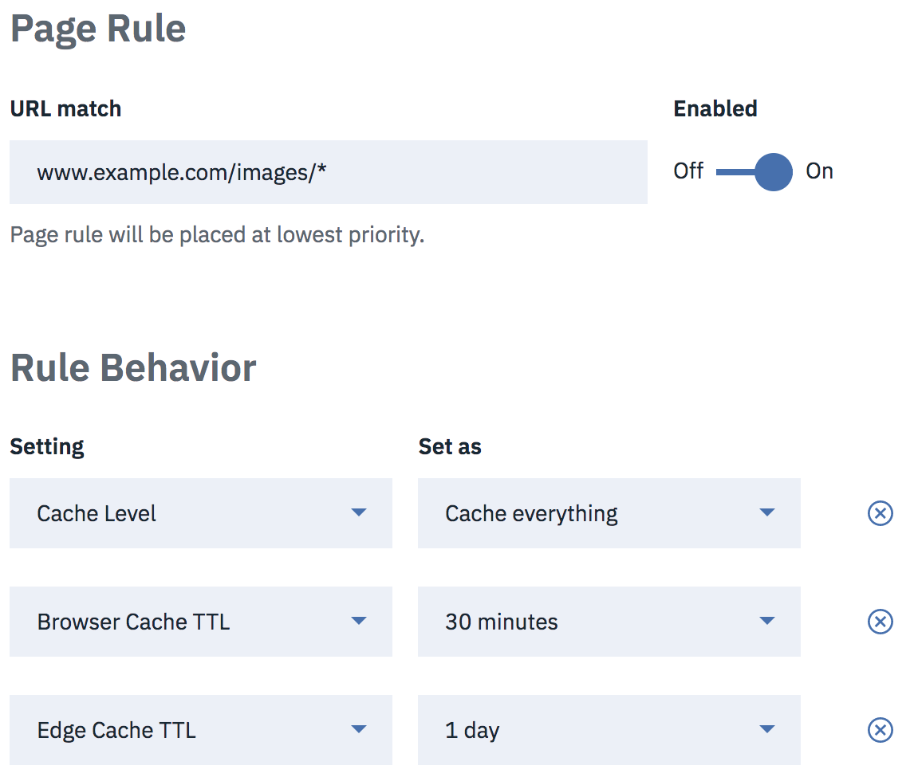

---

copyright:
  years: 2018, 2019
lastupdated: "2019-03-14"

keywords: Use Page Rules, standard cache levels, Custom Caching Sets

subcollection: cis

---

{:shortdesc: .shortdesc}
{:new_window: target="_blank"}
{:DomainName: data-hd-keyref="DomainName"}
{:note: .note}
{:important: .important}
{:deprecated: .deprecated}
{:generic: data-hd-programlang="generic"}

# Verwenden von Seitenregeln mit Caching
{:#use-page-rules-with-caching}

Mit Seitenregeln können Sie verschiedene Aktionen basierend auf der URL der Seite ausführen, z. B. Weiterleitungen erstellen, das Caching-Verhalten optimieren oder Services aktivieren bzw. inaktivieren.

Eine Seitenregel tritt für ein gegebenes URL-Muster in Kraft, das das folgende Format hat:

`<scheme>://<hostname><:port>/<path>`

Beispiel:

`https://www.beispiel.com:80/image.png`

Die `Schema`- und `Port`-Komponenten sind optional. Falls die `Schema`-Komponente nicht angegeben wird, akzeptiert das Format `http://`- und `https://`-Protokolle. Falls der `Port` nicht angegeben wird, stimmt die Regel mit allen Ports überein. Sie können grundlegende Platzhalterabgleiche ausführen, indem Sie das Symbol `*` in Ihrem Regelmuster verwenden, sodass es mit einer Reihe von ähnlichen Mustern übereinstimmt.

**Wichtige Aspekte im Zusammenhang mit Seitenregeln:**

 * Es kann immer nur eine Seitenregel für eine gegebene Anforderung in Kraft treten.
 * Die Priorität von Seitenregeln entspricht der Reihenfolge, in der sie aufgeführt sind. Sobald eine URL mit einer Regel übereinstimmt, wird nur diese Regel angewendet. Das heißt, wenn bereits eine Seitenregel auf eine Anforderung angewendet wurde, sind alle nachfolgenden Regeln, die ebenfalls mit dem URL-Muster übereinstimmen, nicht wirksam. 
 * Grundsätzlich empfehlen wir, zunächst die besonders spezifischen Seitenregeln aufzuführen und dann erst die weniger spezifischen.
 * Seitenregeln können inaktiviert werden. Dann treten sie nicht mehr in Kraft. Aber sie sind weiterhin in der Liste enthalten und können bearbeitet werden. Wenn Sie die Option *Aktiviert* auf 'Aus' setzen, wird eine Seitenregel erstellt, die ursprünglich inaktiviert ist.

## Weiterleitung (URL-Umleitung)
{:#forwarding-url-redirection}

Leitet eine URL mithilfe einer HTTP 301- oder 302-Weiterleitung an eine andere um. Die Inhalte eines beliebigen Teils einer URL, die mit einem Platzhalter übereinstimmen, können mithilfe der `$X`-Syntax referenziert werden. Das `X` gibt den Index eines 'glob' im Muster an: `$1` wird durch die erste Platzhalterübereinstimmung ersetzt, `$2` durch die zweite Platzhalterübereinstimmung usw.

Nehmen wir beispielsweise an, dass Sie die folgende Regel festlegen:

In diesem Fall wird eine Anforderung an `www.beispiel.com/stuff/things` an `http://beispiel.com/stuff/things` umgeleitet.

Achten Sie darauf, keine Umleitung zu erstellen, bei der die Domäne auf sich selbst zeigt. Dies kann zu einem unendlichen Umleitungsfehler führen, den die betroffene URL nicht auflösen kann.
{:note}

## Umleitung an HTTPS
{:#redirecting-to-https}

Wenn Sie möchten, dass Ihre Besucher eine HTTPS-Verbindung nutzen, verwenden Sie stattdessen die Einstellung **Immer HTTPS verwenden**:

## Benutzerdefiniertes Caching
{:#custom-caching}

Legt das Caching-Verhalten unter Verwendung einer unserer Standardcachestufen für alle URLs fest, die mit dem Seitenregelmuster übereinstimmen. Wenn Sie **Cachestufe** auf **Alles zwischenspeichern** festlegen, werden alle Inhalte zwischengespeichert, auch wenn es sich dabei nicht um einen unserer standardmäßigen statischen Dateitypen handelt. Wenn Sie **Cachestufe** auf **Übergehen** festlegen, werden für diese URL keine Inhalte zwischengespeichert.

Wenn Sie eine Cachestufe mithilfe von Seitenregeln angeben, können Sie die Option **Edge-Cache-TTL** angeben, die steuert, wie lange CIS Dateien in unserem Cache aufbewahrt.

Die Option **Browser-Cache-TTL** steuert, wie lange Ressourcen, die von Client-Browsern zwischengespeichert werden, gültig sind. Wenn ein Browser eine Ressource erneut anfordert und die Lebensdauer (TTL) nicht abgelaufen ist, empfängt der Browser eine Antwort vom Typ `HTTP 304 (Not Modified)`. Sie können eine Lebensdauer zwischen 30 Minuten und einem Jahr festlegen.

Nicht alle Standard-Caching-Verhalten sind strikt RFC-konform. Das Einrichten der **Ursprungscachesteuerung** mithilfe von Seitenregeln verwendet einen aktuelleren Satz von Caching-Regeln, die sich enger an RFCs orientieren, vor allem im Hinblick auf eine Neuvalidierung. Zum Beispiel werden bei der Einstellung `max-age=0` standardmäßig keine Inhalte zwischengespeichert, während die Einstellung **Ursprungscachesteuerung** Inhalte zwischenspeichert, aber immer erneut validiert.

Im folgenden Beispiel wird eine Seitenregel festgelegt, um alle gefundenen Inhalte im Ordner `/images` zwischenzuspeichern. Zwischengespeicherte Inhalte verfallen nach 30 Minuten im Benutzerbrowser und nach einem Tag in IBM CIS-Rechenzentren:

**Nicht aktuellen Inhalt speichern** speichert Seiten aus unserem Cache, auch wenn Ihr Server nicht mehr verfügbar ist. Besucher sehen eine eingeschränkte Version Ihrer Site mit der Nachricht, dass sie sich im Offline-Browsing-Modus befinden.  

Diese Funktion gibt den HTTP-Status 503 zurück. Wenn die Server wieder online sind, führt CIS die Besucher nahtlos zum regulären Browsing. 

Wenn die angeforderte Seite sich nicht im Cache befindet, wird dem Besucher eine Fehlerseite angezeigt, die ihn darüber informiert, dass die angeforderte Seite offline ist.
Wenn eine **Alles zwischenspeichern**-Seitenregel mit Ablaufzeiten aktiviert ist, die niedriger als die Cachingfrequenz sind, dann wird **Nicht aktuellen Inhalt speichern** im entsprechenden Intervall bereinigt.
{:note}
