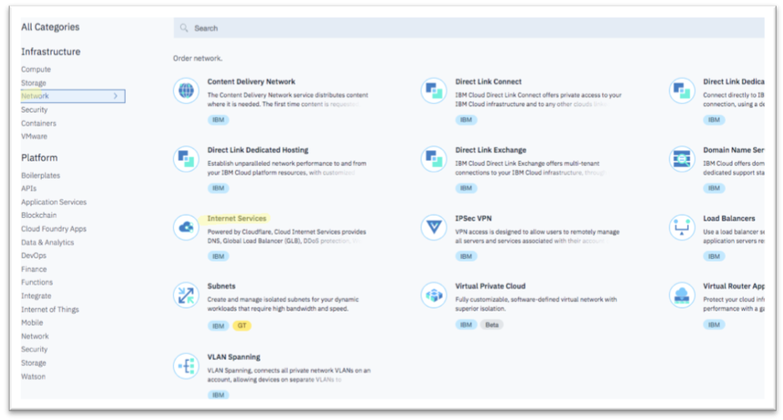

---

copyright:
  years: 2018, 2019
lastupdated: "2019-03-14"

keywords: IBM Cloud Internet Services, setup flow

subcollection: cis

---

{:shortdesc: .shortdesc}
{:codeblock: .codeblock}
{:screen: .screen}
{:new_window: target="_blank"}
{:pre: .pre}
{:table: .aria-labeledby="caption"}
{:DomainName: data-hd-keyref="DomainName"}
{:note: .note}
{:important: .important}
{:deprecated: .deprecated}
{:generic: data-hd-programlang="generic"}

# Ihre IBM Cloud Internet Services-Instanz (CIS) erstellen
{:#create-your-cis-instance}

Führen Sie die folgende Prozedur aus, um eine CIS-Instanz zu erstellen: 

1. Öffnen Sie in Ihrem Browser das [Kundenportal](https://{DomainName}/){: new_window} und melden Sie sich bei Ihrem Konto an.  
2. Klicken Sie oben rechts auf **Katalog** und wählen Sie im Abschnitt **Infrastruktur** die Option **Netz** aus. Klicken Sie dann auf **Internet-Services**.

   

3. Geben Sie den Namen für Ihre Serviceinstanz und die Ressourcengruppe an, in die Sie diesen Service stellen möchten. Die Standardressourcengruppe ist `default`. Überprüfen Sie die Planzusammenfassung und klicken Sie auf **Erstellen**.
    
Das System führt Sie zu einem Konfigurationsablauf auf der Übersichtsseite, um den Service zu überprüfen. 
    

