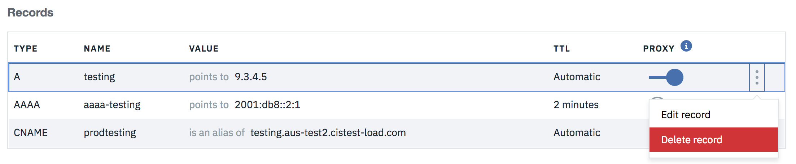

---

copyright:
  years: 2018, 2019
lastupdated: "2019-03-14"

keywords: IBM CIS DNS records, parts of the DS record, Type

subcollection: cis

---

{:shortdesc: .shortdesc}
{:new_window: target="_blank"}
{:codeblock: .codeblock}
{:pre: .pre}
{:screen: .screen}
{:tip: .tip}
{:download: .download}
{:DomainName: data-hd-keyref="DomainName"} 
{:note: .note} 
{:important: .important} 
{:deprecated: .deprecated} 
{:generic: data-hd-programlang="generic"}

# Einrichten Ihres Domain Name System (DNS) für IBM CIS
{:#set-up-your-dns-for-cis}

In diesem Dokument finden Sie spezifische Anweisungen zum Konfigurieren Ihrer IBM CIS-DNS-Datensätze, darunter auch zum Konfigurieren von Secure DNS.

## Secure DNS
{:#secure-dns}

**DNSSec** ist eine Technologie zum digitalen "Signieren" von DNS-Daten, sodass Sie sicher sein können, dass diese gültig sind. Um mögliche Internetsicherheitslücken zu eliminieren, muss DNSSec in jedem Schritt des Suchvorgangs implementiert sein, von der Rootzone bis hin zum finalen Domänennamen (z. B. www.icann.org). 

## Secure DNS konfigurieren und verwalten 
{:#configuring-and-managing-your-secure-dns}

DNSSec fügt der DNS-Infrastruktur des Internets, die andernfalls nicht sicher wäre, eine Authentifizierungsebene hinzu. Secure DNS garantiert, dass Besucher direkt zu **Ihrem** Web-Server geführt werden, wenn sie Ihren Domänennamen in einen Web-Browser eingeben.  Sie müssen nur dafür sorgen, dass 'DNSSec' auf der DNS-Seite in Ihrem IBM CIS-Konto aktiviert ist, und Sie müssen den DS-Datensatz zu Ihrem Registrator hinzufügen.


Sie können auf die Schaltfläche **DS-Datensätze anzeigen** klicken, um ein Dialogfenster zu öffnen, in dem erläutert wird, wie Sie den DS-Datensatz zu Ihrem Registrator hinzufügen. Sie müssen Teile des DS-Datensatzes kopieren und in das Dashboard Ihres Registrators einfügen. Jeder Registrator unterscheidet sich, und möglicherweise müssen Sie bei Ihrem Registrator nur einen Teil der verfügbaren Felder ausfüllen.

## DNS-Datensätze hinzufügen
{:#adding-dns-records}

Im Dropdown-**Typ** können Sie den Typ von Datensatz auswählen, den Sie erstellen möchten. Jedem DNS-Datensatztyp ist ein Name und eine Lebensdauer (Time-To-Live, TTL) zugeordnet. 

Dem Eintrag im Namensfeld wird der Domänenname angehängt, es sei denn, der Domänenname wurde bereits manuell im Feld angegeben (Beispiel: Wenn `www` oder `www.beispiel.com` im Feld eingegeben wird, verarbeitet die API beides als `www.beispiel.com`). Wenn der exakte Domänenname in das Namensfeld eingegeben wird, wird er nicht an sich selbst angehängt (Beispiel: `beispiel.com` wird als `beispiel.com` verarbeitet). In der Liste von DNS-Datensätzen werden jedoch nur die Namen ohne die angehängten Domänennamen angezeigt. `www.beispiel.com` wird also als `www` und `beispiel.com` wird als `beispiel.com` angezeigt. Die Lebensdauer hat den Standardwert `Automatisch`, kann aber vom Benutzer geändert werden. Ein Proxy-DNS-Datensatz hat immer die TTL-Einstellung `Automatisch`, deshalb wird ein neuer Proxy-Datensatz diese Konfiguration übernehmen.

### Datensatz vom Typ A
{:#a-type-record}

Um diesen Datensatztyp hinzuzufügen, müssen in den Feldern **Name** und **IPv4-Adresse** gültige Werte vorhanden sein. Im Dropdown-Menü kann auch eine **TTL** (Lebensdauer) ausgewählt werden, der Standardwert ist `Automatisch`.


    Erforderliche Felder: Name, IPv4-Adresse
    Optionales Feld: TTL (Standardwert ist 'Automatisch')

### Datensatz vom Typ AAAA
{:#aaaa-type-record}

Um diesen Datensatztyp hinzuzufügen, müssen in den Feldern **Name** und **IPv-Adresse** gültige Werte vorhanden sein. Im Dropdown-Menü kann auch eine **TTL** (Lebensdauer) ausgewählt werden. Der Standardwert ist `Automatisch`.


    Erforderliche Felder: Name, IPv6-Adresse
    Optionales Feld: TTL (Standardwert ist 'Automatisch')

### Datensatz vom Typ CNAME
{:#cname-type-record}

Um diesen Datensatztyp hinzuzufügen, müssen im Feld **Name** ein gültiger Wert und im Feld **Domänenname** (FQDN) ein vollständig qualifizierter Domänenname vorhanden sein. Im Dropdown-Menü kann auch eine **TTL** (Lebensdauer) ausgewählt werden. Der Standardwert ist `Automatisch`.


    Erforderliche Felder: Name, Domänenname (für CNAME)
    Optionales Feld: TTL (Standardwert ist 'Automatisch')

Enterprise-Pläne sind in der Lage, einer anderen Domäne einen CNAME zu geben, solange diese Domäne innerhalb der CIS konfiguriert ist.{:note}

```
Ex.
Configured CIS Domains:
  - example.com
  - different.com

test.example.com -CNAME-> test.different.com
```

### Datensatz vom Typ MX
{:#mx-type-record}

Um diesen Datensatztyp hinzuzufügen, müssen im Feld **Name** ein gültiger Wert und im Feld **E-Mail-Server** eine gültige Adresse vorhanden sein. Im Dropdown-Menü kann auch eine **TTL** (Lebensdauer) ausgewählt werden. Der Standardwert ist `Automatisch`.


    Erforderliche Felder: Name, E-Mail-Server
    Optionale Felder: TTL (Standardwert ist 'Automatisch'), Priorität (Standardwert ist '1')

### Datensatz vom Typ LOC
{:#loc-type-record}

Um diesen Datensatz hinzuzufügen, muss im Feld **Name** ein gültiger Wert vorhanden sein. Wenn Sie genauere Informationen benötigen, klicken Sie auf die Schaltfläche **LOC-Optionen konfigurieren**. Im Dropdown-Menü kann auch eine **TTL** (Lebensdauer) ausgewählt werden. Der Standardwert ist `Automatisch`.


    Erforderliche Felder: Name
    Optionale Felder: LOC-Optionen (zur Konfiguration auf die Schaltfläche klicken)


### Datensatz vom Typ CAA
{:#caa-type-record}

Um diesen Datensatztyp hinzuzufügen, müssen in den Feldern **Name** und **Wert** gültige Werte vorhanden sein. Das Feld 'Wert' wird mit dem Wert im Dropdown-Feld **Tag** korreliert, der standardmäßig 'Berichte zu Verstößen an URL senden' lautet. Im Dropdown-Menü kann auch eine **TTL** (Lebensdauer) ausgewählt werden. Der Standardwert ist `Automatisch`.


    Erforderliche Felder: Name, Wert (mit Tag korreliert)
    Optionale Felder: TTL (Standardwert ist 'Automatisch'), Tag (Standardwert ist 'Berichte zu Verstößen an URL senden')

### Datensatz vom Typ SRV
{:#srv-type-record}

Um diesen Datensatztyp hinzuzufügen, müssen in den Feldern **Name**, **Servicename** und **Ziel** gültige Werte vorhanden sein. Wählen Sie im Dropdown-Menü ein **Protokoll** aus; standardmäßig ist das UDP-Protokoll ausgewählt. Darüber hinaus können Sie die **Priorität**, die **Wertigkeit** und den **Port** angeben. Diese drei Felder haben den Standardwert '1'. Im Dropdown-Menü kann auch eine **TTL** (Lebensdauer) ausgewählt werden; der Standardwert ist `Automatisch`.


    Erforderliche Felder: Name, Servicename, Ziel
    Optionale Felder: TTL (Standardwert ist 'Automatisch'), Protokoll (Standardwert ist 'UDP'), Priorität (Standardwert ist '1'), Wertigkeit (Standardwert ist '1'), Port (Standardwert ist '1')

### Datensatz vom Typ SPF
{:#spf-type-record}

Um diesen Datensatztyp hinzuzufügen, müssen in den Feldern **Name** und **Inhalt** gültige Werte vorhanden sein. Im Dropdown-Menü kann auch eine **TTL** (Lebensdauer) ausgewählt werden. Der Standardwert ist `Automatisch`.


    Erforderliche Felder: Name, Inhalt
    Optionales Feld: TTL (Standardwert ist 'Automatisch')

### Datensatz vom Typ TXT
{:#txt-type-record}

Um diesen Datensatztyp hinzuzufügen, müssen in den Feldern **Name** und **Inhalt** gültige Werte vorhanden sein. Im Dropdown-Menü kann auch eine **TTL** (Lebensdauer) ausgewählt werden. Der Standardwert ist `Automatisch`.


    Erforderliche Felder: Name, Inhalt
    Optionales Feld: TTL (Standardwert ist 'Automatisch')

Wenn Sie zum ersten Mal ein dediziertes Zertifikat bestellen, wird der DCV-Prozess (Certificate Domain Control Validation) ausgeführt, der einen entsprechenden TXT-Datensatz generiert. Wenn Sie den TXT-Datensatz löschen, wird der DCV-Prozess erneut ausgeführt, wenn Sie ein anderes dediziertes Zertifikat bestellen. Wenn Sie ein dediziertes Zertifikat löschen, wird der entsprechende TXT-Datensatz für den DCV-Prozess nicht gelöscht.
{:note}

### Datensatz vom Typ NS
{:#ns-type-record}

Um diesen Datensatztyp hinzuzufügen, müssen in den Feldern **Name** und **Namensserver** gültige Werte vorhanden sein. Im Dropdown-Menü kann auch eine **TTL** (Lebensdauer) ausgewählt werden. Der Standardwert ist `Automatisch`.


    Erforderliche Felder: Name, Namensserver
    Optionales Feld: TTL (Standardwert ist 'Automatisch')

## DNS-Datensätze aktualisieren
{:#updating-dns-records}

Sie können in jeder Datensatzzeile im Menü auf die Option **Datensatz bearbeiten** klicken, wodurch ein Dialogfenster geöffnet wird, in dem Sie den Datensatz aktualisieren können.


Dies ist z. B. der Aktualisierungsdialog für den Datensatztyp **A**. Nachdem Sie die Änderungen vorgenommen haben, wählen Sie **Datensatz aktualisieren** aus, um sie zu speichern.


## Datensätze löschen
{:#deleting-dns-records}

Sie können in jeder Datensatzzeile im Menü die Option **Datensatz löschen** auswählen, wodurch ein Dialogfenster geöffnet wird, in dem Sie den Löschvorgang bestätigen können.



Klicken Sie auf die Schaltfläche **Löschen**, um Ihre Löschaktion zu bestätigen. Wählen Sie **Abbrechen** aus, wenn Sie doch nicht löschen möchten.


## Import und Export von Datensätzen
{:#import-export-records}

DNS-Datensätze können in CIS importiert und aus CIS exportiert werden. Alle Dateien werden als .txt-Dateien im BIND-Format importiert und exportiert. Weitere Informationen zum [BIND-Format](https://en.wikipedia.org/wiki/Zone_file).
Klicken Sie auf das Überlaufmenü und wählen Sie Datensätze importieren oder exportieren aus. 

### Datensätze importieren
{:#import-dns-records}

Standardmäßig sind insgesamt 3500 DNS-Datensätze zulässig (importiert und erstellt unter CIS). Sie können mehrere Dateien jeweils nacheinander importieren, solange die Gesamtzahl der Datensätze unter der maximalen Begrenzung liegt. Nach dem Importieren wird eine Zusammenfassung mit der Anzahl der erfolgreich hinzugefügten Datensätze und mit der Anzahl der Datensätze, die fehlgeschlagen sind, zusammen mit dem Grund für das Fehlschlagen der einzelnen Datensätze angezeigt. 

### Datensätze exportieren
{:#export-dns-records}

Verwenden Sie `Datensätze exportieren`, um eine Sicherung Ihrer Zonendatei zu erstellen oder um diese zu exportieren, um sie mit einem anderen DNS-Provider zu verwenden. Wenn auf diese Menüoption geklickt wird, werden die Datensätze an die Position heruntergeladen, die in den Browsereinstellungen angegeben ist (normalerweise der Ordner "Downloads"). Wenn Sie eine andere Ordnerposition auswählen möchten, ändern Sie die Einstellungen Ihres Browsers so, dass Sie bei jedem Download aufgefordert werden, einen Speicherort anzugeben. 
