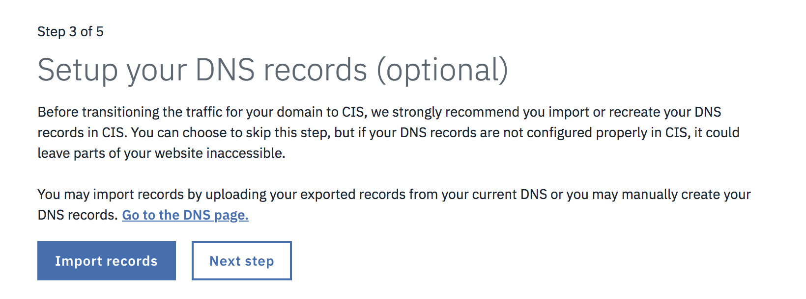

---

copyright:
  years: 2018, 2019
lastupdated: "2019-03-29"

keywords: IBM Cloud Internet Services, IBM CIS application, Authoritative DNS servers

subcollection: cis

---

{:shortdesc: .shortdesc}
{:new_window: target="_blank"}
{:DomainName: data-hd-keyref="DomainName"}
{:note: .note}
{:important: .important}
{:deprecated: .deprecated}
{:generic: data-hd-programlang="generic"}

# Einführung in IBM Cloud Internet Services (CIS)
{:#getting-started}

IBM Cloud Internet Services (CIS), powered with Cloudflare, bietet drei zentrale Leistungsmerkmale zur Verbesserung Ihres Workflows: [Sicherheit](/docs/infrastructure/cis?topic=cis-manage-your-ibm-cis-for-optimal-security), [Zuverlässigkeit](/docs/infrastructure/cis?topic=cis-manage-your-ibm-cis-deployment-for-optimal-reliability) und [Leistung](/docs/infrastructure/cis?topic=cis-manage-your-cis-deployment-for-best-performance). Alle drei Funktionalitäten werden in der linken Navigationsleiste Ihres Bildschirms dargestellt, sobald Sie die IBM CIS-Anwendung öffnen.

Mit IBM CIS können Sie die einzelnen Merkmale dieser Funktionalitäten an Ihre speziellen Bedürfnisse anpassen:

 * Autoritative DNS-Server
 * Globaler und lokaler Lastausgleich
 * Web Application Firewall (WAF)
 * DDoS-Schutz
 * Caching und Seitenregeln

## Vorbemerkungen
{:#before-you-begin}

Bevor Sie IBM CIS verwenden können, benötigen Sie eine [IBMid](https://www.ibm.com/account/reg/us-en/signup?formid=urx-19776). Im Anschluss können Sie Ihre Services über Ihr IBM Cloud-Konto oder über das neue [IBM Cloud Internet Services-Portal](https://{DomainName}/catalog/services/internet-services) anfordern, ganz wie Sie wünschen.

Wenn Sie Unterstützung benötigen, um ein Konto für die Verwendung von IBM Cloud Internet Services zu erhalten, [wenden Sie sich an Ihren IBM Vertriebsbeauftragten](https://{DomainName}/cloud/support), um weitere Informationen zu den ersten Schritten zu erhalten.

Wenn Sie bereits über ein Softlayer-Konto verfügen, können Sie [Ihr Konto mit Ihrer IBMid verknüpfen](https://{DomainName}/docs/account?topic=account-unifyingaccounts). 

## Übersicht über die Vorgehensweise
{:#process-overview}

Sie können mit der Verwendung von IBM CIS für Ihren Internetdatenverkehr in nur wenigen Schritten beginnen. 

 * Öffnen Sie die IBM CIS-Anwendung in Ihrem IBM Cloud-Dashboard.
 * Fügen Sie die Domäne hinzu, die Sie verwalten möchten.
 * Konfigurieren Sie Ihre DNS-Informationen mit den Namensservern, die wir bereitgestellt haben.
 * Fahren Sie mit der Einführung in IBM CIS fort, indem Sie ein Lernprogramm ausführen oder weitere Features einrichten.

### Schritt 1: IBM CIS-Anwendung öffnen
{:#open-cis-application}

Öffnen Sie Ihr [IBM Cloud-Dashboard](https://{DomainName}/catalog/). Navigieren Sie dann zum IBM CIS-Anwendungssymbol, indem Sie die Kategorie **Infrastruktur -> Netz** in der linken Navigationsleiste des Dashboards auswählen. Öffnen Sie die IBM Cloud Internet Services-Anwendung, indem Sie auf das Symbol klicken, das in der Mitte des Bildschirms angezeigt wird. 

**Übersichtsanzeige**

Sobald die IBM CIS-Anwendung gestartet wurde, wird die Anzeige **Übersicht** für IBM CIS geöffnet und auf der linken Seite der Benutzeroberfläche finden Sie die Registerkarten für **Sicherheit**, **Zuverlässigkeit** und **Leistung**. 

**Welchen Plan wähle ich?**

Es gibt 4 Pläne zur Auswahl, 
* **Enterprise-Nutzung** 
* **Enterprise-Paket** 
* **Standardplan** 
* **Free Trial (kostenlose Testversion)**. 

Die kostenlose Testversion **Free Trial** läuft nach 30 Tagen ab. Sie können dann ein Upgrade auf den **Standardplan** oder einen **Enterprise-Plan** durchführen. Eine einzige **Standard**instanz kann eine Domäne verwalten. Sie können so viele **Standard**serviceinstanzen, die jeweils eine einzelne Domäne verwalten, innerhalb eines einzelnen Kontos erstellen, wie Sie wünschen.  

Mit den **Enterprise-Plänen** können Sie mehrere Domänen in einer einzigen Serviceinstanz verwalten. Wählen Sie die Schaltfläche **Erstellen** in der Anzeige **Übersicht** aus, um mit der Bereitstellung Ihres Kontos zu beginnen. 

Die kostenlose Testversion **Free Trial** ist auf eine Instanz pro Konto begrenzt.
{:note}

**Bereitstellung beginnen**

Die erste Anzeige der IBM CIS-Anwendung wird geöffnet, in der Sie auf die Schaltfläche **Domäne hinzufügen** klicken.

### Schritt 2. Domäne hinzufügen und konfigurieren
{:#add-configure-your-domain}

Wählen Sie **Einführung** in der Begrüßungsseite aus, um mit der Konfiguration von CIS zu beginnen.

Beginnen Sie dann mit dem Schutz und der Verbesserung der Leistung Ihres Web-Service, indem Sie Ihre Domäne oder eine Unterdomäne eingeben. 

Bitte geben Sie DNS-Zonen an. Sie können die Namensserver für diese Domänen oder Unterdomänen beim Registrator der Domäne oder beim DNS-Anbieter konfigurieren. Verwenden Sie keine CNAMEs.
{:note}

In der Übersichtsanzeige wird Ihre Domäne im Status `Anstehend` dargestellt. Sie verbleibt in diesem Status, bis Sie Schritt 4 ausgeführt haben. 

Die IBM CIS-Instanz kann nicht gelöscht werden, nachdem eine Domäne hinzugefügt wurde. Um die Instanz zu löschen, müssen Sie zunächst die Domäne aus der Instanz löschen.
{:note}

### Schritt 3. Konfigurieren Sie Ihre DNS-Datensätze (optional).
{:#setup-your-dns-records}

Bevor Sie eine Statusänderung für den Datenverkehr in Ihrer Domäne auf CIS ausführen, wird dringend empfohlen, Ihre DNS-Datensätze in CIS zu importieren oder erneut zu erstellen. Sie können diesen Schritt auch überspringen, aber Ihre DNS-Datensätze werden in CIS nicht korrekt konfiguriert, sodass Teile Ihrer Webseite möglicherweise nicht zugänglich sind. 

Importieren Sie Datensätze, indem Sie Ihre exportieren Datensätze von Ihrem aktuellen DNS hochladen oder Ihre DNS-Datensätze manuell erstellen. Wählen Sie **Datensätze importieren** aus, um Datensätze zu importieren.

Wenn Sie fertig sind oder diesen Schritt überspringen möchten, wählen Sie **Nächster Schritt** aus.

### Schritt 4. Namensserver beim Registrator oder dem vorhandenen DNS-Anbieter konfigurieren
{:#configure-your-name-servers-with-the-registrar-or-existing-dns-provider}

Damit Sie von den Vorteilen von IBM CIS profitieren können, konfigurieren Sie Ihren Registrator oder Domänennamenanbieter für die Verwendung der aufgelisteten Namensserver. Wenn Sie eine Domäne delegieren (z. B. `beispiel.com`), konfigurieren Sie die aufgelisteten Namensserver in den Einstellungen Ihrer Domäne, wo sie von Ihrem Registrator verwaltet werden (z. B. im Webportal des Registrators). Wenn Sie sich nicht sicher sind, wer der Registrator für Ihre Domäne ist, finden Sie diese Angabe unter 'https://whois.icann.org/'. Wenn Sie eine Unterdomäne (z. B. `unterdomäne.beispiel.com`) von einem anderen DNS-Anbieter delegieren, müssen Sie einen Namensserver-Datensatz (NS-Datensatz) für jeden aufgelisteten Namensserver hinzufügen. Genaue Anweisungen, die von unseren Partnern bei Cloudflare geschrieben wurden, finden Sie nach Provider geordnet unter [DNS-Datensätze verwalten](https://support.cloudflare.com/hc/en-us/articles/360019093151-Managing-DNS-records-in-Cloudflare){:new_window}. 

Nachdem Sie Ihren Registrator oder DNS-Anbieter konfiguriert haben, kann es bis zu 24 Stunden dauern, bis die Änderungen wirksam werden. Sobald wir überprüfen konnten, dass die angegebenen Namensserver korrekt für Ihre Domäne oder Unterdomäne konfiguriert wurden, ändert sich der Status der Domäne von `Anstehend` in `Aktiv`. Nach der Konfiguration der Namensserver können Sie auf den Link zum erneuten Prüfen der Namensserver auf der Seite `Übersicht` klicken, um die Aktivierung Ihrer Domäne möglicherweise zu beschleunigen (diese Prüfung kann nur einmal pro Stunde ausgeführt werden).

Ihre Domäne muss innerhalb von 60 Tagen in den Status `Aktiv` versetzt werden. Andernfalls werden Ihre Domäne und alle Konfigurationsdaten gelöscht.
{:note}

### Schritt 5. Stellen Sie sicher, dass IBM Cloud Internet Services die Domäneninformationen für Ihre Anwendung, Ihren Hostnamen oder Ihre Website auflöst. 
{:#ensure-cis-is-resolving-domain-info}

Fahren Sie fort, indem Sie die Registerkarte **Zuverlässigkeit** in der linksseitigen Navigationsleiste und dann die Option **DNS** auswählen. Stellen Sie sicher, dass Sie die passenden _DNS-Datensätze_ hinzufügen. Fügen Sie den **Datensatz A** und alle **AAAA**- oder **MX**-Einträge hinzu, die einen Wert enthalten. Wenn Sie vergessen, diese Datensätze hinzuzufügen, bevor die Delegierung des Registrators abgeschlossen ist, kann IBM Cloud Internet Services die Domäneninformationen für Ihre mit dem Internet verbundenen Anwendungen nicht auflösen.

### Schritt 6. Mit der Verwaltung anderer IBM CIS-Funktionen und -Features beginnen
{:#manage-other-cis-functions}

Weitere Details zum Verwalten anderer Funktionen oder Features finden Sie in den [schrittweisen Anleitungen](/docs/infrastructure/cis?topic=cis-manage-your-ibm-cloud-internet-services-cis-deployment).
