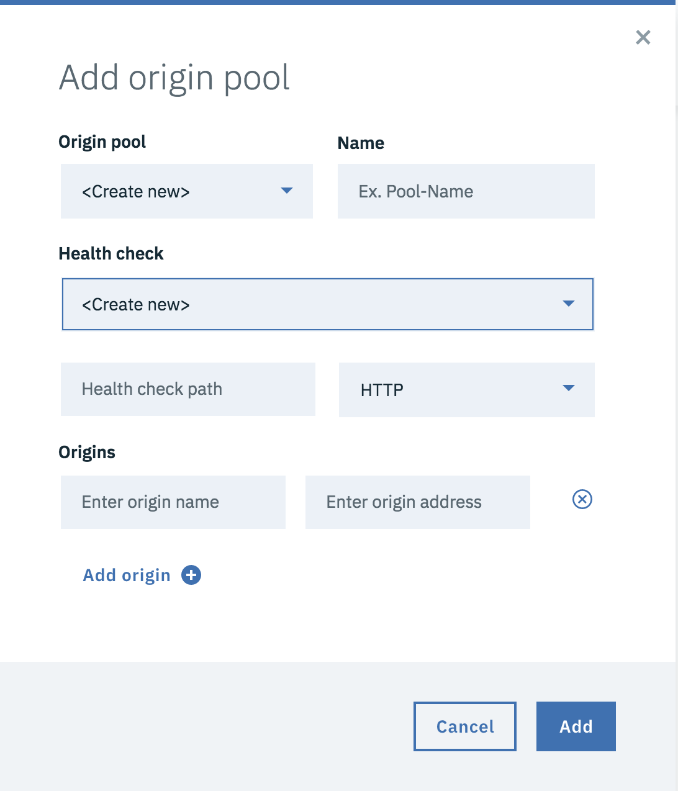

---

copyright:
  years: 2018, 2019
lastupdated: "2019-03-14"

keywords: Create Load Balancer, Global Load Balancer, health checks, quick setup

subcollection: cis

---

{:shortdesc: .shortdesc}
{:new_window: target="_blank"}
{:DomainName: data-hd-keyref="DomainName"}
{:note: .note}
{:important: .important}
{:deprecated: .deprecated}
{:generic: data-hd-programlang="generic"}

# Schnellkonfiguration der globalen Lastausgleichsfunktion
{:#global-load-balancer-quick-setup}

Sie können Pools und Statusprüfungen direkt über die Menüoption **Lastausgleichsfunktion erstellen** erstellen. Navigieren Sie zu **Zuverlässigkeit > Globale Lastausgleichsfunktion > Lastausgleichsfunktion erstellen > Pool hinzufügen** und wählen Sie unter dem Ursprungspool die Option **Neu erstellen** aus.  

Geben Sie einen Poolnamen und Ursprünge ein und wählen Sie eine Statusprüfung aus. Sie können hier eine neue Statusprüfung erstellen, indem Sie im Dropdownmenü der Statusprüfung die Option **Neu erstellen** auswählen und die Informationen zum Erstellen der Statusprüfung eingeben.  

Verwenden Sie für vollständig konfigurierbare Optionen die längere Konfigurationsmethode in [Lastausgleichsfunktionen einrichten und konfigurieren](/docs/infrastructure/cis?topic=cis-set-up-and-configure-your-load-balancers).

Definitionen allgemeiner Begriffe finden Sie im [Glossar](/docs/infrastructure/cis?topic=cis-glossary).
