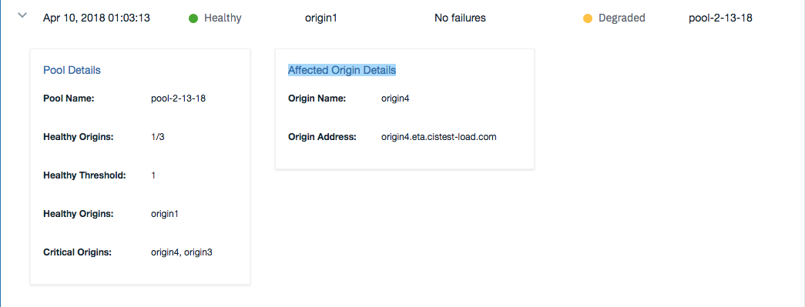

---

copyright:
  years: 2018, 2019
lastupdated: "2019-03-14"

keywords: origin server, pool implementation, origin servers

subcollection: cis

---

{:shortdesc: .shortdesc} 
{:new_window: target="_blank"} 
{:note: .note}

# Konzepte für globale Laustausgleichsfunktionen (Global Load Balancer, GLB)
{:#global-load-balancer-glb-concepts}

In diesem Dokument finden Sie Konzepte und Definitionen im Zusammenhang mit globalen Lastausgleichsfunktionen und wie diese sich auf Ihre IBM CIS-Bereitstellung auswirken.

## Globale Lastausgleichsfunktion
{:#global-load-balancer-cis}

Globale Lastausgleichsfunktionen verwalten Datenverkehr über Serverressourcen in mehreren Regionen hinweg. Der Ursprungsserver kann den gesamten Inhalt einer Website bereitstellen, solange der Webdatenverkehr nicht über die Verarbeitungskapazität des Servers hinausgeht und die Latenzzeit keine primäre Problemstellung ist. Die GLB verwendet eine _Pool_implementierung, die es ermöglicht, dass der Datenverkehr auf mehrere Ursprünge verteilt wird. Diese Poolfunktion bietet zahlreiche Vorteile wie beispielsweise: 

  * Antwortzeit minimieren
  * Höhere Verfügbarkeit über Redundanz erstellen
  * Durchsatz beim Datenverkehr maximieren

Die GLB leitet Datenverkehr mit höchster Priorität an den Pool weiter und verteilt dabei die Last auf seine Ursprungsserver. Informationen dazu, wie der Datenverkehr in einem Pool verteilt wird, finden Sie im folgenden Abschnitt _Pool_. Wenn der primäre Pool nicht mehr verfügbar ist, wird der Datenverkehr automatisch an den nächsten Pool in der nach Priorität geordneten Liste weitergeleitet. 

Wenn Pools für bestimmte Regionen eingerichtet wurden, wird der Datenverkehr von diesen Regionen zuerst an die Pools für die bestimmte Region gesendet. Erst wenn alle Pools einer bestimmten Region inaktiv sind, wird der Datenverkehr wieder auf die Standardpools geleitet. In diesem Fall ist der Ausweichpool der Pool mit der niedrigsten Priorität.  

### Funktionsweise
{:#how-glb-works}
Wenn die GLB erstellt wird, wird für sie automatisch ein DNS-Datensatz mit dem Namen der Lastausgleichsfunktion hinzugefügt. Die GLB gibt dann eine der IP-Ursprungsadressen an den Client zurück und stellt eine DNS-Anforderung. 

Ein Ursprungspool wird zum Beispiel mit zwei Ursprüngen erstellt, die die IP-Adressen `169.61.244.18` und `169.61.244.19` kennzeichnen. Wenn eine globale Lastausgleichsfunktion mit dem  Namen `glbcust.ibmmo.com` erstellt wird, die den Ursprungspool verwendet, dann kann ein Client im Internet den Befehl ausführen. 
```
$ ping glbcust.ibmom.com
PING glbcust.ibmom.com (169.61.244.18): 56 data bytes
```
In diesem Beispiel führt CIS folgende Aktionen aus:

    * einen DNS-Datensatz mit dem Namen `glbcust.ibmmo.com` erstellen
    * die GLB zum Auflösen des DNS-Namens an einer der im Ursprungspool identifizierten IP-Adressen verwenden

Beachten Sie, dass die globale Lastausgleichsfunktion die TCP-Verbindung nicht beendet.
{:note}

Das Festlegen von einem DNS-Element oder von GLB auf "proxy" ändert das Verhalten.
Wenn Sie zum Beispiel die Weiterleitung aktivieren und für **Sicherheit > TLS > Modus** nicht `Aus` festlegen, beendet CIS nun die TCP-Verbindung und etabliert eine zweite Verbindung zwischen CIS und dem Absender. 

In diesem Beispiel führt CIS folgende Aktionen aus:

    * einen DNS-Datensatz mit dem Namen `glbcust.ibmmo.com` erstellen
    * die GLB zum Auflösen des DNS-Namens in eine von CIS bereitgestellte IP-Adresse verwenden
    
Jetzt werden Verbindungen zu `glbcust.ibmmo.com` von CIS beendet und HTTPS-Zertifikate werden von CIS gehostet (was für die Beendigung von TCP erforderlich ist). 

Nachdem der Client eine Verbindung zu der Anwendung hergestellt hat, sieht das Bild wie folgt aus:

`[client]<--tls-->[cis]<-->[origin server]`

## Pool
{:#glb-pools}

Ein Pool ist eine Gruppe von Ursprungsservern, an die der Datenverkehr intelligent weitergeleitet wird, wenn sie mit einer globalen Lastausgleichsfunktion verknüpft sind. Die Mindestanzahl der verfügbaren Ursprungsserver für den Pool, die als einwandfrei markiert werden müssen, kann vom Benutzer zusammen mit der zu verwendenden spezifischen Statusprüfung konfiguriert werden. Der Ursprungspool kann einer bestimmten Region zugeordnet sein oder er kann für alle Regionen verfügbar gemacht werden.

### Verteilung des Datenverkehrs in einem Pool
{:#distribution-of-traffic-within-a-pool}

Standardmäßig wird der gesamte Datenverkehr unter Verwendung des Umlaufprotokolls gleichmäßig auf die Ursprünge im Pool verteilt. Dies gilt auch für GLBs ohne Weiterleitung.

Die Ursprünge können mit Gewichtungen konfiguriert werden und diese Gewichtungen bestimmen bei GLBs mit Weiterleitung, wieviel Datenverkehr jeder Ursprungsserver im Vergleich zu den anderen Ursprüngen im Pool empfängt. Gewichtungen werden als Zahlen zwischen 0 und 1 konfiguriert und geben an, welcher Anteil des Datenverkehrs an den Ursprung gehen soll. 

Für jeden Ursprung gilt:  

` Prozentsatz des Datenverkehrs an den Ursprung = Gewichtung des Ursprungs / Summe der Gewichtungen aller Ursprünge`

Wenn alle Ursprünge die Gewichtung `1` haben, wird der Datenverkehr gleichmäßig verteilt.  

Ursprünge mit der Gewichtung `0` empfangen für diesen Pool keinen Datenverkehr. Durch die Sitzungsaffinität kann dies jedoch immer noch außer Kraft gesetzt werden, bis alle Sitzungen geschlossen sind. Wenn der Ursprung ein Mitglied in einem anderen Pool ist, wird möglicherweise noch Datenverkehr für den anderen Pool empfangen.

**Beispiel:** 

Ein Ursprungspool wird mit 3 Ursprüngen konfiguriert, die über folgende Gewichtung verfügen: Ursprung-A: 0,4, Ursprung-B: 0,3 und Ursprung-C: 0,3. 

* Zunächst sind alle Ursprünge in einwandfreiem Zustand. Die Menge an Datenverkehr, die jeder Ursprung empfängt ist wie folgt: Ursprung-A: 40%, Ursprung-B: 30% und Ursprung-C: 30%.
* Dann gerät Ursprung-A in einen kritischen Zustand. Er empfängt keinen Datenverkehr mehr. Die übrigen Ursprünge haben dieselbe Gewichtung und der Datenverkehr wird daher gleichmäßig auf diese beiden verteilt, sodass jeder 50% empfängt.
* Der Administrator ändert die Gewichtung für Ursprung-C auf `0`. Jetzt fließt 100% des Datenverkehrs an Ursprung-B. Bei eingeschalteter Sitzungsaffinität wird der Datenverkehr für vorhandene Sitzungen bei Ursprung-C weiterhin an Ursprung-C geleitet, bis diese Sitzungen geschlossen werden (max. 24 Stunden). 

### Ausweichpool
{:#fallback-pool}

Der Ursprungspool mit der niedrigsten Priorität (die höchste Zahl) ist als Ausweichpool vorgesehen. Wenn alle Pools für eine bestimmte Region ausfallen, wird der Datenverkehr unabhängig von dessen Zustand an den Ausweichpool weitergeleitet. 

Wenn alle Pools inaktiviert sind, ist der Ausweichpool nicht verfügbar.
{:note}

## Statusprüfung
{:#cis-health-check}

Eine Statusprüfung hilft Ihnen dabei, Einblick in die Verfügbarkeit von Pools zu erhalten, damit der Datenverkehr an die Pools in einwandfreiem Zustand weitergeleitet werden kann. Diese Prüfungen senden regelmäßig HTTP-, HTTPS- oder TCP-Anforderungen und überwachen die Antworten. Sie können mit einem angepassten Port, Intervall, Zeitlimit, Statuscode usw. konfiguriert werden. Sobald ein Pool als nicht mehr einwandfrei markiert ist, wird der Datenverkehr an andere verfügbare Pools weitergeleitet.
Beachten Sie, dass Ihre Protokolle über Verweise auf Cloudflare verfügen, weil seitens IBM eine Partnerschaft mit Cloudflare zur Unterstützung von CIS besteht.
{:note}

### Statusprüfereignisse
{:#health-check-events}

Statusprüfereignisse sind Statusänderungen von Pools mit angeschlossenen Statusprüfungen und ihren zugehörigen Ursprungsservern. Wenn der Status eines Ursprungs auf eine Leistungsverschlechterung hinweist, wird in der Tabelle ein neues Element mit der Beschreibung des Ereignisses angezeigt. Navigieren Sie zu **Zuverlässigkeit > Globale Lastausgleichsfunktion > Statusprüfereignisse**, um die Tabelle mit Statusprüfereignissen anzuzeigen. Sie können nach Datum, Zustand des Pools oder des Ursprungs, Poolname und Ursprungsname filtern, indem Sie die Filterparameter in den Dropdown-Menüs auswählen. Spalten innerhalb der Tabelle können durch Klicken auf den Spaltennamen sortiert werden. 

Einzelne Zeilen innerhalb der Tabelle können weitere Informationen zum Eintrag einblenden. Wenn der Pool in einwandfreiem Zustand ist, ist nur die Kachel **Pooldetails** sichtbar. Wenn die Zeile über einen kritischen Ursprung verfügt oder über einen degradierten Pool, wird zusätzlich die Kachel **Betroffene Ursprungsdetails** angezeigt.  



#### Pooldetails:
* Poolname - Name des Pools
* Einwandfreie Ursprünge - Verhältnis von einwandfreien Ursprüngen zur Gesamtanzahl im Pool
* Einwandfreier Schwellenwert - Anzahl der Ursprünge, die in einwandfreiem Zustand sein müssen, damit der Pool als einwandfrei betrachtet wird
* Einwandfreie Ursprünge - Namen der Ursprünge in einwandfreiem Zustand
* Kritische Ursprünge - Namen der Ursprünge, die nicht in einwandfreiem Zustand sind

#### Details zum betroffenen Ursprung: 
* Ursprungsname - Name des Ursprungs
* Ursprungsadresse - Adresse des Ursprungs
