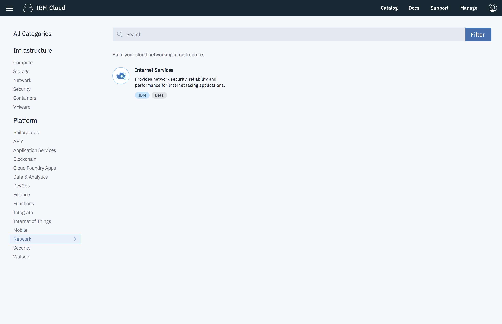

---

copyright:
  years: 2018, 2019
lastupdated: "2019-03-29"

keywords: IBM Cloud Internet Services, IBM CIS application, Authoritative DNS servers

subcollection: cis

---

{:shortdesc: .shortdesc}
{:new_window: target="_blank"}
{:DomainName: data-hd-keyref="DomainName"}
{:note: .note}
{:important: .important}
{:deprecated: .deprecated}
{:generic: data-hd-programlang="generic"}

# Iniciación a IBM Cloud Internet Services (CIS)
{:#getting-started}

IBM Cloud Internet Services (CIS), aumentado con Cloudflare, ofrece tres funciones principales para mejorar su flujo de trabajo: [seguridad](/docs/infrastructure/cis?topic=cis-manage-your-ibm-cis-for-optimal-security), [fiabilidad](/docs/infrastructure/cis?topic=cis-manage-your-ibm-cis-deployment-for-optimal-reliability) y [rendimiento](/docs/infrastructure/cis?topic=cis-manage-your-cis-deployment-for-best-performance). Cada área de funcionalidad está representada en la barra de navegación izquierda de la pantalla, una vez que haya abierto la aplicación de IBM CIS.

Para cada funcionalidad, IBM CIS le ayuda a ajustar sus características para que se ajusten a sus necesidades específicas, entre las que se incluye:

 * Servidores DNS autorizados
 * Equilibrio de carga global y local
 * Cortafuegos de aplicaciones web (WAF)
 * Protección DDoS
 * Almacenamiento en memoria y reglas de páginas

## Antes de empezar
{:#before-you-begin}

Antes de empezar a utilizar IBM CIS, primero necesitará un [IBMid](https://www.ibm.com/account/reg/us-en/signup?formid=urx-19776). Entonces, podrá pedir sus servicios mediante su Cuenta de IBM Cloud, o mediante el nuevo [IBM Cloud Internet Services Portal](https://{DomainName}/catalog/services/internet-services), dependiendo de su preferencia.

Si necesita ayuda al obtener una cuenta para utilizar IBM Cloud Internet Services, [póngase en contacto con el representante de ventas de IBM](https://{DomainName}/cloud/support) para obtener orientación adicional sobre cómo empezar.

Si tiene una cuenta de Softlayer existente, puede [enlazar la cuenta](https://{DomainName}/docs/account?topic=account-unifyingaccounts) con el IBMid. 

## Visión general del proceso
{:#process-overview}

Puede empezar a utilizar IBM CIS para el tráfico de Internet con sólo unos pocos pasos.

 * Abra la aplicación IBM CIS desde el panel de control de IBM Cloud.
 * Añada el dominio que desea gestionar.
 * Configure la información de DNS con los servidores de nombres que hemos proporcionado.
 * Continúe iniciándose a IBM CIS, siguiendo una guía de aprendizaje o configurando otras características.

### Paso 1: Abra la aplicación IBM CIS
{:#open-cis-application}

Abra el [panel de control de IBM Cloud](https://{DomainName}/catalog/). A continuación, vaya al icono de aplicación de IBM CIS seleccionando la categoría **Infraestructura -> Red** en la barra de navegación izquierda del panel de control. Abra la aplicación IBM Cloud Internet Services pulsando el icono que verá cerca de la mitad de la pantalla. 

**La pantalla Visión general**

Una vez que se inicie la aplicación IBM CIS, verá la pantalla **Visión general** de IBM CIS, y encontrará los separadores para **Seguridad**, **Fiabilidad** y **Rendimiento** en el área izquierda de la pantalla IU.

**¿Qué plan debo elegir?**

Hay 4 planes para elegir, 
* **Uso empresarial** 
* **Paquete de empresa** 
* **Plan Estándar** 
* **Prueba gratuita**. 

La **Prueba gratuita** caduca pasados 30 días, momento en el que puede actualizarse a **Plan estándar** o a un **Plan de empresa**. Una instancia de **Estándar** puede gestionar un dominio. Puede crear tantas instancias de servicio **Estándar** como desee dentro de una sola cuenta, cada una de ellas gestionando un solo dominio. 

Los **Planes de Empresa** le permiten gestionar varios dominios en una sola instancia de servicio. Seleccione el botón **Crear** en la pantalla **Visión general** para empezar a suministrar a su cuenta.

El plan **Prueba gratuita** está limitado a una instancia por cuenta. 
{:note}

**Empezar a suministrar**

Verá la primera pantalla de la aplicación IBM CIS, donde seleccionará el botón **Añadir dominio** para empezar.

### Paso 2. Añada y configure su Dominio.
{:#add-configure-your-domain}

Seleccione **Empecemos** en la página de bienvenida para empezar a configurar CIS.

A continuación, comience a proteger y a mejorar el rendimiento de su servicio web especificando su dominio o un subdominio.

Especifique zonas DNS. Puede configurar los servidores de nombres para estos dominios o subdominios en el registrador del dominio o en el proveedor de DNS. No utilice CNAME.
{:note}

La pantalla Visión general mostrará el dominio en el estado `Pendiente`. Su dominio seguirá `Pendiente` hasta que complete el Paso 4.

La instancia de IBM CIS no se puede suprimir una vez que se haya añadido un dominio. Para suprimir la instancia, suprima el dominio de la instancia en primer lugar.
{:note}

### Paso 3. Configure sus registros de DNS (opcional).
{:#setup-your-dns-records}

Antes de realizar la transición del tráfico de su dominio a CIS, le recomendamos que importe o vuelva a crear los registros DNS en CIS. Puede saltarse este paso, pero si sus registros DNS no se configuran correctamente en CIS, partes de su sitio web podrían quedar inaccesibles.

Importe los registros cargando los registros exportados desde el DNS actual o creando manualmente los registros de DNS. Para importar registros, seleccione **Importar registros**.

Cuando haya terminado, o si desea saltarse este paso, seleccione **Paso siguiente**.

### Paso 4. Configure los Servidores de nombres con el Registrador o un Proveedor DNS existente.
{:#configure-your-name-servers-with-the-registrar-or-existing-dns-provider}

Para empezar a recibir los beneficios de IBM CIS, configure el registrador o el proveedor de nombres de dominio para utilizar los servidores de nombres listados. Si está delegando un dominio (algo parecido a `example.com`), configure los servidores de nombres listados en la configuración del dominio, donde están gestionados por el registrador (por ejemplo, en el portal web del registrador). Si no está seguro de quién es el registrador para el dominio, puede buscarlo en https://whois.icann.org/. Si delega un subdominio (por ejemplo, `subdomain.example.com`) desde otro proveedor de DNS, debe añadir un registro de NS (Name Server, servidor de nombres) para cada uno de los servidores de nombres listados. Consulte [Gestión de registros DNS ](https://support.cloudflare.com/hc/en-us/articles/360019093151-Managing-DNS-records-in-Cloudflare){:new_window}, escrito por nuestros socios de Cloudflare, para obtener instrucciones detalladas por proveedor.

Después de haber configurado el registrador o proveedor de DNS, puede necesitar hasta 24 horas para que los cambios entren en vigor. Una vez que hayamos verificado que se hayan configurado correctamente los servidores de nombres especificados para el dominio o subdominio, el estado del dominio cambiará de `Pendiente` a `Activo`. Después de configurar los servidores de nombres, puede pulsar en el enlace "Volver a comprobar los servidores de nombres" en la página `Visión general` para acelerar potencialmente la activación del dominio (puede realizar esta comprobación solo una vez cada hora).

El dominio debe pasar al estado `Activo` en un plazo de 60 días o se eliminarán el dominio y sus datos de configuración. 
{:note}

### Paso 5. Asegúrese de que IBM Cloud Internet Services esté resolviendo la información de dominio para su aplicación, nombre de host o sitio web.
{:#ensure-cis-is-resolving-domain-info}

Para continuar, seleccione el separador **Fiabilidad** desde la barra de navegación de la izquierda y, a continuación, seleccione la opción **DNS**. Asegúrese de añadir los _Registros DNS_ apropiados. Añada el **Registro A** y cualquier entrada **AAAA** o **MX** que se rellene. Si se olvida de añadir estos registros antes de que la delegación del registrador se haya completado, IBM Cloud Services Internet no podrá resolver la información de dominio para sus aplicaciones conectadas a Internet.

### Paso 6. Mientras tanto, puede empezar a gestionar otras funciones y características de IBM CIS.
{:#manage-other-cis-functions}

Para obtener más detalles sobre la gestión de otras funciones y características, consulte las [instrucciones paso a paso](/docs/infrastructure/cis?topic=cis-manage-your-ibm-cloud-internet-services-cis-deployment).
