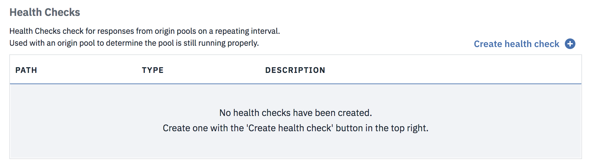

---

copyright:
  years: 2018, 2019
lastupdated: "2019-03-14"

keywords: health checks, origin pools, load balancers, IBM CIS

subcollection: cis

---

{:shortdesc: .shortdesc}
{:new_window: target="_blank"}
{:DomainName: data-hd-keyref="DomainName"}
{:note: .note}
{:important: .important}
{:deprecated: .deprecated}
{:generic: data-hd-programlang="generic"}

# Establecimiento y configuración de los equilibradores de carga
{:#set-up-and-configure-your-load-balancers}
 
 IBM CIS proporciona equilibrio de carga global como un servicio. Éste es el aspecto del panel de instrumentos GLB:

## Panel de control de GLB
{:#glb-dashboard}

En el panel de control, verá tres listas que muestran los equilibradores de carga, las agrupaciones de origen y las comprobaciones de estado. Las listas muestran el equilibrador de carga global nuevo o actualizado o uno de sus componentes cuando lo suministre o lo actualice. Inicialmente, las listas están vacías, y antes de crear un equilibrador de carga debe realizar algunas acciones.

Consulte la [Guía de inicio rápido](/docs/infrastructure/cis?topic=cis-global-load-balancer-quick-setup) si ya sabe lo que necesita hacer

### Crear
{:#create-health-check}

`*` indica que este paso es opcional
{:note}

1) `*`Crear una comprobación de estado, pulse **Crear comprobación de estado**.
  
    <ul>
      <li><b>Vía de acceso</b>: La vía de acceso de punto final en la que comprobar el estado.</li> 
      <li><b>Tipo</b>: El protocolo que se utilizará para la comprobación de estado.</li>
      <li><b>Descripción</b>: Descripción proporcionada por el usuario.</li>
    </ul>

2) Crear una agrupación, pulse **Crear agrupación**.
  
    <ul>
      <li><b>Estado</b>: Estado de la agrupación.</li>
      <li><b>Nombre</b>: Nombre proporcionado por el usuario.</li>
      <li><b>Orígenes</b>: Recuento de orígenes de estado en la agrupación.</li>
      <li><b>Comprobación de estado</b>: Vía de acceso de la comprobación de estado adjunta, si la hay.</li>
    </ul>

3) Crear un equilibrador de carga, pulse **Crear equilibrador de carga**.
  
    <ul>
      <li><b>Estado</b>: Estado del equilibrador de carga.</li>
      <li><b>Nombre de host</b>: Nombre preañadido al nombre de dominio.</li>
      <li><b>Agrupaciones disponibles</b>: Recuento de agrupaciones en buen estado.</li>
      <li><b>TTL</b>: Tiempo de duración.</li>
      <li><b>Proxy</b>: Habilitar o inhabilitar el flujo de tráfico de proxy.</li>
      <li><b>Estado</b>: Habilitar o inhabilitar el equilibrador de carga.</li>
    </ul>

Las regiones geográficas de IBM difieren de las regiones de Cloudflare. Para obtener información detallada sobre las regiones geográficas que utiliza Cloudflare, consulte [Load Balancing: Geographic Regions ](https://support.cloudflare.com/hc/en-us/articles/115000540888-Load-Balancing-Geographic-Regions){:new_window}.  
{:note}

### Editar/suprimir
{:#edit-delete-load-balancer}
Para editar o suprimir un equilibrador de carga o uno de sus componentes, pulse el botón de menú de desbordamiento ubicado en el extremo derecho de cada fila.

Botón de menú de desbordamiento:

Las opciones siguientes se proporcionan para cada lista.

* Comprobación de estado
    * **Ver comprobación de estado**: Esta opción muestra un breve resumen de la comprobación de estado, con un enlace para ir al flujo de edición.
    * **Editar comprobación de estado**: Esta opción redirige al usuario al flujo de edición. 
    * **Suprimir comprobación de estado**: Esta opción abre el recuadro de diálogo de confirmación para el flujo de supresión.

* Agrupación
    * **Ver detalles de la agrupación**: Esta opción abre un recuadro de diálogo modal con información sobre la agrupación.
    * **Editar agrupación**: Esta opción redirige al usuario al flujo de edición.
    * **Suprimir agrupación**: Esta opción abre el recuadro de diálogo de confirmación para el flujo de supresión.

* Equilibrador de carga
    * **Inhabilitar/Habilitar**: Habilitar o inhabilitar un equilibrador de carga.
    * **Editar equilibrador de carga**: Redirige al flujo de edición. 
    * **Suprimir equilibrador de carga**: Abre el recuadro de diálogo de confirmación para el flujo de supresión.

## Adición de una comprobación de estado
{:#add-a-health-check}

Las comprobaciones de estado son archivos adjuntos opcionales para agrupaciones de origen. Utilizan un intervalo de repetición personalizado para probar un cuerpo de respuesta específico, o para un código de estado, para supervisar el estado de la agrupación. Una vez creadas, las comprobaciones de estado se pueden añadir a una agrupación de origen nueva o existente.

Al crear una comprobación de estado, solo se necesita un campo:
 * **Código de respuesta**: El código de respuesta HTTP esperado o el rango de códigos de la comprobación de estado. Este valor debe estar entre 200 y 299 con comodines indicados por una 'x'.

Campos opcionales adicionales:
 * **Vía de acceso**: La vía de acceso de punto final en la que se realizará la comprobación de estado (su valor predeterminado es /).
 * **Tipo**: El protocolo que se utilizará para la comprobación de estado (el valor predeterminado es HTTP).
 * **Descripción**: Descripción de la comprobación de estado.
 * **Intervalo**: El intervalo (en segundos) entre cada comprobación de estado. Los intervalos más cortos pueden mejorar el tiempo de migración tras error, pero aumentan la carga en los orígenes, ya que las comprobaciones provienen de varias ubicaciones (el valor predeterminado es 60).
 * **Método**: El método HTTP que se utilizará para la comprobación de estado (el valor predeterminado es GET).
 * **Tiempo de espera**: El tiempo (en segundos) antes de marcar la comprobación de estado como fallida (el valor predeterminado es 5).
 * **Reintentos**: El número de reintentos que se realizarán en caso de que se supere el tiempo de espera antes de marcar el origen como en mal estado. Los reintentos se realizarán inmediatamente (el valor predeterminado es 2).
 * **Cuerpo de respuesta**: Una subserie que no distingue entre mayúscula y minúscula para hacerla coincidir en el cuerpo de respuesta. Si esta serie no se encuentra, el origen se marcará como en mal estado.
 * **Cabeceras de solicitud**: Las cabeceras de solicitud HTTP que se enviarán en la comprobación de estado. Se recomienda establecer una cabecera Host de forma predeterminada. La cabecera `User-Agent` no se puede sobrescribir.

## Adición de una agrupación
{:#add-a-pool}

Es necesaria al menos una agrupación para cada equilibrador de carga suministrado. Las agrupaciones agrupan sus orígenes para el equilibrador de carga que se utilizará.

Al crear una agrupación, serán necesarios dos campos:
 * **Nombre**: Un nombre abreviado (etiqueta) para la agrupación. Solo se permiten caracteres alfanuméricos, guiones y subrayados.
 * **Orígenes**: La lista de orígenes de esta agrupación. El tráfico dirigido a esta agrupación se equilibra entre todos los orígenes que están en buen estado actualmente, siempre que la agrupación lo esté también.

Campos opcionales adicionales:
 * **Descripción**: Una descripción legible por humanos de la agrupación.
 * **Habilitado**: Habilitar (valor predeterminado) o no esta agrupación. Las agrupaciones inhabilitadas no reciben tráfico y están excluidas de las comprobaciones de estado. La inhabilitación de una agrupación hace que cualquier equilibrador de carga que la utilice migre tras error a la siguiente agrupación, si la hay (el valor predeterminado es true).
 * **Umbral de orígenes en buen estado**: El número mínimo de orígenes que deben estar en buen estado para que esta agrupación sirva tráfico. Si el número de orígenes en buen estado está por debajo de este número, la agrupación se marcará como en mal estado y migrará tras error a la siguiente agrupación disponible (el valor predeterminado es 1).
 * **Regiones de comprobación de estado**: Región desde la que la comprobación de estado realizará la supervisión. **Nota**: Las regiones geográficas de IBM difieren de las regiones de Cloudflare. Para obtener información detallada sobre las regiones geográficas que utiliza Cloudflare, consulte [Load Balancing: Geographic Regions ](https://support.cloudflare.com/hc/en-us/articles/115000540888-Load-Balancing-Geographic-Regions){:new_window}. 
 * **Comprobación de estado**: La comprobación de estado que se utilizará para comprobar orígenes dentro de esta agrupación (el valor predeterminado es sin comprobación de estado).
 * **Correo electrónico de notificación**: La dirección de correo electrónico que debería recibir las notificaciones de estado. Esta dirección puede ser un buzón de correo individual o una lista de distribución.

## Adición de un equilibrador de carga
{:#add-a-load-balancer}

Los equilibradores de carga ayudan a distribuir el tráfico con proxy en varias agrupaciones de origen utilizando una distribución en rueda.

Al crear un equilibrador de carga, los campos necesarios son:
 * **Nombre**: El nombre de host de DNS que se asociará con el Equilibrador de carga. Si este nombre de host ya existe como un registro de DNS en el DNS de IBM, el Equilibrador de carga tendrá prioridad y el registro de DNS no se utilizará.
 * **Agrupaciones predeterminadas**: Una lista de ID de agrupación. La lista está ordenada por su prioridad de migración tras error. Las agrupaciones definidas aquí se utilizan de forma predeterminada, o cuando las agrupaciones de regiones no están configuradas para una región determinada.

Opcionalmente, se pueden configurar los campos siguientes:
 * **Proxy**: Direcciona el tráfico a través del servicio de rendimiento y de métricas de IBM.
 * **Afinidad de sesiones**: Direcciona siempre a través de la misma instancia de rendimiento y de métricas. Esta opción solo está disponible si el proxy está habilitado.
 * **TTL**: Tiempo de duración (TTL) de la entrada DNS para la dirección IP devuelta por este equilibrador de carga. Esta opción solo se aplica a los equilibradores de carga sin proxy; de lo contrario, tiene como valor predeterminado `Automatic`.
 * **Agrupaciones de región**: Una correlación de códigos de regiones o de países en una lista de agrupaciones (ordenadas por su prioridad de migración tras error) para la región determinada. Cualquier región no definida explícitamente volverá a utilizar las agrupaciones predeterminadas. **Nota**: Las regiones geográficas de IBM difieren de las regiones de Cloudflare. Para obtener información detallada sobre las regiones geográficas que utiliza Cloudflare, consulte [Load Balancing: Geographic Regions ](https://support.cloudflare.com/hc/en-us/articles/115000540888-Load-Balancing-Geographic-Regions){:new_window}. 
 
Para obtener definiciones de los términos utilizados en este documento, que en general son términos utilizados comúnmente en el sector, consulte el [Glosario](/docs/infrastructure/cis?topic=cis-glossary).
