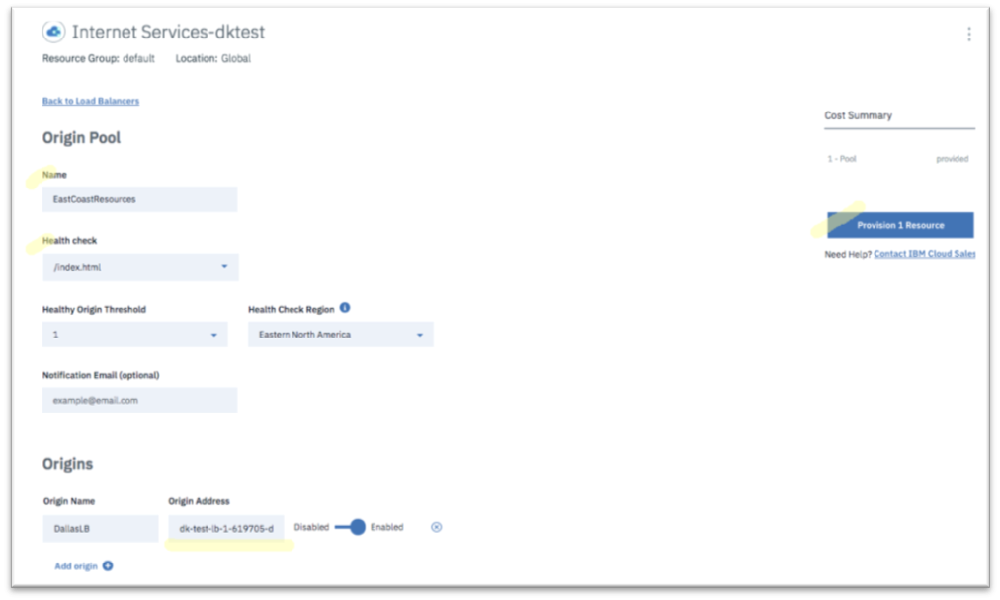

---

copyright:
  years: 2018, 2019
lastupdated: "2019-03-14"

keywords: origin pools, application resources, Origin Pools section

subcollection: cis

---

{:shortdesc: .shortdesc}
{:codeblock: .codeblock}
{:screen: .screen}
{:new_window: target="_blank"}
{:pre: .pre}
{:table: .aria-labeledby="caption"}

# Identificar los recursos de la aplicación
{:#identify-your-application-resources}

Identifique los recursos de la aplicación como, por ejemplo, las agrupaciones de origen y los mecanismos de comprobación de estado.
 
1. Vaya a la sección **Agrupaciones de origen** y haga clic en **Crear agrupación** para definir una nueva agrupación de origen. 

   Las agrupaciones de origen son recursos de servidor que suministran aplicaciones a sus clientes. 
   
2. Asigne un nombre a la agrupación de origen, y seleccione el mecanismo de comprobación de estado definido anteriormente. Añada el servidor de aplicaciones como su origen. Puede añadir uno o más orígenes pulsando **Añadir origen**. 

   Si los servidores de aplicaciones están detrás de un equilibrador de carga local como, por ejemplo, un equilibrador de carga de IBM Cloud, añada el FQDN o la IP virtual del equilibrador de carga como origen en lugar de añadir servidores individuales. 
   {:note}
   
3. Pulse **Suministrar recurso** para completar la creación de la agrupación de origen.  

   
   
   La agrupación de origen se mostrará inicialmente como **En mal estado**. Su estado cambiará a **En buen estado** después de una comprobación de estado satisfactoria por parte del sistema. Es posible que tenga que renovar el navegador para ver el cambio de estado. 
   
   
   
   Si tiene varios orígenes dentro de la agrupación de origen, utilice el Umbral de orígenes en buen estado para especificar el número mínimo de orígenes que deben estar en buen estado para poder declarar la agrupación en buen estado. 
   {:note}
   
4. Defina tantas agrupaciones de origen como conjuntos de aplicaciones tenga. Estos conjuntos pueden estar dentro de la misma o de distintas regiones geográficas. En nuestro ejemplo, crearemos dos agrupaciones de origen que representen un conjunto de aplicaciones en las costas este y oeste de Estados Unidos. 

   
