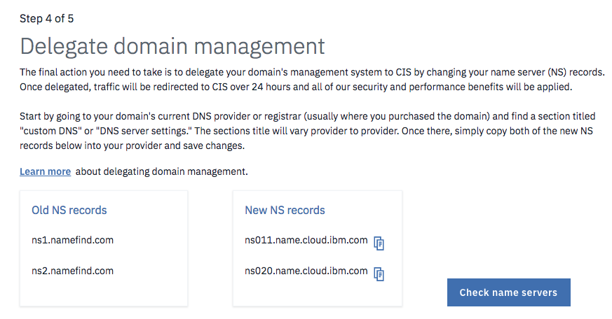
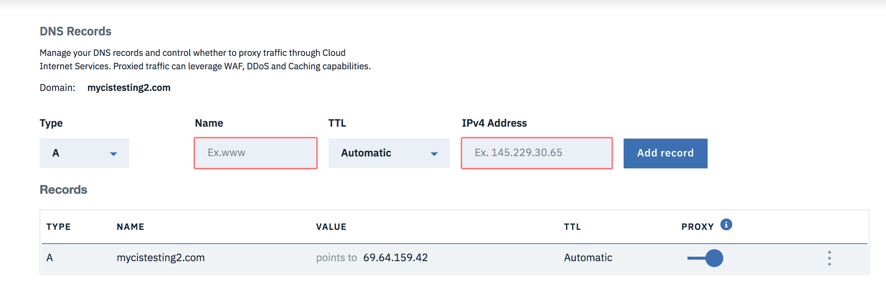

---

copyright:
  years: 2018, 2019
lastupdated: "2019-03-29"

keywords: IBM Cloud Internet Services, IBM CIS application, Authoritative DNS servers

subcollection: cis

---

{:shortdesc: .shortdesc}
{:new_window: target="_blank"}
{:DomainName: data-hd-keyref="DomainName"}
{:note: .note}
{:important: .important}
{:deprecated: .deprecated}
{:generic: data-hd-programlang="generic"}

# Initiation à IBM Cloud Internet Services (CIS)
{:#getting-started}

IBM Cloud Internet Services (CIS), alimenté par Cloudflare, propose trois grandes fonctionnalités pour optimiser votre flux de travail : [sécurité](/docs/infrastructure/cis?topic=cis-manage-your-ibm-cis-for-optimal-security), [fiabilité](/docs/infrastructure/cis?topic=cis-manage-your-ibm-cis-deployment-for-optimal-reliability) et [performances](/docs/infrastructure/cis?topic=cis-manage-your-cis-deployment-for-best-performance). Chacune de ces fonctionnalités est représentée dans la barre de navigation à gauche de votre écran lorsque l'application IBM CIS est ouverte.

IBM CIS vous permet d'optimiser ces fonctionnalités afin de répondre à vos besoins spécifiques, y compris :

 * Serveurs DNS faisant autorité
 * Equilibrage de charge global et local
 * Pare-feu d'application Web (WAF)
 * Protection contre les DDoS
 * Mise en cache et règles de page

## Avant de commencer
{:#before-you-begin}

Pour pouvoir utiliser IBM CIS, vous devez tout d'abord disposer d'un [IBMid](https://www.ibm.com/account/reg/us-en/signup?formid=urx-19776). Ensuite, vous pourrez commander vos services via IBM Cloud Account, ou le nouveau portail [IBM Cloud Internet Services Portal](https://{DomainName}/catalog/services/internet-services), selon vos préférences.

Si vous avez besoin d'aide pour ouvrir un compte permettant d'utiliser IBM Cloud Internet Services, [contactez votre représentant commercial IBM](https://{DomainName}/cloud/support) pour en savoir plus sur la mise en route.

Si vous possédez déjà un compte Softlayer, vous pouvez [lier votre compte](https://{DomainName}/docs/account?topic=account-unifyingaccounts) à votre IBMid. 

## Présentation du processus
{:#process-overview}

Vous pouvez commencer à utiliser IBM CIS pour vos connexions à Internet en seulement quelques étapes.

 * Ouvrez l'application IBM CIS à partir de votre tableau de bord IBM Cloud.
 * Ajoutez le domaine que vous souhaitez gérer.
 * Configurez vos informations DNS avec les serveurs de noms que nous vous avons fourni.
 * Familiarisez-vous avec IBM CIS, en regardant un tutoriel ou en configurant d'autres fonctionnalités.

### Etape 1 : Ouvrez l'application IBM CIS
{:#open-cis-application}

Ouvrez votre [tableau de bord IBM Cloud](https://{DomainName}/catalog/). Accédez ensuite à l'icône de l'application IBM CIS en sélectionnant la catégorie **Infrastructure -> Réseau** située dans la barre de navigation à gauche du tableau de bord. Ouvrez l'application IBM Cloud Internet Services en cliquant sur l'icône qui apparaît près du milieu de l'écran. 

**Ecran Vue d'ensemble**

Lorsque l'application IBM CIS démarre, l'écran **Vue d'ensemble** s'ouvre avec les onglets **Sécurité**, **Fiabilité** et **Performances** à gauche de l'interface.

**Quel forfait dois-je choisir ?**

Vous disposez de 4 forfaits :  
* **Utilisation Enterprise** 
* **Module Enterprise** 
* **Forfait Standard** 
* **Essai gratuit**. 

L'**Essai gratuit** arrive à expiration après 30 jours, après quoi vous pouvez mettre à niveau vers le **Forfait Standard** ou un **Forfait Enterprise**. Une seule instance **Standard** peut gérer un domaine. Vous pouvez créer autant d'instances de service **Standard** que vous le souhaitez dans un même compte, chacune gérant un seul domaine. 

Les **Forfaits Enterprise** vous permettent de gérer plusieurs domaines dans une seule instance de service. Sélectionnez le bouton **Créer** sur l'écran **Vue d'ensemble** pour commencer la mise à disposition de votre compte.

Le forfait **Essai gratuit** est limité à une instance par compte. {:note}

**Commencer la mise à disposition**

Le premier écran de l'application IBM CIS s'affiche, à partir duquel vous allez cliquer sur le bouton **Ajouter un domaine**.

### Etape 2. Ajoutez et configurez votre domaine.
{:#add-configure-your-domain}

Sélectionnez **Mise en route** dans la page d'accueil pour commencer à configurer CIS.

Commencez ensuite à protéger et à améliorer les performances de votre service Web en entrant votre domaine ou un sous-domaine.

Veuillez renseigner les zones DNS. Vous pouvez configurer les serveurs de noms de ces domaines ou sous-domaines au niveau du registre ou du fournisseur DNS du domaine. N'utilisez pas les CNAME.
{:note}

L'écran Vue d'ensemble affiche votre domaine à l'état `En attente`. Il restera dans cet état jusqu'à ce que vous ayez terminé l'étape 4.

L'instance IBM CIS ne peut pas être supprimée une fois qu'un domaine a été ajouté. Pour supprimer l'instance, supprimez d'abord le domaine de l'instance.
{:note}

### Etape 3. Configurez vos enregistrements DNS (facultatif). 
{:#setup-your-dns-records}

Avant de transférer le trafic de votre domaine vers CIS, nous vous recommandons vivement d'importer ou de recréer vos enregistrements DNS dans CIS. Vous pouvez choisir de passer cette étape, mais si vos enregistrements DNS ne sont pas configurés correctement dans CIS, des parties de votre site Web pourraient être inaccessibles. 

Importez des enregistrements en téléchargeant vos enregistrements exportés à partir de votre DNS actuel ou créez manuellement vos enregistrements DNS. Pour importer des enregistrements, sélectionnez **Importation d'enregistrements**. 

Lorsque vous avez terminé ou si vous souhaitez ignorer cette étape, sélectionnez **Etape suivante**. 

### Etape 4. Configurez vos serveurs de noms avec l'enregistreur ou le fournisseur DNS existant. 
{:#configure-your-name-servers-with-the-registrar-or-existing-dns-provider}

Pour profiter des avantages d'IBM CIS, configurez votre registre ou votre fournisseur de nom de domaine de manière à utiliser les serveurs de noms répertoriés dans la liste. Si vous déléguez un domaine (`example.com`, par exemple), configurez les serveurs de noms répertoriés dans les paramètres de votre domaine, à l'emplacement à partir duquel ils sont gérés par votre registre (par exemple, sur le portail Web du registre). Si vous n'êtes pas sûr du registre de votre domaine, consultez la liste à l'adresse https://whois.icann.org/. Si vous déléguez un sous-domaine (par exemple, `subdomain.example.com`) à partir d'un autre fournisseur DNS, vous devez ajouter un enregistrement de serveur de noms (NS) à chacun des serveurs figurant dans la liste. Consultez le document [Managing DNS Records ](https://support.cloudflare.com/hc/en-us/articles/360019093151-Managing-DNS-records-in-Cloudflare){:new_window}, rédigé par nos partenaires de Cloudflare, pour obtenir des instructions détaillées par fournisseur.

Lorsque vous avez configuré votre registre ou fournisseur DNS, un délai de 24 heures peut être requis pour que les modifications soient prises en compte. Après avoir vérifié que les serveurs de noms ont été correctement configurés pour votre domaine ou sous-domaine, le statut du domaine passe de `En attente` à `Actif`. Une fois les noms de serveurs configurés, vous pouvez cliquer sur le lien "Revérifier les serveurs de noms" dans la page `Vue d'ensemble` pour accélérer potentiellement l'activation de votre domaine (cette vérification ne peut être exécutée qu'une fois par heure).

Votre domaine doit passer à l'état `Actif` dans un délai de 60 jours, faute de quoi votre domaine et toutes les données de configuration seront supprimés. {:note}

### Etape 5. Assurez-vous qu'IBM Cloud Internet Services effectue la résolution des informations de domaine pour votre application, nom d'hôte ou site Web.
{:#ensure-cis-is-resolving-domain-info}

Pour continuer, sélectionnez l'onglet **Fiabilité** dans la barre de navigation de gauche et choisissez l'option **DNS**. Veillez à ajouter les _Enregistrements DNS_ appropriés. Ajoutez l'**enregistrement A** ainsi que toutes les entrées **AAAA** ou **MX** qui sont renseignées. Si vous oubliez d'ajouter ces enregistrements avant que la délégation de registre ne soit terminée, IBM Cloud Internet Services ne peut pas résoudre les informations de domaine pour vos applications Internet.

### Etape 6. Pendant ce temps, vous pouvez commencer à gérer d'autres fonctionnalités IBM CIS.
{:#manage-other-cis-functions}

Pour en savoir plus sur la gestion des autres fonctionnalités, voir les [instructions détaillées](/docs/infrastructure/cis?topic=cis-manage-your-ibm-cloud-internet-services-cis-deployment).
