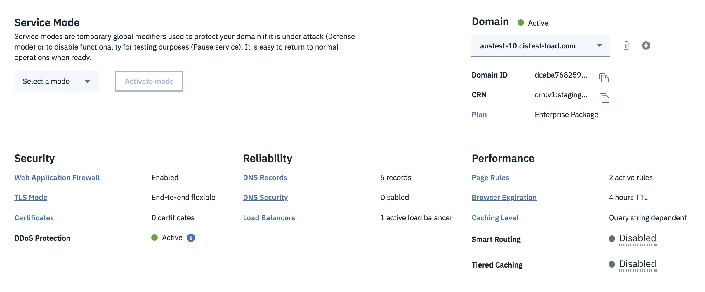

---

copyright:
  years: 2018, 2019
lastupdated: "2019-03-14"

keywords: Overview page, page rules, Service Mode

subcollection: cis

---

{:shortdesc: .shortdesc}
{:new_window: target="_blank"}
{:DomainName: data-hd-keyref="DomainName"}
{:note: .note}
{:important: .important}
{:deprecated: .deprecated}
{:generic: data-hd-programlang="generic"}

# Gestion de votre déploiement IBM Cloud Internet Services (CIS)
{:#manage-your-cis-deployment}

Vous allez utiliser l'écran Vue d'ensemble comme base de travail. Vous trouverez dans cet écran l'ensemble des paramètres actuels de votre déploiement.

Une fois que vous avez installé et configuré votre DNS, vous pouvez commencer à l'utiliser.

## Utilisation de l'écran Vue d'ensemble
{:#using-the-overview-screen}

Dans cet écran, vous pouvez voir le statut de toutes vos sélections. Chaque paramètre est lié à la section de l'interface utilisateur où il est configuré. Pour modifier une sélection, vous pouvez naviguer en cliquant sur le lien du paramètre. Par exemple, pour modifier la configuration de l'équilibreur de charge ou en ajouter un nouvel équilibreur, cliquez sur la zone `Equilibreur de charge`.

Sur l'écran Vue d'ensemble, vous pouvez voir que le statut de la configuration de votre nom de domaine est **En attente** ou **Actif**, comme illustré dans la figure ci-dessous.

L'état **En attente** indique que votre domaine n'est pas encore complètement configuré. Vous devez mettre à jour votre fournisseur DNS ou votre enregistreur avec les serveurs de noms fournis dans le cadre du processus d'installation. 

**Enterprise uniquement** : la section **Détails du service** de la page Vue d'ensemble vous permet également d'ajouter des domaines à votre instance de CIS et de basculer entre plusieurs domaines.

## Modification du mode Service
{#changing-the-service-mode}

Sur la page Vue d'ensemble, sous la section Mode service, un menu déroulant permet de sélectionner l'un des deux modes suivants : 

* Le **Mode défense** aide à vous protéger contre les attaques DNS existantes ou prévues. Il empêche tout le trafic d'atteindre vos serveurs d'origine via votre domaine.
* L'option **Suspendre le service** désactive tous les avantages en termes de sécurité et de performances pour votre domaine. Les fonctions DNS restent opérationnelles pour votre site Web mais le trafic est envoyé directement aux origines configurées. 

### Etapes pour définir le Mode service 
{:#steps-to-set-service-mode}

1. Sélectionnez le mode souhaité dans le menu déroulant. 
1. Cliquez sur le bouton `Activer`.
1. Confirmez ou annulez la sélection dans la fenêtre de confirmation. 

Une notification apparaît sur toutes les pages pour indiquer que l'option Suspendre le service ou Mode défense est active. Pour revenir au fonctionnement normal, cliquez sur `Désactiver le mode` dans la bannière de notification.

## Configuration et gestion du DNS
{:#configure-and-manage-your-dns}

Accédez à votre page DNS et ajoutez un enregistrement (vraisemblablement un enregistrement de type A). Entrez les informations relatives à votre enregistrement DNS, puis cliquez sur `Ajouter un enregistrement` pour implémenter vos changements.

Après avoir créé vos enregistrements, envisagez d’activer le paramètre `Proxy`. La plupart des fonctionnalités de CIS exigent que le trafic Internet sur votre site passe par l’infrastructure CIS. En d'autres termes, elles ne s'appliquent qu'aux enregistrements transmis par proxy et aux équilibreurs de charge. Pour tirer pleinement parti des avantages de CIS, assurez-vous que le paramètre de proxy est activé pour vos enregistrements DNS et vos équilibreurs de charge. 

## Configuration et gestion de la mise en cache
{:#set-up-and-manage-your-caching}

Vous pouvez maintenant configurer la mise en cache. 

Vous avez la possibilité de choisir entre trois options de mise en cache à partir du menu déroulant correspondant : 

 * Aucune chaîne de requête : seules les ressources du cache sont distribuées lorsqu'il n'y a aucune chaîne de requête.
 * Indépendamment de la chaîne de requête : la même ressource est distribuée, peu importe la chaîne de requête. (Remarque : le paramètre **Ignorer la chaîne de requête** s'applique uniquement aux extensions de fichier statique. Ce paramètre supprime la chaîne de requête lors de la génération de la clé de cache, de sorte qu'une demande pour `style.css?something` est normalisée au format `style.css` lorsqu'elle provient de la mémoire cache.)
 * Selon la chaîne de requête : une ressource différente est distribuée chaque fois que la chaîne de requête est modifiée.
  
## Vider le cache
{:#purge-cache-overview}
 
Vous pouvez vider le cache pour préparer les mises à jour à tout moment, en saisissant simplement l'adresse URL dans la zone de purge du cache. Vous pouvez purger un seul fichier ou plusieurs fichiers simultanément (jusqu'à 30 fichiers).
 
 ## Expiration du navigateur
 {:#browser-expiration}
 
Utilisez le menu déroulant pour sélectionner une durée d'expiration de votre navigateur, par exemple, 8 heures ou 1 jour.

Enterprise uniquement : vous pouvez également demander à CIS de ne pas contourner le contrôle du cache du navigateur en définissant cette option sur **Respecter les en-têtes existants**.
 
 ## Utilisation du mode développement
 {:#using-development-mode}
 
L'option **Mode développement** est destinée à être utilisée lorsque vous devez procéder à des mises à jour majeures, lorsque de nouveaux téléchargements de fichiers sont requis, ou chaque fois que vous ne voulez pas que les utilisateurs finaux travaillent à partir de la mémoire cache, mais extraient les fichiers directement à partir des serveurs d'origine. Pour commencer à utiliser le **Mode développement**, déplacez le commutateur sur la position `Activé`. Pour arrêter de l'utiliser, replacez le commutateur sur la position `Désactivé`. Le **Mode développement** expire automatiquement au bout de 3 heures. 

## Gestion de vos règles de page
{:#managing-your-page-rules}
 
Vous pouvez utiliser des règles de page pour spécifier des paramètres particuliers qui ne s'appliquent qu'à certaines URL, par exemple pour définir des paramètres de contrôle du cache différents pour certains chemins d'URL. Servez-vous des menus déroulants pour les configurer. Les paramètres de règle sont divisés en trois catégories : **Sécurité**, **Performances** et **Fiabilité**.

Notez que certaines règles de page sont activées tandis que d'autres sont grisées, si ces options entrent en conflit avec les autres règles que vous venez de sélectionner. Après avoir sélectionné les règles de page de votre choix, cliquez sur **Provisionner** pour les activer. Les nouvelles règles prennent effet immédiatement et sont aussitôt visibles dans l'écran Règles de page.
 
 
 
Vous pouvez également activer ou désactiver vos règles de page depuis le tableau affiché dans l'écran Règles de page. Pour plus d'informations, voir [Utilisation des règles de page](/docs/infrastructure/cis?topic=cis-use-page-rules).
 
 ## Paramètres de sécurité
 {:#security-settings-overview}
 
Par défaut, la protection DDoS est activée pour tous les enregistrements DNS ou les équilibreurs de charge avec proxy activé.
Les paramètres de sécurité sont les suivants :  

* Activez WAF à l'aide de la bascule de la page **Pare-feu d'application web**. Lorsque vous activez ou désactivez les règles, les modifications sont appliquées immédiatement.

* **Enterprise uniquement** : la **Limitation de débit** permet de configurer des règles de limitation de débit pour éviter les problèmes de voisin bruyant et éviter les attaques DDoS.

* Sur la page **Pare-feu IP**, vous pouvez configurer des règles d’accès basées sur l’IP, le code pays ou l’ASN. Vous pouvez également configurer des règles pour bloquer les agents utilisateurs. La section Verrouillage de domaine de cette page vous permet de limiter l'accès à votre domaine à certaines adresses IP. 

* Vous pouvez consulter les événements liés au pare-feu sur la page **Evénements**. 

## Certificats
{:#certificates-overview}

Lorsque vous configurez un domaine, IBM CIS déploie automatiquement un certificat universel pour ce domaine. Par conséquent, vous n'avez rien à faire pour que la protection basée sur certificat soit activé dans ce domaine. Si vous le souhaitez, vous pouvez télécharger votre propre certificat. Vous aurez besoin d'un certificat distinct pour chaque domaine, et un message d'erreur s'affiche si le certificat que vous téléchargez ne correspond pas à votre domaine. Vous pouvez également commander des certificats personnalisés sur cette page. 

 
 
