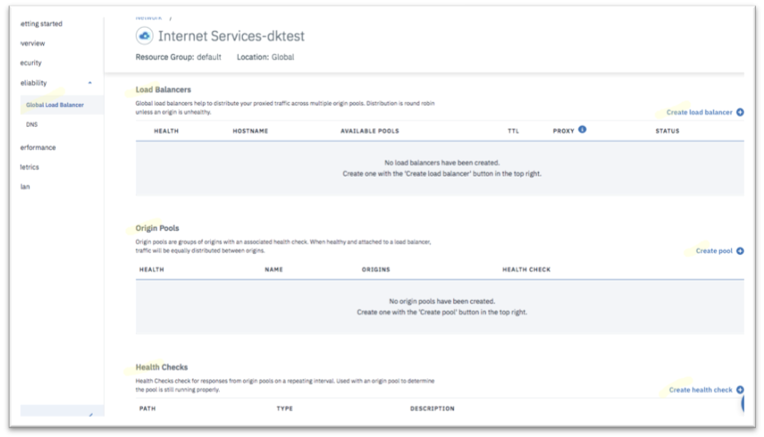

---

copyright:
  years: 2018, 2019
lastupdated: "2019-03-14"

keywords: global load balancer configuration, glb configuration

subcollection: cis

---

{:shortdesc: .shortdesc}
{:codeblock: .codeblock}
{:screen: .screen}
{:new_window: target="_blank"}
{:pre: .pre}
{:table: .aria-labeledby="caption"}
{:note: .note}

# グローバル・ロード・バランサーの構成の開始
{:#begin-global-load-balancer-configuration}

グローバル・ロード・バランサーの構成を始めます。

1. **「信頼性」**セクションで、**「グローバル・ロード・バランサー」**を選択します。 
    
    

2. 「ヘルス・チェック」セクションまでスクロールダウンします。 

   この構成はオプションです。 カスタム・ヘルス・チェックを定義しない場合、システムは「/」をデフォルトのヘルス・チェック・パスとして使用します。 
   {:note}

3. **「ヘルス・チェックの作成 (Create health check)」**ボタンをクリックしてカスタム・ヘルス・チェックを定義します。   

   ヘルス・チェックを実行したいパスを指定します。 ヘルス・チェックには HTTP プロトコルと HTTPS プロトコルのいずれかを使用できます。 
   
4. **「詳細オプション」**で、ヘルス・チェックの間隔、再試行回数、要求方式、応答本文など、他のパラメーターをカスタマイズできます。 
   
   
   
5. **「リソースのプロビジョン (Provision Resource)」**をクリックし、ヘルス・チェックの構成を完了します。 
