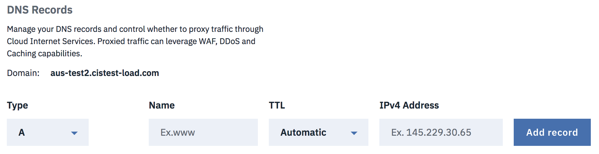

---

copyright:
  years: 2018, 2019
lastupdated: "2019-03-14"

keywords: IBM CIS DNS records, parts of the DS record, Type

subcollection: cis

---

{:shortdesc: .shortdesc}
{:new_window: target="_blank"}
{:codeblock: .codeblock}
{:pre: .pre}
{:screen: .screen}
{:tip: .tip}
{:download: .download}
{:DomainName: data-hd-keyref="DomainName"} 
{:note: .note} 
{:important: .important} 
{:deprecated: .deprecated} 
{:generic: data-hd-programlang="generic"}

# IBM CIS 用にドメイン・ネーム・システム (DNS) をセットアップする
{:#set-up-your-dns-for-cis}

この資料には、IBM CIS DNS レコードの構成方法に関するいくつかの具体的な指示が記載されています。これには 保護 DNS の構成方法も含まれます。

## 保護 DNS
{:#secure-dns}

**DNSSec** は、DNS データにデジタル「署名」して、データが有効であることを証明するテクノロジーです。 インターネットから脆弱性を除外するために、ルート・ゾーンから最終的なドメイン・ネーム (www.icann.org など) までの検索の各ステップで DNSSec をデプロイしなければなりません。

## 保護 DNS の構成と管理 
{:#configuring-and-managing-your-secure-dns}

DNSSec はインターネットの DNS インフラストラクチャーに認証の層を追加します。この層を追加しないと、DNS インフラストラクチャーは保護されません。 保護 DNS により、訪問者が対象のドメイン・ネームを Web ブラウザーに入力したときに、**対象の** Web サーバーに誘導されることが保証されます。  必要な作業は、IBM CIS アカウントから対象の DNS ページ内で DNSSec を有効にして、対象のレジストラーに DS レコードを追加することだけです。


**「DS レコードの表示 (View DS records)」**ボタンを選択すると、対象のレジストラーに DS レコードを追加する方法について説明したダイアログ・ボックスが開きます。 DS レコードのパーツをコピーして、対象のレジストラーのダッシュボードに貼り付ける必要があります。 入力する必要のあるフィールドはレジストラーごとに異なります。対象レジストラーで必須とされる情報を入力してください。

## DNS レコードの追加
{:#adding-dns-records}

**「タイプ」**ドロップダウンを使用して、作成しようとしているレコードのタイプを選択できます。 各 DNS レコード・タイプには、関連付けられた名前と存続時間 (TTL) があります。 

「名前」フィールドに入力される値にドメイン・ネームが手入力で付加されていない場合は、その値にドメイン・ネームが付加されます (例えば、このフィールドに `www` と `www.example.com` のどちらを入力しても、API では両方とも `www.example.com` として処理されます)。 名前フィールドに正確なドメイン・ネームが入力された場合は、ドメイン名が重複して付加されることはありません (例えば、`example.com` は `example.com` として処理されます)。 ただし、DNS レコードのリストには、名前のみが表示され、付加されたドメイン・ネームは表示されません。したがって、`www.example.com` は `www` と表示され、`example.com` は `example.com` と表示されます。 TTL のデフォルト値は`「自動 (Automatic)」`ですが、ユーザーが変更できます。 プロキシー処理される DNS レコードの TTL は常に`「自動 (Automatic)」`なので、新しくプロキシー処理されるレコードの TTL 設定は (「自動 (Automatic)」) に変わります。

### A タイプ・レコード
{:#a-type-record}

このレコード・タイプを追加するには、**「名前」**フィールドと**「IPv4 アドレス (IPv4 Address)」**フィールドに有効な値がなければなりません。 **「TTL」**の値は、ドロップダウン・メニューからも指定できます。このデフォルト値は「`自動 (Automatic)`」です。



    必須フィールド:「名前」、「IPv4 アドレス (IPv4 Address)」
    オプション・フィールド:「TTL」(デフォルト値は「自動 (Automatic)」)

### AAAA タイプ・レコード
{:#aaaa-type-record}

このレコード・タイプを追加するには、**「名前」**フィールドと**「IPv6 アドレス (IPv6 Address)」**フィールドに有効な値がなければなりません。 **「TTL」**の値は、ドロップダウン・メニューからも指定できます。このデフォルト値は「`自動 (Automatic)`」です。


    必須フィールド:「名前」、「IPv6 アドレス (IPv6 Address)」
    オプション・フィールド:「TTL」(デフォルト値は「自動 (Automatic)」)

### CNAME タイプ・レコード
{:#cname-type-record}

このレコード・タイプを追加するには、**「名前」**フィールドに有効な値がなければならず、**「ドメイン・ネーム (Domain Name)」**(FQDN) フィールドに完全修飾ドメイン・ネームがなければなりません。 **「TTL」**の値は、ドロップダウン・メニューからも指定できます。このデフォルト値は「`自動 (Automatic)`」です。


    必須フィールド:「名前」、(CNAME の)「ドメイン・ネーム (Domain Name)」
    オプション・フィールド:「TTL」(デフォルト値は「自動 (Automatic)」)

エンタープライズ・プランでは、CIS 内で別のドメインが構成されている場合、そのドメインに CNAME することができます。
{:note}

```
Ex.
Configured CIS Domains:
  - example.com
  - different.com

test.example.com -CNAME-> test.different.com
```

### MX タイプ・レコード
{:#mx-type-record}

このレコード・タイプを追加するには、**「名前」**フィールドに有効な値がなければならず、**「メール・サーバー (Mail Server)」**フィールドに有効なアドレスがなければなりません。 **「TTL」**の値は、ドロップダウン・メニューからも指定できます。このデフォルト値は「`自動 (Automatic)`」です。


    必須フィールド:「名前」、「メール・サーバー (Mail Server)」
    オプション・フィールド:「TTL」(デフォルト値は「自動 (Automatic)」)、「優先度 (Priority)」(デフォルト値は 1)

### LOC タイプ・レコード
{:#loc-type-record}

このレコード・タイプを追加するには、**「名前」**フィールドに有効な値がなければなりません。 詳細な情報が必要な場合は、**「LOC オプションの構成 (Configure LOC options)」**ボタンを選択します。 **「TTL」**の値は、ドロップダウン・メニューからも指定できます。このデフォルト値は「`自動 (Automatic)`」です。


    必須フィールド:「名前」
    オプション・フィールド:「LOC オプション (LOC options)」(このボタンをクリックして構成)


### CAA タイプ・レコード
{:#caa-type-record}

このレコード・タイプを追加するには、**「名前」**フィールドと**「値」**フィールドに有効な値がなければなりません。 「値」フィールドは**「タグ」**ドロップダウン・フィールドの値 (デフォルト値は「URL に違反レポートを送信 (Send violation reports to URL)」) と関連付けられます。 **「TTL」**の値は、ドロップダウン・メニューからも指定できます。このデフォルト値は「`自動 (Automatic)`」です。


    必須フィールド:「名前」、「値」(タグに関連付けられる)
    オプション・フィールド:「TTL」(デフォルト値は「自動 (Automatic)」)、「タグ」(デフォルト値は「URL に違反レポートを送信 (Send violation reports to URL)」)

### SRV タイプ・レコード
{:#srv-type-record}

このレコード・タイプを追加するには、**「名前」**、**「サービス名」**、**「ターゲット (Target)」**の各フィールドに有効な値がなければなりません。 ドロップダウン・メニューを使用して**「プロトコル (protocol)」** を選択します。このデフォルトは「UDP」プロトコルです。 さらに、**「優先度 (Priority)」**、**「重み (Weight)」**、および**「ポート」**を指定できます。 これらの 3 つのフィールドのデフォルト値は 1 です。**「TTL」**の値は、ドロップダウン・メニューからも指定でき、このデフォルト値は「`自動 (Automatic)`」です。


    必須フィールド:「名前」、「サービス名」、「ターゲット (Target)」
    オプション・フィールド:「TTL」(デフォルト値は「自動 (Automatic)」)、「プロトコル (Protocol)」(デフォルト値は「UDP」)、「優先度 (Priority)」(デフォルト値は 1)、「重み (Weight)」(デフォルト値は 1)、「ポート」(デフォルト値は 1)

### SPF タイプ・レコード
{:#spf-type-record}

このレコード・タイプを追加するには、**「名前」**フィールドと**「コンテンツ (Content)」**フィールドに有効な値がなければなりません。 **「TTL」**の値は、ドロップダウン・メニューからも指定できます。このデフォルト値は「`自動 (Automatic)`」です。


    必須フィールド:「名前」、「コンテンツ (Content)」
    オプション・フィールド:「TTL」(デフォルト値は「自動 (Automatic)」)

### TXT タイプ・レコード
{:#txt-type-record}

このレコード・タイプを追加するには、**「名前」**フィールドと**「コンテンツ (Content)」**フィールドに有効な値がなければなりません。 **「TTL」**の値は、ドロップダウン・メニューからも指定できます。このデフォルト値は「`自動 (Automatic)`」です。


    必須フィールド:「名前」、「コンテンツ (Content)」
    オプション・フィールド:「TTL」(デフォルト値は「自動 (Automatic)」)

初めて専用の証明書を注文する際に、ドメイン制御検証 (DCV) プロセスが実行され、対応する TXT レコードが生成されます。TXT レコードを削除すると、別の専用証明書の注文時に再度 DCV プロセスが実行されます。専用の証明書を削除しても、DCV プロセスに対応する TXT レコードは削除されません。
{:note}

### NS タイプ・レコード
{:#ns-type-record}

このレコード・タイプを追加するには、**「名前」**フィールドと**「ネーム・サーバー (Name Server)」**フィールドに有効な値がなければなりません。 **「TTL」**の値は、ドロップダウン・メニューからも指定できます。このデフォルト値は「`自動 (Automatic)`」です。


    必須フィールド:「名前」、「ネーム・サーバー (Name Server)」
    オプション・フィールド:「TTL」(デフォルト値は「自動 (Automatic)」)

## DNS レコードの更新
{:#updating-dns-records}

各レコード行で、メニューから**「レコードの編集 (Edit record)」**オプションをクリックするとダイアログ・ボックスが開くので、それを使用してレコードを更新できます。


例えば、上記は **A** タイプのレコードの更新ダイアログです。 変更を加え終えたら、**「レコードの更新 (Update record)」**を選択して保存します。


## レコードの削除
{:#deleting-dns-records}

各レコード行で、メニューから**「レコードの削除 (Delete record)」**オプションを選択すると、削除プロセスを確定するためのダイアログ・ボックスが開きます。


**「削除」**ボタンを選択して、削除アクションを確定できます。 削除しない場合は、**「キャンセル」**を選択します。


## レコードのインポートとエクスポート
{:#import-export-records}

DNS レコードを CIS にインポートしたり CIS からエクスポートしたりできます。ファイルはすべて BIND 形式の .txt ファイルとしてインポートされたりエクスポートされたりします。詳しくは、[BIND 形式](https://en.wikipedia.org/wiki/Zone_file)を参照してください。
オーバーフロー・メニューをクリックして、レコードのインポートかエクスポートを選択します。


### レコードのインポート
{:#import-dns-records}

デフォルトでは、合計 3500 の DNS レコードが (インポートと、CIS での作成として) 許可されます。レコードの総数が最大限度を下回っていれば、複数のファイルを同時にインポートできます。インポート後に要約が表示され、正常に追加されたレコードの数や、失敗したレコードの数と各レコードが失敗した理由が示されます。


### レコードのエクスポート
{:#export-dns-records}

`「レコードのエクスポート」`を使用して、ゾーン・ファイルのバックアップを作成したり、別の DNS プロバイダーで使用するためにエクスポートしたりできます。このメニュー・オプションをクリックすると、ブラウザー設定で指定されている場所 (通常は Downloads フォルダー) にレコードがダウンロードされます。別のフォルダーの場所を選択するには、ダウンロードのたびに場所を尋ねるようにブラウザーの設定を変更してください。
