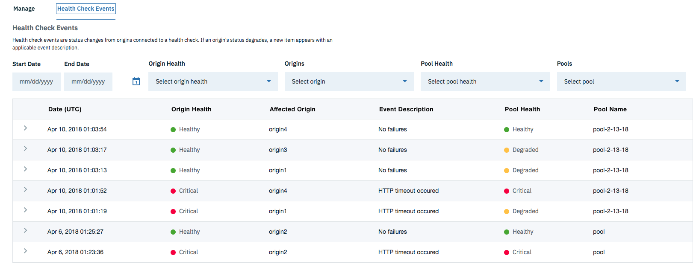

---

copyright:
  years: 2018, 2019
lastupdated: "2019-03-14"

keywords: origin server, pool implementation, origin servers

subcollection: cis

---

{:shortdesc: .shortdesc} 
{:new_window: target="_blank"} 
{:note: .note}

# グローバル・ロード・バランサー (GLB) の概念
{:#global-load-balancer-glb-concepts}

このドキュメントでは、グローバル・ロード・バランサー (GLB) に関連するいくつかの概念と定義、GLB が IBM CIS デプロイメントに与える影響について説明します。

## グローバル・ロード・バランサー
{:#global-load-balancer-cis}

グローバル・ロード・バランサー (GLB) は、複数の領域に配置されたサーバー・リソース間のトラフィックを管理します。 起点サーバーは、Web トラフィックがそのサーバーの処理能力を超えない場合、そして待ち時間が主な検討課題とならない場合に、Web サイトのすべてのコンテンツにサービスを提供できます。GLB はトラフィックを複数のオリジンに分散できる_プール_の実装を利用します。このプール機能には次のような多くの利点があります。

  * 応答時間を最小化する
  * 冗長化によって可用性を向上させる
  * トラフィックのスループットを最大化する

GLB はトラフィックをプールに最高の優先度で経路指定して、負荷をその複数の起点サーバーに分散します。プール内でトラフィックが分散される方法について詳しくは、以下の_プール_のセクションを参照してください。プライマリー・プールが使用不可になった場合、トラフィックは優先度に基づいてリスト内の次のプールに自動的に経路指定されます。

プールが特定の地域用にセットアップされている場合、それらの地域からのトラフィックは、最初に指定の地域用のプールに送られます。指定された地域用のすべてのプールがダウンした場合にのみ、トラフィックはデフォルトのプールにフォールバックします。このケースでは、最低の優先度のプールがフォールバック・プールとなります。 

### 動作の仕組み
{:#how-glb-works}
GLB が作成されると、そのための DNS レコードがロード・バランサーの名前で自動的に追加されます。その後、GLB はいずれかの起点 IP アドレスを、DNS 要求を出しているクライアントに返します。

例えば、IP アドレス `169.61.244.18` および `169.61.244.19` を指定する 2 つの起点がある起点プールが作成されるとします。起点プールを使用してグローバル・ロード・バランサーが `glbcust.ibmmo.com` の名前で作成される場合、インターネット上のクライアントは次のコマンドを実行できます。
```
$ ping glbcust.ibmom.com
PING glbcust.ibmom.com (169.61.244.18): 56 data bytes
```
この例で、CIS は以下を行いました。

    * `glbcust.ibmmo.com` という名前の DNS レコードを作成すること
    * GLB を使用して DNS 名を、起点プールで指定されたいずれかの IP アドレスに解決すること

グローバル・ロード・バランサーが TCP 接続を終了しないことに注意してください。
{:note}

DNS 要素または GLB を "プロキシー" に設定すると、動作が変わります。
例えば、プロキシーをオンにして、**「セキュリティー」>「TLS」>「モード」**を `Off` 以外の値に設定すると、CIS は TCP 接続を終了するようになり、CIS とオリジネーターとの間に 2 番目の接続が確立されます。

この例で、CIS は以下を行いました。

    * `glbcust.ibmmo.com` という名前の DNS レコードを作成すること
    * GLB を使用して DNS 名を CIS 提供の IP アドレスに解決すること
    
この段階で、`glbcust.ibmmo.com` への接続は CIS によって終了し、HTTPS 証明書は CIS によってホストされています (これは TCP の終了に必要なことです)。

クライアントがアプリケーションに接続した後に、図は以下のようになります。

`[クライアント]<--tls-->[CIS]<-->[オリジン・サーバー]`

## プール
{:#glb-pools}

プールとは、GLB に接続するとトラフィックがインテリジェントに転送されるオリジン・サーバーのグループのことです。 プールに正常のマークを付けるために必要なオリジン・サーバーの最小数、ならびに、使用する具体的なヘルス・チェックは、ユーザーが構成可能です。 オリジン・プールは、特定の領域に関連付けることも、すべての領域で使用可能にすることもできます。

### プール内でのトラフィックの分散
{:#distribution-of-traffic-within-a-pool}

デフォルトで、すべてのトラフィックはラウンドロビン・プロトコルを使用してプール内の複数の起点に均等に分散されます。これはプロキシーを使用しない GLB にも当てはまります。

起点は重みによって構成できます。プロキシーを使用する GLB では、重みにより、各起点サーバーがプール内の他の起点との相対関係で受け取るトラフィックの量が決まります。重みは 0 から 1 までの数値として構成され、トラフィックのどれほどの部分が起点に向かうかを指定します。 

起点ごとに: 

`起点に向かうトラフィックのパーセント = 起点の重み / すべての起点の重みの合計`

すべての起点の重みが `1` の場合、トラフィックは均等に分散されます。 

重みが `0` の起点は、このプールのトラフィックを受け取りません。ただし、すべてのセッションが閉じられるまでは、セッション・アフィニティーによってこれが指定変更される可能性もあります。起点が別のプールのメンバーである場合には、そのプールのトラフィックを受け取る可能性もあります。

**例:** 

起点プールが、次の重みを持つ 3 つの起点によってセットアップされているとします。origin-A: 0.4、origin-B: 0.3、origin-C: 0.3。 

* 最初は、すべての起点が正常に機能しています。それぞれの起点が受け取るトラフィックの量は、origin-A: 40%、origin-B: 30%、origin-C: 30% です。
* その後、origin-A がクリティカルになり、トラフィックを受け取らなくなります。その他の起点には同じ値の重みがあるので、トラフィックは均等に分散され、それぞれが 50% を受け取ります。
* 管理者が origin-C の重みを `0` に変更します。これにより、新しいトラフィックの 100% が origin-B に向かいます。ただし、セッション・アフィニティーがオンになっていれば、origin-C 上の既存のセッションに対するトラフィックは、それらのセッションが閉じるまで origin-C に向かいます (最大 24 時間)。

### フォールバック・プール
{:#fallback-pool}

最低の優先度 (最大の番号) の起点プールは、指定された「フォールバック・プール」です。指定された地域用のすべてのプールがダウンしたとき、トラフィックはそのヘルスに関係なく、このフォールバック・プールに経路指定されます。

すべてのプールが無効になっているときは、フォールバック・プールを使用できません。
{:note}

## ヘルス・チェック
{:#cis-health-check}

ヘルス・チェックを使用すると、プールが使用可能かどうかを調べて、正常なプールにトラフィックを転送できます。 これらのチェックは、定期的に HTTP、HTTPS、または TCP 要求を送信して応答をモニターします。ポート、間隔、タイムアウト、状況コードなどをカスタマイズしてチェックを構成できます。プールに非正常のマークが付けられると、ただちに、トラフィックは使用可能な別のプールにインテリジェントに再転送されます。IBM は CIS を強化するために Cloudflare と提携しているので、ご使用のログが Cloudflare を参照していることをご承知おきください。
{:note}

### ヘルス・チェック・イベント
{:#health-check-events}

ヘルス・チェック・イベントは、ヘルス・チェックが接続されて起点サーバーが関連付けられている、プールからの状況変更です。起点の状況が機能低下した場合、新しい項目がイベントの説明と共に表に示されます。**「信頼性」>「グローバル・ロード・バランサー」>「ヘルス・チェック・イベント」**にナビゲートして、ヘルス・チェック・イベントの表を参照してください。ドロップダウン・メニューからフィルター・パラメーターを選択することにより、日付、プールまたは起点のヘルス、プール名、および起点名でフィルター処理できます。列名をクリックすることにより、表内の列をソートできます。

表に含まれる個々の行は、項目についての詳細情報によって拡張します。プールが正常な場合、**「プールの詳細」**のタイルだけが表示されます。行にクリティカルな起点がある場合や機能低下したプールがある場合は、**「影響を受ける起点の詳細」**のタイルも表示されます。 


#### プールの詳細:
* プール名 - プールの名前
* 正常な起点 - プール内の「正常な起点/起点の総数」の比率
* 正常なしきい値 - プールを正常と見なすために必要な正常な起点の数
* 正常な起点 - 正常な起点の名前
* クリティカルな起点 - 異常な起点の名前

#### 影響を受ける起点の詳細:
* 起点名 - 起点の名前
* 起点アドレス - 起点のアドレス
