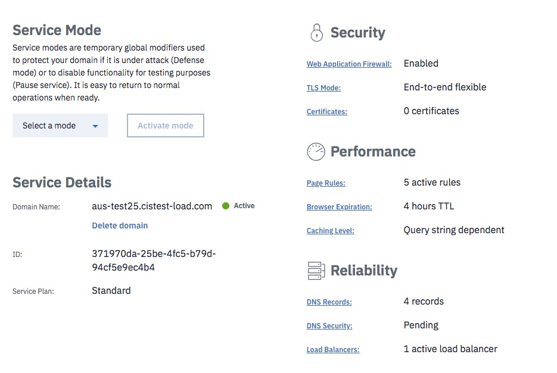
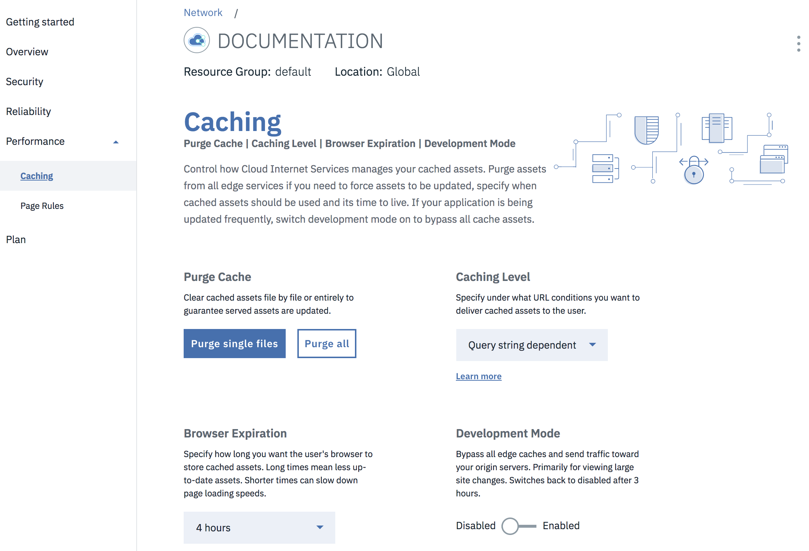

---
copyright:
  years: 2018
lastupdated: "2018-03-17"
---

{:shortdesc: .shortdesc}
{:new_window: target="_blank"}

# IBM Cloud Internet Services (CIS) デプロイメントの管理

まずは、操作のベースとなる「概要」画面を使用してみましょう。ここには、デプロイメントの現在のパラメーターがすべて表示されます。

DNS をセットアップして構成したら、準備は完了です。

## 「概要」画面を使用する

「概要」画面を使用して、すべての選択項目の状況を確認できます。「概要」画面から直接、設定を変更できます。変更する設定の下線付きの名前をクリックするだけです。例えば、ロード・バランサーを追加するには`「ロード・バランサー (Load Balancers)」`フィールドをクリックします。

「概要」画面では、以下の図に示すように、ドメイン名構成の状況が**「保留中」**または**「アクティブ」**と表示されるはずです。

## DNS の構成と管理

DNS ページに移動し、レコード (たいていの場合、A レコード) を追加します。DNS レコードに関する情報を入力し、`「レコードの追加 (Add record)」`をクリックして変更を実施します。

## キャッシングのセットアップと管理

次は、キャッシングをセットアップできます。 

キャッシング画面のドロップダウン・メニューから、以下の 3 タイプのキャッシングを選択できます。 

 * 照会ストリングなし (No query string) : 照会ストリングがない場合にのみ、キャッシュのリソースを配信します。
 * 照会ストリングに依存しない (Query string independent) : 照会ストリングとは無関係に、すべてのユーザーに同じリソースを配信します (注: この**「照会ストリングを無視する」**設定は、静的ファイル拡張子にのみ適用されます。この設定にすると、キャッシュ・キーの生成時に照会ストリングが除去されるので、`style.css?something` という要求は、キャッシュで処理されるときに `style.css` に正規化されます)。
 * 照会ストリングに依存する (Query string dependent) : 照会ストリングが変わるたびに別のリソースを配信します。
  
## キャッシュのパージ
 
キャッシュのパージ・フィールドに URL を入力するだけで、いつでもキャッシュをパージして更新に備えることができます。単一のファイルまたは複数のファイル (一度に最大 30 個) をパージできます。
 
 ## ブラウザーの有効期限
 
ドロップダウン・メニューを使用して、必要なブラウザー有効期間 (8 時間や 1 日など) を選択できます。
 
 ## 開発モードの使用
 
**「開発モード (Development mode)」**は、大きな更新や新規ファイルのアップロードが必要な場合など、エンド・ユーザーにキャッシュを一切使用させずに元のサーバーから直接ファイルを取得させたい場合に使用します。**「開発モード (Development Mode)」**の使用を開始するには、スイッチを`「有効」`の位置に切り替えます。**「開発モード (Development Mode)」**の使用を停止するには、スイッチを`「無効」`の位置に切り替えます。**「開発モード (Development mode)」**は、3 時間後に自動的に失効します。 

## ページ・ルールの管理
 
最大 50 個のページ・ルールを有効にできます。ドロップダウン・メニューを使用して、ページ・ルールを構成します。ルールの設定は、**「セキュリティー」**、**「パフォーマンス」**、**「信頼性」**という 3 つのカテゴリーに分かれています。

いくつかのルールを有効にすると、その選択したばかりのルールと競合する他のオプションがグレー表示になることに注目してください。必要なページ・ルールを選択したら、**「プロビジョン」**をクリックしてそれらを有効にします。ただちに新規ルールが適用され、ページ・ルール画面にすぐに表示されます。
 
 
 
ページ・ルール画面に表示されたテーブルから、ページ・ルールを有効または無効にすることもできます。詳しくは、[ページ・ルールの使用](using-page-rules.html)を参照してください。
 
 ## セキュリティー設定
 
デフォルトでは、プロキシーをオンにしたすべての DNS レコードに対して DDoS 防御が有効になります。プロキシーは、DNS ページの**「レコード」**テーブルでオンにすることができます。WAF は、切り替えスイッチを使用してオンにします。ルールのオン/オフを切り替えると、その変更はただちに適用されます。

## 証明書

ゾーンをデプロイすると、IBM CIS が自動的にそのゾーン用の汎用証明書をデプロイします。そのため、お客様は何も行わなくても、証明書ベースの保護をそのゾーンで利用できます。必要であれば、お客様独自の証明書をアップロードできます。ゾーンごとに別の証明書が必要になります。アップロードしている証明書がゾーンと一致しない場合は、エラー・メッセージが表示されます。

 
 ## ロード・バランサーのセットアップと構成
 
 IBM CIS は、グローバル・ロード・バランシングをサービスとして提供しています。

### GLB ダッシュボード
ダッシュボードには、ロード・バランサー、オリジン・プール、ヘルス・チェックを示す 3 つのリストが表示されます。リストには、新規または更新されたグローバル・ロード・バランサーまたはそのコンポーネントの 1 つが、プロビジョンまたは更新された後に表示されます。リストは最初は空です。ロード・バランサーを作成するには、いくつかの操作を実行する必要があります。

#### 作成
**注**: `*` は、その手順がオプションであることを示しています。

1) `*`ヘルス・チェックを作成します。「ヘルス・チェックの作成 (Create health check)」をクリックしてください。
  
    <ul>
      <li>* **パス**: ヘルス・チェックの対象にするエンドポイント・パス。</li> 
      <li>* **タイプ**: ヘルス・チェックに使用するプロトコル。</li>
      <li>* **説明**: ユーザー指定の説明。</li>
    </ul>

2) プールを作成します。「プールの作成 (Create pool)」をクリックしてください。
  
    <ul>
      <li>* **正常性**: プールの状況。</li>
      <li>* **名前**: ユーザー指定の名前。</li>
      <li>* **オリジン (Origins)**: プール内の正常なオリジンの数。</li>
      <li>* **ヘルス・チェック (Health Check)**: 付加されたヘルス・チェックのパス (存在する場合)。</li>
    </ul>

3) ロード・バランサーを作成します。「ロード・バランサーを作成 (Create load balancer)」をクリックしてください。
  
    <ul>
      <li>* **正常性**: ロード・バランサーの状況。</li>
      <li>* **ホスト名**: ドメイン名の前に付加する名前。</li>
      <li>* **使用可能なプール (Available Pools)**: 正常なプールの数。</li>
      <li>* **TTL**: 存続時間。</li>
      <li>* **プロキシー**: トラフィック・フローの中継を有効または無効にします。</li>
      <li>* **状況**: ロード・バランサーを有効または無効にします。</li>
    </ul>

#### 編集/削除
ロード・バランサーまたはそのコンポーネントの 1 つを編集または削除するには、各行の右端にあるオーバーフロー・メニュー・ボタンをクリックします。

オーバーフロー・メニュー・ボタンを以下に示します。

リストごとに以下のオプションが用意されています。

* ヘルス・チェック
    * **ヘルス・チェックの編集 (Edit health check)**: このオプションは、ユーザーを編集フローにリダイレクトします。 
    * **ヘルス・チェックの削除 (Delete health check)**: このオプションは、削除フローの確認ダイアログ・ボックスを表示します。

* プール
    * **プール詳細の表示 (View pool details)**: このオプションは、プールの情報を含むモーダルなダイアログ・ボックスを表示します。
    * **プールの編集 (Edit pool)**: このオプションは、ユーザーを編集フローにリダイレクトします。
    * **プールの削除 (Delete pool)**: このオプションは、削除フローの確認ダイアログ・ボックスを表示します。

* ロード・バランサー
    * **無効化/有効化 (Disable/Enable)**: ロード・バランサーを有効または無効にします。
    * **ロード・バランサーの編集 (Edit load balancer)**: 編集フローにリダイレクトします。 
    * **ロード・バランサーの削除 (Delete load balancer)**: 削除フローの確認ダイアログ・ボックスを表示します。

### ヘルス・チェックの追加

ヘルス・チェックは、オリジン・プールに対するオプションの付加機能です。このチェックは、プールの正常性をモニターするために、カスタムの繰り返し間隔を使用して、特定の応答本文または状況コードが返されるかどうかを調べます。作成したヘルス・チェックは、新規または既存のオリジン・プールに追加できます。

ヘルス・チェックを作成するときの必須フィールドは以下の 1 つだけです。
 * **応答コード (Reponse Code)**: ヘルス・チェックで予期する HTTP 応答コードまたはコード範囲。「x」で表すワイルドカードを使用して、200 から 299 までの値を指定する必要があります。

オプションの追加フィールド
 * **パス**: ヘルス・チェックの実行対象のエンドポイント・パス (デフォルトは /)。
 * **タイプ**: ヘルス・チェックに使用するプロトコル (デフォルトは HTTP)。
 * **説明**: ヘルス・チェックの説明。
 * **間隔 (Interval)**: ヘルス・チェックの実行間隔 (秒単位)。間隔を短くすると、フェイルオーバー時間は向上しますが、複数の場所でチェックを行うのでオリジンに対する負荷は増加します (デフォルトは 60)。
 * **メソッド**: ヘルス・チェックに使用する HTTP メソッド (デフォルトは GET)。
 * **タイムアウト**: ヘルス・チェックに失敗のマークを付けるまでの時間 (秒) (デフォルトは 5)。
 * **再試行**: タイムアウトが発生した場合に、オリジンに非正常のマークを付けるまでに再試行する回数。再試行は即時に実行されます (デフォルトは 2)。
 * **応答本文**: 応答本文で照合する大/小文字を区別しないサブストリング。このストリングが検出されない場合、オリジンには非正常のマークが付けられます。
 * **要求ヘッダー**: ヘルス・チェックで送信する HTTP 要求ヘッダー。デフォルトでホスト・ヘッダーを設定することをお勧めします。`User-Agent` ヘッダーは、オーバーライドできません。

### プールの追加

プロビジョンしたロード・バランサーごとに、少なくとも 1 つのプールが必要です。プールとは、ロード・バランサーで使用するオリジンをグループ化したものです。

プールを作成するときの必須フィールドは以下の 2 つです。
 * **名前**: プールの短縮名 (タグ)。英数字、ハイフン、下線のみを使用できます。
 * **オリジン (Origins)**: このプールに含めるオリジンのリスト。このプールに向けて送信されたトラフィックは、プール自体が正常であれば、現在正常なすべてのオリジンの間で分散されます。

オプションの追加フィールド
 * **説明**: 人間が理解できるプールの説明。
 * **有効**: このプールを有効 (デフォルト) にするかどうか。無効にしたプールは、トラフィックを受信せず、ヘルス・チェックから除外されます。プールを無効にすると、そのプールを使用するロード・バランサーは、次のプール (存在する場合) にフェイルオーバーします (デフォルトは真)。
 * **正常なオリジンのしきい値 (Healthy Origin Threshold)**: このプールでトラフィックを処理するために必要とする正常なオリジンの最小数。正常なオリジンの数がこの数を下回ると、プールに非正常のマークが付けられ、次に使用可能なプールにフェイルオーバーされます (デフォルトは 1)。
 * **ヘルス・チェック地域 (Health Check Regions)**: モニターを実行するヘルス・チェックの地域。
 * **ヘルス・チェック (Health Check)**: このプールに含まれているオリジンを検査するために使用するヘルス・チェック (デフォルトはヘルス・チェックなし)。
 * **通知 E メール (Notification Email)**: 正常性状況の通知を受け取る E メール・アドレス。このアドレスは、1 人のメールボックスにすることも、メーリング・リストにすることもできます。

 ### ロード・バランサーの追加

ロード・バランサーは、中継するトラフィックを、ラウンドロビン分散を使用して複数のオリジン・プールの間に分散させます。

ロード・バランサーを作成するときの必須フィールドを次に示します。
 * **名前**: ロード・バランサーに関連付ける DNS ホスト名。このホスト名が IBM の DNS に DNS レコードとして既に存在する場合、ロード・バランサーが優先され、DNS レコードは使用されません。
 * **デフォルトのプール (Default Pools)**: プール ID のリスト。フェイルオーバーの優先順にリストします。ここに定義したプールがデフォルトで使用されます。つまり、特定の地域に地域プールが構成されていない場合に使用されます。

オプションで、以下のフィールドを構成できます。
 * **プロキシー**: IBM のパフォーマンスおよびメトリック・サービスを使用してトラフィックを転送します。
 * **セッション・アフィニティー (Session Affinity)**: 常に同じパフォーマンスおよびメトリック・インスタンスを使用して転送します。このオプションは、プロキシーを有効にした場合にのみ使用できます。
 * **TTL**: このロード・バランサーから返される IP アドレスの DNS エントリーの存続時間 (TTL)。このオプションは、プロキシーしないロード・バランサーにのみ適用されます。その他の場合は、デフォルトで`「自動」`になります。
 * **地域プール (Region Pools)**: 地域/国別コードから、特定の地域用のプール・リスト (フェイルオーバーの優先順のリスト) へのマッピング。地域が明示的に定義されていない場合は、デフォルトのプールを使用するようにフォールバックされます。
