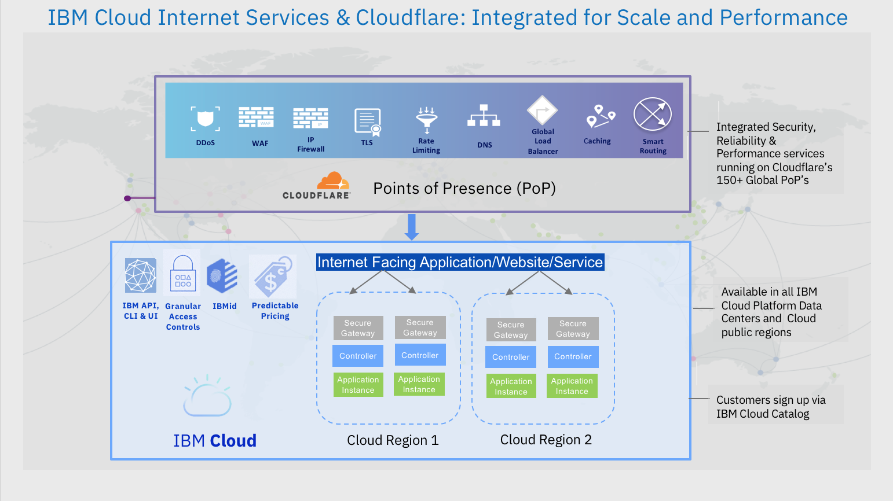

---
copyright:
  years: 2018
lastupdated: "2018-03-16"
---

{:shortdesc: .shortdesc}
{:new_window: target="_blank"}

# IBM Cloud Internet Services (CIS) を使用して作業をセキュアにする方法

IBM CIS は、処理能力やサーバー・リソースの消耗の原因となる脅威をブロックし、悪意のあるボットやクローラーを制限する、グローバルに分散されたクラウド・サービスです。IBM CIS は、グローバル HTTP(S) リバース・プロキシーおよび管理対象 DNS サービス・プロバイダーとして機能します。Web トラフィックは、パフォーマンスとセキュリティーの両方を最適化するように、インテリジェント・グローバル・ネットワーク内で経路指定されます。

機能の概要を以下に示します。

## セキュリティー機能

 * Web アプリケーション・ファイアウォール (WAF)
 * 無制限の DDoS 緩和

## セキュリティー規格とプラットフォーム

 * TLS (SHA2 および SHA1)
 * IPv6
 * HTTP/2 および SPDY

## DNS

 * グローバル・エニーキャスト・ネットワーク
 * DNSSEC

## ネットワーク攻撃と緩和

一般に、検出される攻撃は 2 つのカテゴリーに分類されます

| レイヤー 3 またはレイヤー 4 の攻撃 | レイヤー 7 の攻撃 |
|------------------------------|-----------------|
|これらの攻撃には、ICMP フラッディングなどの ISO レイヤー 3 (ネットワーク層) のトラフィックのフラッディングや、TCP SYN フラッディング や反射型 UDP フラッディングなどのレイヤー 4 (トランスポート層) のトラフィックのフラッディングが含まれます。|これらは、GET フラッディングなど、ISO レイヤー 7 (アプリケーション層) の悪意のある要求を送信する攻撃です。|
| エッジで自動的にブロックされます | これらは防御モード、WAF、およびセキュリティー・レベル設定によって対処します |

## 要約

 * 防御モードは、悪意のあるクライアントの多くで欠落しているブラウザー機能をテストします
 * WAF は悪意を持つ可能性のある既知の要求パターンをブロックまたは検査します
