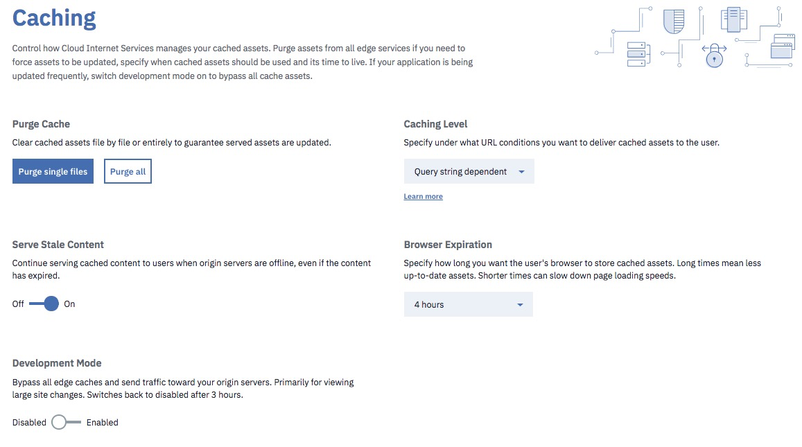

---
copyright:
  years: 2018
lastupdated: "2018-03-17"
---

{:shortdesc: .shortdesc}
{:new_window: target="_blank"}

# IBM CIS(Cloud Internet Services) 배치 관리

오퍼레이션의 작업 기반으로서 개요 화면을 사용하여 시작합니다. 이 화면은 배치에 대한 모든 현재 매개변수를 표시합니다. 

일단 DNS를 설정하고 이를 구성했으면 준비를 마친 것입니다! 

## 개요 화면 사용

개요 화면을 사용하여 모든 선택사항의 상태를 볼 수 있습니다. 개요 화면에서 직접 설정을 변경할 수 있습니다. 단지 변경하고자 하는 설정의 밑줄친 이름을 클릭하십시오. 예를 들어, `로드 밸런서` 필드를 클릭하여 로드 밸런서를 추가할 수 있습니다. 

개요 화면에서 도메인 이름 구성이 **보류 중** 상태임을 볼 수 있습니다. 또는 다음 그림에 표시된 대로 **활성** 상태임을 볼 수 있습니다. 

## DNS 구성 및 관리

DNS 페이지로 이동하고 레코드를 추가하십시오(아마도 A 레코드). DNS 레코드에 대한 정보를 입력한 후에 `레코드 추가`를 클릭하여 변경사항을 구현하십시오. 

## 캐싱 설정 및 관리

그 다음에는 캐싱을 설정할 수 있습니다.  

캐싱 화면 드롭 다운 메뉴에서 사용 가능한 세 가지 유형의 캐싱 옵션이 있습니다.  

 * 조회 문자열 없음: 조회 문자열이 없으면 단지 캐시의 리소스를 전달합니다. 
 * 조회 문자열 독립적: 조회 문자열과 무관하게 모든 사용자에게 동일한 리소스를 전달합니다. (참고: **조회 문자열 무시** 설정은 정적 파일 확장자에만 적용됩니다. 이 설정은 캐시 키 생성 시에 조회 문자열을 제거합니다. 따라서 캐시에서 서비스될 때 `style.css?something`에 대한 요청이 `style.css`로 정규화됩니다.) 
 * 조회 문자열 종속적: 조회 문자열이 변경될 때마다 다른 리소스를 전달합니다. 
  
## 캐시 영구 제거
 
캐시 영구 제거 필드에 단지 URL을 입력하여 언제든지 업데이트 준비를 위해 캐시를 영구 제거할 수 있습니다. 하나의 파일이나 여러 개의 파일(한 번에 최대 30개)을 영구 제거할 수 있습니다. 
 
 ## 브라우저 만기
 
드롭 다운 메뉴를 사용하여 필요한 브라우저 만기 시간을 선택할 수 있습니다(예: 8시간 또는 1일). 
 
 ## 개발 모드 사용
 
**개발 모드**는 기본 업데이트나 새 파일 업로드가 필요할 때 또는 일반 사용자의 캐시에서의 작업을 전혀 원하지 않지만 오리진 서버에서 직접 파일을 검색하도록 하고자 할 때 언제든지 사용할 수 있습니다. **개발 모드** 사용을 시작하려면 스위치를 `Enabled` 위치로 토글하십시오. **개발 모드** 사용을 중지하려면 스위치를 `Disabled` 위치로 토글하십시오. **개발 모드**는 3시간이 지나면 자동으로 만료됩니다.  

## 규칙 페이지 관리
 
최대 50개의 페이지 규칙을 사용할 수 있습니다. 페이지 규칙을 구성하려면 드롭 다운 메뉴를 사용하십시오. 규칙 설정은 **보안**, **성능** 및 **안정성**의 3개 카테고리로 구분되어 있습니다. 

참고로, 특정 규칙이 사용되는 경우에 해당 옵션이 방금 선택된 기타 규칙과 충돌하면 기타 옵션은 회색으로 희미해집니다. 원하는 페이지 규칙을 선택한 후에는 **프로비저닝**을 클릭하여 이를 사용 가능하게 하십시오. 새 규칙은 즉시 적용되며 페이지 규칙 화면에서 이를 바로 볼 수 있습니다. 
 
 
 
페이지 규칙 화면에 표시된 테이블에서 페이지 규칙을 사용 또는 사용 안함으로 설정할 수도 있습니다. 자세한 정보는 [페이지 규칙 사용](using-page-rules.html)을 참조하십시오. 
 
 ## 보안 설정
 
기본적으로 DDoS 보호는 프록시가 켜진 DNS 레코드에 대해 사용되며, 이는 DNS 페이지의 **레코드** 테이블에서 완료될 수 있습니다. 토글을 사용하여 WAF를 켜십시오. 규칙 켜기 또는 끄기를 토글하면 변경사항이 즉각적으로 적용됩니다. 

## 인증서

구역에 배치할 때 IBM CIS는 해당 구역에 대한 유니버셜 인증서를 자동으로 배치합니다. 따라서 해당 구역에서 인증서 기반 보호를 받기 위해 어떤 작업도 필요하지 않습니다. 원하면 자체 인증서를 업로드할 수 있습니다. 각 구역마다 별도의 인증서가 필요하며, 업로드 중인 인증서가 구역과 일치하지 않으면 오류 메시지가 표시됩니다. 

 
 ## 로드 밸런서 설정 및 구성
 
 IBM CIS는 글로벌 로드 밸런싱을 서비스로 제공합니다. 

### GLB 대시보드
대시보드에는 로드 밸런서, 오리진 풀 및 상태 확인을 표시하는 세 개의 목록이 표시됩니다. 이 목록은 프로비저닝하거나 업데이트한 후에 신규 또는 업데이트된 글로벌 로드 밸런서나 해당 컴포넌트 중 하나를 표시합니다. 처음에 목록은 비어 있으며 로드 밸런서를 작성하기 전에 일부 조치를 취해야 합니다. 

#### 작성
**참고**: `*`는 이 단계가 선택사항임을 표시합니다. 

1) `*`상태 확인을 작성하십시오. "상태 확인 작성"을 클릭하십시오.
  
    <ul>
      <li>* **경로**: 상태 확인에 대한 엔드포인트 경로입니다. </li> 
      <li>* **유형**: 상태 확인에 사용할 프로토콜입니다. </li>
      <li>* **설명**: 사용자가 제공한 설명입니다. </li>
    </ul>

2) 풀을 작성하십시오. "풀 작성"을 클릭하십시오.
  
    <ul>
      <li>* **상태**: 풀의 상태입니다. </li>
      <li>* **이름**: 사용자가 제공한 이름입니다. </li>
      <li>* **오리진**: 풀에서 정상 상태인 오리진의 개수입니다. </li>
      <li>* **상태 확인**: 연결된 상태 확인의 경로입니다(있는 경우). </li>
    </ul>

3) 로드 밸런서를 작성하십시오. "로드 밸런서 작성"을 클릭하십시오.
  
    <ul>
      <li>* **상태**: 로드 밸런서의 상태입니다. </li>
      <li>* **호스트 이름**: 도메인 이름 앞에 붙는 이름입니다. </li>
      <li>* **사용 가능한 풀**: 정상 상태인 풀의 개수입니다. </li>
      <li>* **TTL**: TTL(Time To Live)입니다. </li>
      <li>* **프록시**: 프록시 트래픽 플로우를 사용하거나 사용하지 않습니다. </li>
      <li>* **상태**: 로드 밸런서를 사용하거나 사용하지 않습니다. </li>
    </ul>

#### 편집/삭제
로드 밸런서나 해당 컴포넌트 중 하나를 편집하거나 삭제하려면 각 행의 맨 오른쪽에 있는 오버플로우 메뉴 단추를 클릭하십시오. 

오버플로우 메뉴 단추:

다음 옵션이 각 목록에 대해 제공됩니다. 

* 상태 확인
    * **상태 확인 편집**: 이 옵션은 사용자를 편집 플로우로 경로 재지정합니다.  
    * **상태 확인 삭제**: 이 옵션은 삭제 플로우에 대한 확인 대화 상자를 가져옵니다. 

* 풀
    * **풀 세부사항 보기**: 이 옵션은 풀에 대한 정보와 함께 모달 대화 상자를 가져옵니다. 
    * **풀 편집**: 이 옵션은 사용자를 편집 플로우로 경로 재지정합니다. 
    * **풀 삭제**: 이 옵션은 삭제 플로우에 대한 확인 대화 상자를 가져옵니다. 

* 로드 밸런서
    * **사용 안함/사용**: 로드 밸런서를 사용하거나 사용하지 않습니다. 
    * **로드 밸런서 편집**: 편집 플로우로 경로 재지정합니다.  
    * **로드 밸런서 삭제**: 삭제 플로우에 대한 확인 대화 상자를 가져옵니다. 

### 상태 확인 추가

상태 확인은 오리진 풀에 대한 선택적 첨부 파일입니다. 이는 특정 응답 본문 또는 상태 코드를 프로브하는 사용자 정의 반복 간격을 사용하여 풀의 상태를 모니터링합니다. 일단 작성되면 상태 확인이 신규 또는 기존 오리진 풀에 추가될 수 있습니다. 

상태 확인을 작성할 때는 하나의 필드만 필요합니다. 
 * **응답 코드**: 상태 확인의 예상 HTTP 응답 코드 또는 코드 범위입니다. 이 값은 'x'로 표시된 와일드카드와 함께 200-299 범위에 있어야 합니다. 

추가적인 선택적 필드:
 * **경로**: 상태 확인을 수행할 엔드포인트 경로입니다(기본값: /).
 * **유형**: 상태 확인에 사용할 프로토콜입니다(기본값: HTTP).
 * **설명**: 상태 확인 설명입니다. 
 * **간격**: 각 상태 확인 간의 간격(초)입니다. 간격이 짧을수록 장애 복구 시간이 개선될 수 있지만, 여러 위치에서 확인을 가져오기 때문에 오리진의 로드가 증가될 수 있습니다(기본값: 60).
 * **메소드**: 상태 확인에 사용할 HTTP 메소드입니다(기본값: GET).
 * **제한시간**: 상태 확인이 실패로 표시되기 전의 시간(초)입니다(기본값: 5). 
 * **재시도**: 오리진의 상태가 불량으로 표시되기 전에 제한시간 초과 시의 재시도 횟수입니다. 재시도는 즉각적으로 이루어집니다(기본값: 2).
 * **응답 본문**: 응답 본문에서 일치시킬 대소문자를 구분하는 하위 문자열입니다. 이 문자열을 찾을 수 없으면 오리진이 비정상 상태로서 표시됩니다. 
 * **요청 헤더**: 상태 확인에서 전송할 HTTP 요청 헤더입니다. 기본적으로 호스트 헤더를 설정하도록 권장합니다. `User-Agent` 헤더는 대체가 불가능합니다. 

### 풀 추가

프로비저닝된 각각의 로드 밸런서마다 최소한 하나의 풀이 필요합니다. 풀은 사용할 로드 밸런서의 오리진을 그룹화합니다. 

풀을 작성할 때는 두 개의 필드가 필요합니다. 
 * **이름**: 풀의 단축 이름(태그)입니다. 영숫자 문자, 하이픈 및 밑줄만 허용됩니다. 
 * **오리진**: 이 풀 내의 오리진의 목록입니다. 풀 자체가 정상 상태인 경우, 이 풀에서 경로 지정된 트래픽은 현재 정상 상태인 모든 오리진 간에 균형을 유지합니다. 

추가적인 선택적 필드:
 * **설명**: 사람이 읽을 수 있는 풀의 설명입니다. 
 * **사용됨**: 이 풀을 사용(기본값)하는지 여부입니다. 사용 안하는 풀은 트래픽을 수신하지 않으며 상태 확인에서 제외됩니다. 풀을 사용하지 않으면 이를 사용하는 로드 밸런서가 다음 풀로 장애 복구됩니다(있는 경우)(기본값: true). 
 * **정상 상태인 오리진 임계값**: 이 풀이 트래픽을 서비스하기 위해 정상 상태여야 하는 오리진의 최소 수입니다. 정상 상태인 오리진의 수가 이 숫자 아래로 떨어지면 풀이 비정상 상태로 표시되며 다음의 사용 가능한 풀로 장애 복구됩니다. (기본값 1)
 * **상태 확인 지역**: 상태 확인이 모니터링을 수행하는 지역입니다. 
 * **상태 확인**: 이 풀 내의 오리진을 확인하는 데 사용할 상태 확인입니다. (기본값: 상태 확인 안함)
 * **알림 이메일**: 상태 확인 알림을 수신해야 하는 이메일 주소입니다. 이 주소는 개별 메일함 또는 메일 목록일 수 있습니다. 

 ### 로드 밸런서 추가

로드 밸런서는 라운드 로빈 배포를 사용하여 여러 오리진 풀 간에 프록싱 트래픽을 분배하는 데 도움이 됩니다. 

로드 밸런서를 작성할 때 필수 필드는 다음과 같습니다. 
 * **이름**: 로드 밸런서와 연관되는 DNS 호스트 이름입니다. 이 호스트 이름이 IBM의 DNS에서 DNS 레코드로서 이미 존재하면 로드 밸런서가 우선하며 DNS 레코드가 사용되지 않습니다. 
 * **기본 풀**: 풀 ID의 목록입니다. 이 목록은 해당 장애 복구 우선순위에 따라 순서가 지정됩니다. 여기서 정의된 풀은 기본적으로 또는 제공된 지역에 대해 지역 풀이 구성되지 않을 때 사용됩니다. 

선택사항으로, 다음 필드를 구성할 수 있습니다. 
 * **프록시**: IBM의 성능 및 메트릭 서비스를 통해 트래픽을 라우팅합니다. 
 * **세션 선호도**: 항상 동일한 성능 및 메트릭 인스턴스를 통해 라우팅합니다. 이 옵션은 프록시가 사용되는 경우에만 사용 가능합니다. 
 * **TTL**: 이 로드 밸런서가 리턴한 IP 주소에 대한 DNS 항목의 TTL(Time to live)입니다. 이 옵션은 프록싱되지 않은 로드 밸런서에만 적용됩니다. 그렇지 않으면, 기본값은 `Automatic`입니다. 
 * **지역 풀**: 지역 또는 국가 코드를 제공된 지역의 풀 목록(해당 장애 복구 우선순위에 의해 순서 지정됨)에 맵핑합니다. 명시적으로 정의되지 않은 지역은 기본 풀을 사용하여 장애 복구됩니다. 
