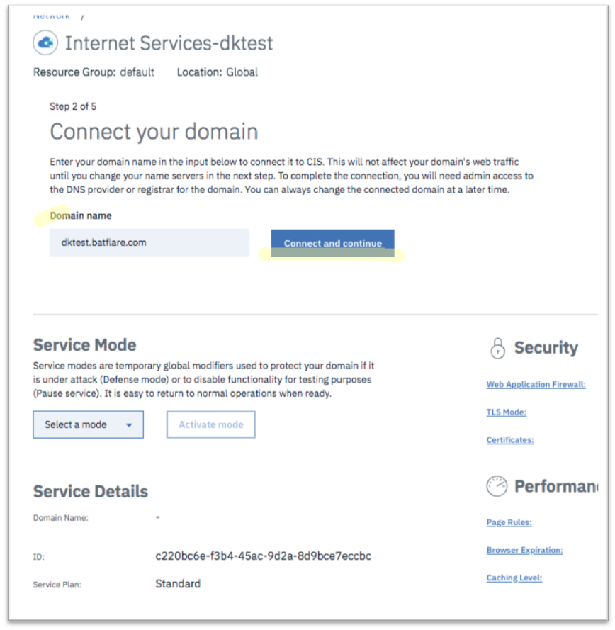

---

copyright:
  years: 2018, 2019
lastupdated: "2019-03-14"

keywords: domain Input information, IBM Cloud Internet Service, Domain Name

subcollection: cis

---

{:shortdesc: .shortdesc}
{:codeblock: .codeblock}
{:screen: .screen}
{:new_window: target="_blank"}
{:pre: .pre}
{:table: .aria-labeledby="caption"}

# 도메인에 대한 정보 입력
{:#input-information-about-your-domain}

글로벌 로드 밸런싱을 보호하고 제공할 도메인에 대한 정보를 입력하십시오.

1. 시작하기 화면의 왼쪽에 있는 **개요**를 클릭합니다. 도메인 이름(또는 하위 도메인 이름)을 입력하고 **도메인 추가**를 클릭합니다. 
    
    
    
    IBM Cloud Internet Services는 DNS 등록자가 아니므로 이 도메인(또는 하위 도메인)이 이전에 작성되었어야 합니다.
    {:note}

    서비스 세부사항 섹션에 새로 추가된 도메인이 처음에 보류 상태로 표시됩니다. 

        

2. 각 DNS 등록자를 통해 도메인의 관리 페이지로 이동하고, NS 레코드를 정의하여 IBM 이름 서버에 도메인/하위 도메인을 위임합니다.

정보가 DNS 데이터베이스에서 복제될 때까지 최대 24시간 동안 대기해야 합니다. 복제되면 도메인 상태가 활성으로 변경됩니다. 

    
