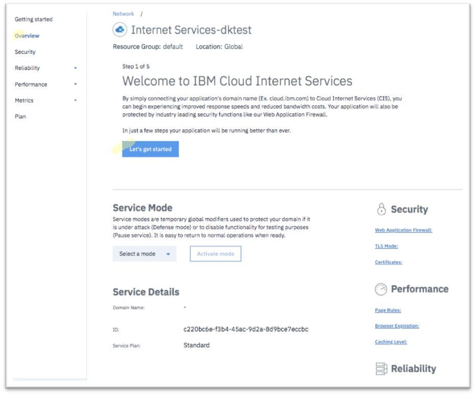

---

copyright:
  years: 2018, 2019
lastupdated: "2019-03-14"

keywords: IBM Cloud Internet Services, setup flow

subcollection: cis

---

{:shortdesc: .shortdesc}
{:codeblock: .codeblock}
{:screen: .screen}
{:new_window: target="_blank"}
{:pre: .pre}
{:table: .aria-labeledby="caption"}
{:DomainName: data-hd-keyref="DomainName"}
{:note: .note}
{:important: .important}
{:deprecated: .deprecated}
{:generic: data-hd-programlang="generic"}

# Crie sua instância do IBM Cloud Internet Services (CIS)
{:#create-your-cis-instance}

Para criar uma instância do CIS, execute o procedimento a seguir:

1. Em seu navegador, abra o [Portal do cliente ](https://{DomainName}/){: new_window} e efetue login em sua conta. 
2. Clique em **Catálogo** na parte superior direita e, na seção **Infraestrutura**, selecione **Rede**. Em seguida, clique em **Internet Services**.

   

3. Especifique o nome para sua instância de serviço e identifique o grupo de recursos no qual gostaria de colocar esse serviço. O grupo de recursos padrão é `default`. Revise o resumo do plano e clique em **Criar**.
    
O sistema levará você a um fluxo de configuração na página Visão Geral para uma revisão rápida do serviço.
    

