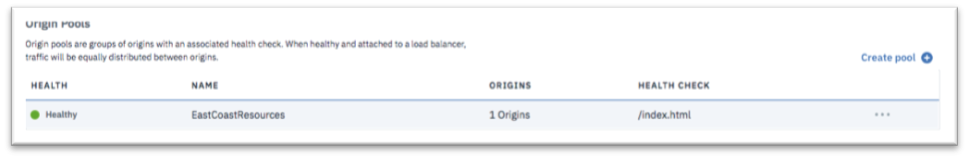

---

copyright:
  years: 2018, 2019
lastupdated: "2019-03-14"

keywords: origin pools, application resources, Origin Pools section

subcollection: cis

---

{:shortdesc: .shortdesc}
{:codeblock: .codeblock}
{:screen: .screen}
{:new_window: target="_blank"}
{:pre: .pre}
{:table: .aria-labeledby="caption"}

# Identificar os recursos de seu aplicativo
{:#identify-your-application-resources}

Identifique os recursos de seu aplicativo, como conjuntos de origem e mecanismos de verificação de funcionamento.
 
1. Navegue até a seção **Conjuntos de origem** e clique em **Criar conjunto** para definir um novo conjunto de origem. 

   Os conjuntos de origem são recursos do servidor que entregam aplicativos para seus clientes. 
   
2. Designe um nome para seu Conjunto de Origem e selecione o mecanismo de verificação de funcionamento definido anteriormente. Inclua seu servidor de aplicativos como sua Origem. É possível incluir uma ou mais Origens clicando em **Incluir origem**. 

   Se seus servidores de aplicativos estiverem atrás de um balanceador de carga local, como um IBM Cloud Load Balancer, inclua o FQDN ou o IP virtual de seu balanceador de carga como sua origem, em vez de incluir seus servidores individuais.
   {:note}
   
3. Clique em **Provisionar recurso** para concluir a criação de seu Conjunto de Origem.  

   
   
   O Conjunto de Origem será inicialmente mostrado como **Não funcional**. Seu estado mudará para **Funcional** depois de uma verificação de funcionamento bem-sucedida ter sido realizada pelo sistema. Pode ser necessário atualizar seu navegador para ver a mudança de estado. 
   
   
   
   Se você tiver diversas origens dentro de seu Conjunto de Origem, use o limite de origem funcional para especificar o número mínimo de origens que devem ser funcionais antes de declarar o conjunto funcional.
   {:note}
   
4. Defina o número de conjuntos de origem como o número de farms de aplicativos que você possui. Esses farms podem estar dentro da mesma região geográfica
ou em regiões geográficas diferentes. Em nosso exemplo, criaremos dois conjuntos de origem representando um farm de aplicativos nas Costas Leste e Oeste dos Estados Unidos. 

   
