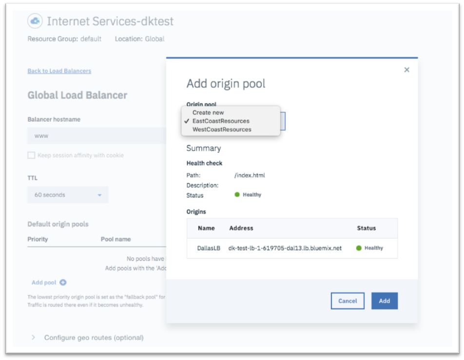
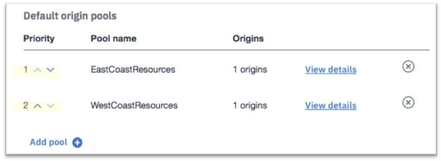

---

copyright:
  years: 2018, 2019
lastupdated: "2019-03-14"

keywords: global load balancer, global load balancer configuration

subcollection: cis

---

{:shortdesc: .shortdesc}
{:codeblock: .codeblock}
{:screen: .screen}
{:new_window: target="_blank"}
{:pre: .pre}
{:table: .aria-labeledby="caption"}

# 定义全局负载均衡器
{:#define-the-global-load-balancer}

通过指定主机名、添加和调整源池以及定义其他规则来控制如何将流量提供给客户机，从而定义您的全局负载均衡器配置。

1. 通过单击右侧的“创建负载均衡器”按钮，创建您的全局负载均衡器。  

2. 指定域的主机名，根据需要调整 TTL 值（缺省值是 60 秒），并使用**添加池**添加您的源池。 

   
   
   **注：**主机名与域名相结合构成应用程序的标准域名 (FQDN)。您的最终用户使用此 FQDN 连接应用程序。 
   
3. 通过单击池左侧的上下箭头，调整源池的相对优先级。这些源池通过循环方式满足最终用户的应用程序请求。 
   
      
   
4. 您可以选择定义其他规则来控制如何将流量提供给不同地理区域的客户机。在下面的示例中，来自南美洲南部区域的客户机将路由到美国西海岸的源池。您可以使用这些规则将客户机定向到尽可能最接近的区域。如果其中任何区域发生故障，那么请求将路由到其他可用的正常运行位置，这样最终用户不会受停机影响。 

      
   
5. 单击**供应资源**以完成全局负载均衡器的配置。 
6. 最终，通过在移动浏览器窗口中键入 `FQDN URL` 来验证应用程序的连接。如果可以连接，您将看到欢迎消息。
