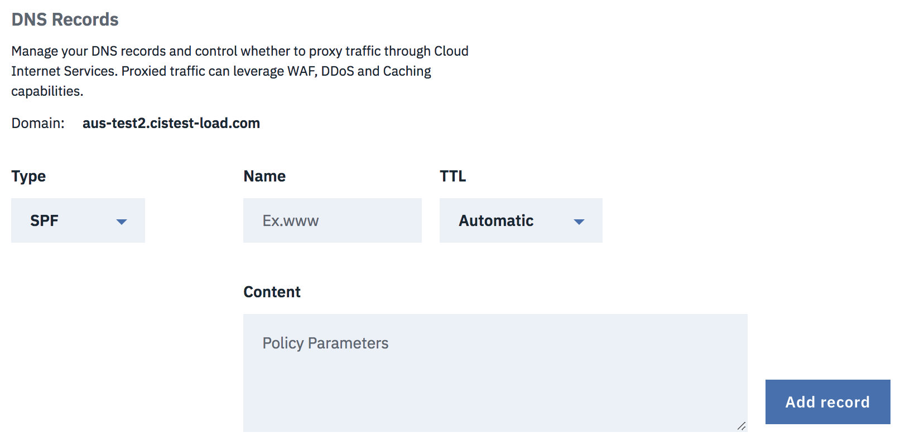
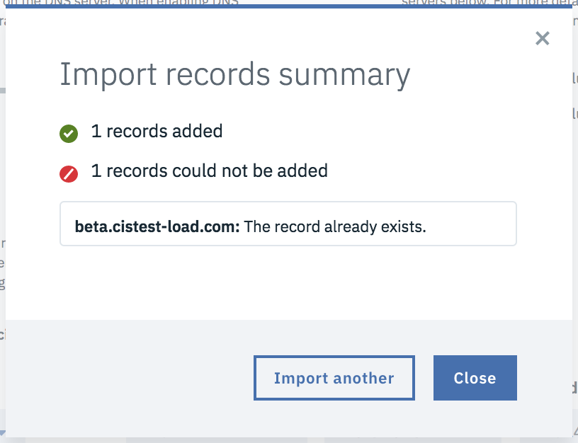

---

copyright:
  years: 2018, 2019
lastupdated: "2019-03-14"

keywords: IBM CIS DNS records, parts of the DS record, Type

subcollection: cis

---

{:shortdesc: .shortdesc}
{:new_window: target="_blank"}
{:codeblock: .codeblock}
{:pre: .pre}
{:screen: .screen}
{:tip: .tip}
{:download: .download}
{:DomainName: data-hd-keyref="DomainName"} 
{:note: .note} 
{:important: .important} 
{:deprecated: .deprecated} 
{:generic: data-hd-programlang="generic"}

# 为 IBM CIS 设置域名系统 (DNS)
{:#set-up-your-dns-for-cis}

本文档包含有关如何配置 IBM CIS DNS 记录（包括如何配置安全 DNS）的一些具体指示信息。

## 安全 DNS
{:#secure-dns}

**DNSSec** 是一种用于对 DNS 数据进行数字“签名”以确保其有效的技术。要消除来自因特网的漏洞，必须在查找的每个步骤中部署 DNSSec，从根区域到最终域名（例如 www.icann.org）都要部署。

## 配置和管理安全 DNS 
{:#configuring-and-managing-your-secure-dns}

DNSSec 向因特网的 DNS 基础架构添加一个认证层，否则基础架构就不安全。安全 DNS 可保证访问者在将域名输入到 Web 浏览器时会定向到**您的** Web 服务器。只需从 IBM CIS 帐户在 DNS 页面中启用 DNSSec ，然后将 DS 记录添加到注册器。


可以选择**查看 DS 记录**按钮以打开一个对话框，该对话框说明如何向注册器添加 DS 记录。必须复制 DS 记录部分，并将其粘贴到注册器的仪表板。每个注册器都不同，您的注册器可能只会要求输入某些可用字段的信息。

## 添加 DNS 记录
{:#adding-dns-records}

您可以使用**类型**下拉菜单，选择要创建的记录的类型。每种 DNS 记录类型都有关联的“名称”和“生存时间 (TTL)”。 

无论在“名称”字段中输入什么内容，除非已经在该字段中手动附加了域名，否则都会在名称上附加域名（例如，不论在该字段中输入的是 `www` 还是 `www.example.com`，API 都会将其作为 `www.example.com` 进行处理）。如果在“名称”字段中输入精确域名，那么不会向其追加域名（例如，`example.com` 会作为 `example.com` 进行处理）。但是，DNS 记录的列表只会显示名称，不会显示附加的域名，因此 `www.example.com` 将显示为 `www`，而 `example.com` 将显示为 `example.com`。TTL 将具有缺省值 `Automatic`，但用户可进行更改。代理的 DNS 记录的 TTL 值始终为 `Automatic`，因此在此更改期间，新代理的记录将更改为此配置。

### “类型”记录
{:#a-type-record}

要添加此记录类型，**名称**和 **IPv4 地址**字段中必须存在有效值。也可以从下拉菜单中指定 **TTL**，缺省值为 `Automatic`。


    必填字段：名称、IPv4 地址
    可选字段：TTL（缺省值为“Automatic”）

### AAA 类型记录
{:#aaaa-type-record}

要添加此记录类型，**名称**和 **IPv6 地址**字段中必须存在有效值。也可以从下拉菜单中指定 **TTL**，缺省值为 `Automatic`。


    必填字段：名称、IPv6 地址
    可选字段：TTL（缺省值为“Automatic”）

### CNAME 类型记录
{:#cname-type-record}

要添加此记录类型，**名称**字段中必须存在有效值，**域名** (FQDN) 字段中必须存在标准域名。也可以从下拉菜单中指定 **TTL**，缺省值为 `Automatic`。


    必填字段：名称、域名（针对 CNAME）
    可选字段：TTL（缺省值为“Automatic”）

企业套餐能够对另一个域设置 CNAME，前提是在 CIS 中配置该域。
{:note}

```
示例
配置的 CIS 域：
  - example.com
  - different.com

test.example.com -CNAME-> test.different.com
```

### MX 类型记录
{:#mx-type-record}

要添加此记录类型，**名称**字段中必须存在有效值，**邮件服务器**字段中必须存在有效地址。也可以从下拉菜单中指定 **TTL**，缺省值为 `Automatic`。


    必填字段：名称、邮件服务器
    可选字段：TTL（缺省值为 Automatic）、属性（缺省值为 1）

### LOC 类型记录
{:#loc-type-record}

要添加此记录类型，**名称**字段中必须存在有效值。如果需要更具体的信息，请选择**配置 LOC 选项**按钮。也可以从下拉菜单中指定 **TTL**，缺省值为 `Automatic`。


    必填字段：名称
    可选字段：LOC 选项（单击此按钮以进行配置）


### CAA 类型记录
{:#caa-type-record}

要添加此记录类型，**名称**和**值**字段中必须存在有效值。“值”字段将与**标记**下拉字段的值相关，缺省情况下，该字段为“将违例报告发送到 URL”。也可以从下拉菜单中指定 **TTL**，缺省值为 `Automatic`。


    必填字段：名称、值（与标记关联）
    可选字段：TTL（缺省值为 Automatic）、标记（缺省值为“将违例报告发送到 URL”）

### SRV 类型记录
{:#srv-type-record}

要添加此记录类型，**名称**、**服务名称**和**目标**字段中必须存在有效值。使用下拉菜单来选择**协议**，缺省情况下，为 UDP 协议。此外，可以指定**优先级**、**权重**和**端口**。这三个字段的缺省值为 1。还可以从下拉菜单中指定 **TTL**，缺省值为 `Automatic`。


    必填字段：名称、服务名称、目标
    可选字段：TTL（缺省值为 Automatic）、协议（缺省值为 UDP）、优先级（缺省值为 1）、权重（缺省值为 1）、端口（缺省值为 1）

### SPF 类型记录
{:#spf-type-record}

要添加此记录类型，**名称**和**内容**字段中必须存在有效值。也可以从下拉菜单中指定 **TTL**，缺省值为 `Automatic`。



    必填字段：名称、内容
    可选字段：TTL（缺省值为 Automatic）

### TXT 类型记录
{:#txt-type-record}

要添加此记录类型，**名称**和**内容**字段中必须存在有效值。也可以从下拉菜单中指定 **TTL**，缺省值为 `Automatic`。


    必填字段：名称、内容
    可选字段：TTL（缺省值为 Automatic）

第一次订购专用证书时，发生“域控制验证”(DCV) 过程，这将生成对应的 TXT 记录。如果删除 TXT 记录，那么在订购另一个专用证书时，DCV 过程将再次发生。如果删除专用证书，那么不会删除与 DCV 过程对应的 TXT 记录。
{:note}

### NS 类型记录
{:#ns-type-record}

要添加此记录类型，**名称**和**名称服务器**字段中必须存在有效值。也可以从下拉菜单中指定 **TTL**，缺省值为 `Automatic`。


    必填字段：名称、名称服务器
    可选字段：TTL（缺省值为 Automatic）

## 更新 DNS 记录
{:#updating-dns-records}

在每个记录行中，可以单击菜单中的**编辑记录**选项，这将打开一个对话框，可使用此对话框来更新记录。


例如，这是 **A** 类型记录的更新对话框。完成更改后，选择**更新记录**以保存更改。


## 删除记录
{:#deleting-dns-records}

在每个记录行中，可以从菜单中选择**删除记录**选项，这将打开一个对话框，可使用此对话框来确认删除过程。


可以选择**删除**按钮来确认删除操作。如果不希望删除，请选择**取消**。


## 导入和导出记录
{:#import-export-records}

可以在 CIS 中导入和导出 DNS 记录。所有文件以 BIND 格式作为 .txt 文件进行导入和导出。有关 [BIND 格式](https://en.wikipedia.org/wiki/Zone_file)的更多信息。
单击溢出菜单并选择导入或导出记录。

### 导入记录
{:#import-dns-records}

缺省情况下，允许总共 3500 条 DNS 记录（在 CIS 上导入和创建）。您可以导入多个文件，一次一个文件，前提是记录总数不超过最大限制。导入后，将向您显示成功添加的记录数和失败数量以及每个记录失败原因的摘要。

### 导出记录
{:#export-dns-records}

使用 `Export records` 以创建区域文件备份，或者导出以用于另一个 DNS 提供程序。单击此菜单选项时，会将记录下载到浏览器设置指定的位置（通常是 Downloads 文件夹)。要选择其他文件夹位置，请更改浏览器的设置，以提示您输入每个下载的位置。
