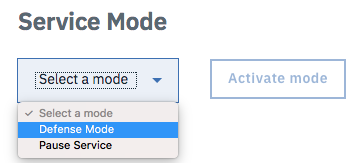

---

copyright:
  years: 2018, 2019
lastupdated: "2019-03-14"

keywords: configuration domain, Free Trial plan, CIS instance

subcollection: cis

---

{:shortdesc: .shortdesc}
{:new_window: target="_blank"}
{:faq: data-hd-content-type='faq'}


# 常见问题及解答
{:#faq}

## 曾经位于目录中的抢先体验套餐发生了什么？
{:#cis-faq-early-access-plan}
{: faq}

抢先体验套餐已于 2018 年 5 月 31 日从目录中除去。该套餐已替换为标准付费套餐和新的 30 天免费试用套餐。如果您有抢先体验套餐实例，请立即升级至标准套餐以避免数据丢失；如果您参与了抢先体验 Beta，将不允许您创建免费试用实例。

## 如何使用免费试用套餐？
{:#cis-faq-free-trial-plan}
{: faq}

按照设计，免费试用套餐仅允许每个帐户一个区域。建议仅为每个帐户创建一个实例，并验证区域名称。在添加区域名称之前对其进行验证至关重要。如果删除了区域，那么在免费试用套餐期间无法添加另一个区域或同一个区域。

## 我可以拥有多少个免费试用实例？
{:#cis-faq-free-trial-instances}
{: faq}

在帐户生命周期内，每个帐户最多只能有一个免费试用实例。如果您已有免费试用实例，或者删除了免费试用实例，或者免费试用已到期，那么将不允许您创建另一个免费试用实例。但是，您可以独立于可能已创建的任何免费试用，创建其他付费套餐类型（例如，标准）的实例。

## 我有一个预订了抢先体验套餐的服务实例。能否将其更改为免费试用？
{:#cis-faq-early-access-to-free-trial-plan}
{: faq}

否。抢先体验套餐只能升级到付费套餐，后者目前是标准套餐。

## 我有一个抢先体验实例，我（可能已经或可能尚未）将其删除。现在，能否创建免费试用实例？
{:#cis-faq-early-access-and-free-trial-plan}
{: faq}

否。每个帐户仅授权有一个免费实例。抢先体验套餐和替换它的免费试用套餐都视为免费套餐。这也意味着您最多可以有一个免费试用实例。

## 能否从标准降级到免费试用？
{:#cis-faq-downgrade-standard-to-free-plan}
{: faq}

否。这是不允许的。

## 我的免费试用已到期。我有哪些选项？
{:#cis-faq-free-trial-plan-expired}
{: faq}

为避免任何数据损失，您必须在到期日期前从免费试用升级到标准。此后，我们仅支持升级套餐或删除 CIS 实例。如果在 45 天（从实例启动日期起）后未删除或升级实例，那么将自动删除配置域、GLB、池和运行状况检查。

## 如何删除 CIS 实例？
{:#{:#cis-faq-delete-instance}
{: faq}

要删除 CIS 实例，首先必须删除所有 GLB、池和运行状况检查。然后，删除关联的域（区域）。转至**概述**页面，单击**服务详细信息**部分中域名旁边的废纸箱图标以启动删除过程。

## 我已向帐户添加用户并授予该用户管理 Internet Services 实例的许可权。为何该用户面临认证问题？
{:#cis-faq-user-authentication-issue}
{: faq}

您可能未向该用户分配“服务访问角色”。请注意，有两个单独的角色集：“平台访问”和“服务访问”。需要平台访问角色才能创建和管理服务实例，但需要服务访问角色才能对服务实例执行特定于服务的操作。在控制台中，可以通过选择**管理 > 安全性 > 身份和访问**来更新这些设置。

## 为什么我的域处于“暂挂”状态？如何将其激活？
{:#cis-faq-pending-domain}
{: faq}

将域添加到 CIS 时，我们将向您提供两个名称服务器，以便在您的注册器中（或者，如果要添加子域，就在 DNS 提供者处）进行配置。域或子域将保持暂挂状态，直到您正确配置名称服务器。请确保将两个名称服务器都添加到注册器或 DNS 提供者。我们定期扫描公用 DNS 系统以检查是否已按照指示配置了名称服务器。只要我们能够验证名称服务器的更改（最多可能需要 24 小时），就会激活域。可以通过单击概述页面中的**重新检查名称服务器**，提交请求以重新检查名称服务器。

## 我的域的注册器是哪一个？
{:#cis-faq-who-is-registrar}
{: faq}

请参阅 https://whois.icann.org/ 以获取此信息。**注**：您必须具有管理特权才能在注册器中编辑您的域配置，以便在将域添加到 CIS 时更新或添加为您的域提供的名称服务器。如果您不知道正尝试将其添加到 CIS 的域的注册器，那么可能无权在注册器处更新域的配置。与组织中的域所有者一起进行必要的更改。

## 我希望保留我的域 (example.com) 的当前 DNS 提供者。是否可以从我的当前 DNS 提供者向 CIS 委派子域 (subdomain.example.com)？
{:#cis-faq-keep-current-dns-provider}
{: faq}

可以。该过程类似于添加域，不过针对更高级别域将使用 DNS 提供者，而不是注册器。向 CIS 添加子域时，通常会为您提供两个名称服务器以进行配置。为这两台名称服务器都配置名称服务器 (NS) 记录，因为域中的 DNS 记录由其他 DNS 提供者管理。当我们能够验证是否已添加必需的 NS 记录时，会激活您的子域。如果您未在组织内管理更高级别的域，那么必须与更高级别域的所有者合作才能添加 NS 记录。

## 什么是 TLS？
{:#cis-faq-what-is-tls}
{: faq}

TLS 是一种标准安全协议，用于在联机通信中在 Web 服务器和浏览器之间建立加密链路。要创建与 Web 站点的 TLS 连接，需要 TLS 证书，此证书包含域名、公司名称以及公司地址、城市、省/自治区/直辖市以及国家或地区之类的其他数据。证书还显示到期日期以及发布证书的认证中心 (CA) 的详细信息。

## TLS 如何工作？
{:#cis-faq-how-does-tls-work}
{: faq}

当浏览器启动与 TLS 保护的 Web 站点的连接时，将首先检索该站点的 TLS 证书，以检查证书是否仍然有效。TLS 验证 CA 是否为浏览器信任的 CA，以及该证书是否由针对其发布证书的 Web 站点使用。如果其中任何一项检查失败，将收到一个警告，指示该 Web 站点未受到有效证书的保护。

在 Web 服务器上安装 TLS 证书后，会在 Web 服务器及所连接的浏览器之间实现安全连接。Web 站点的 URL 前缀为“https”而不是“http”，会在地址栏上显示挂锁。如果 Web 站点使用扩展验证 (EV) 证书，那么浏览器还可能会显示绿色地址栏。

## 我为什么会看到隐私警告？
{:#cis-faq-privacy-warning}
{: faq}

IBM Cloud CIS 发布的 TLS 证书包含根域 (`example.com`) 和一级子域 (`*.example.com`)。如果尝试访问二级子域 (`*.*.example.com`)，那么将在浏览器中看到隐私警告，因为这些主机名未添加到 SAN 中。

另外，请允许最多 15 分钟时间以便一个合作伙伴认证中心 (CA) 发布新证书。如果新证书尚未发布，那么将在浏览器中看到隐私警告。

## 为什么我会看到无效的 SSL 证书错误？
{:#cis-faq-invalid-ssl-cert-error}
{: faq}

如果在访问站点时看到“错误 526，无效的 SSL 证书”，这可能意味着源证书无效。启用 CIS 代理时，在缺省 SSL 方式下，源中需要有效的 CA 签名证书，即“端到端 CA 签名”。请注意，SSL 方式的缺省设置先前为“端到端灵活性”，这将忽略源提供的证书的有效性。新缺省值仅应用于重新添加的域。如果您的域是在缺省 SSL 方式为“端到端灵活性”时添加的，将不会覆盖该设置。您可以将该方式更改为严格性较低的方式，但是建议不要用于生产环境。

## 什么是 DDoS？
{:#cis-faq-what-is-ddos}
{: faq}

分布式拒绝服务 (DDoS) 攻击是一种通过使用来自多个源的流量使联机服务溢出而导致其不可用的尝试。在 DDoS 攻击中，多个受损的计算机系统会攻击目标（例如，服务器、Web 站点或其他网络资源），这会影响目标资源的用户。

大量入局消息、连接请求或格式不正确的包传入目标系统会导致系统运行速度减慢，甚至会崩溃或停机，这样就会拒绝为合法用户或系统提供服务。DDoS 攻击由不同的威胁参与者执行，从个人犯罪黑客到有组织犯罪团伙和政府机构。

## 如果受到 DDoS 攻击应该怎么办？
{:#cis-faq-what-to-do-in-ddos}
{: faq}

**步骤 1：**在**概述**屏幕中打开“防御模式”。 



**步骤 2：**设置 DNS 记录以实现最高安全性。

**步骤 3：**不要对来自 IBM CIS 的请求进行速率限制或调速，我们需要带宽来帮助您解决该情况。

**步骤 4：**必要时阻止特定国家或地区和访问者。

## 遇到 522 错误时该怎么办？
{:#cis-faq-522-error}
{: faq}

522 错误指示无法建立与源服务器（即，主机）的连接。连接失败大约 15 秒后，将关闭连接并显示 522 错误页面。

此问题通常是由防火墙或安全软件意外阻止了我们的 IP 地址所导致的。因为 CIS 充当逆向代理，所以与站点的连接将显示为来自一系列 CIS IP。此行为可能导致某些防火墙阻止这些连接，这将导致无法向站点访问者提供正确内容。

要解决此问题，请让主机将[此处](/docs/infrastructure/cis?topic=cis-ibm-cloud-cis-whitelisted-ip-addresses)列出的所有 CIS IP 范围列入白名单。

必须将所有这些 IP 都列入白名单，才可避免 522 错误。有必要检查这些范围内的任意 IP 是否会被阻止。

网络连接问题也可能导致 522 错误，因此请确认服务器和网络正常运行，且未超负荷。

如果在执行上述步骤后仍收到错误，请联系 IBM CIS 支持人员并确认以下内容：

* 您已将 IP 范围列入白名单
* 您的服务器/网络处于联机状态并且运行状况普遍正常

如果您联系我们的支持团队，请提供最新 522 错误中的 ray ID。我们可以使用此 ID 来确定所涉及的 CIS 数据中心并执行进一步的测试。

## 什么是代理记录，为何需要这些记录？
{:#cis-faq-proxied-record}
{: faq}

代理记录是通过 IBM CIS 来代理其流量的记录。只有代理记录能受益于 CIS，如 IP 屏蔽，就是用 CIS IP 替换源 IP 以对其进行保护：

```
$ whois 104.28.22.57 | grep OrgName
OrgName:        IBM
```

对于某个域，如果希望绕过 CIS（仍然会解析 DNS），那么不对记录使用代理是可行的解决方案。

## 我收到 DNS 验证错误：1004；现在怎么办？
{:#cis-faq-dns-validation-error}
{: faq}

要使页面规则有效，需要针对您的区域解析 DNS。因此，必须有针对您区域的代理 DNS 记录。 

## 可以为根记录添加 CNAME 吗？
{:#cis-faq-add-cname-root-record}
{: faq}

可以。IBM CIS 支持名为“CNAME 序列化”的功能，这允许用户添加 CNAME 作为根记录。我们的权威 DNS 服务器枚举 CNAME 目标的记录并使用这些记录而不是 CNAME 自身进行响应，这实际上隐藏了用户在域根中配置了 CNAME 的事实。

## 缺省运行状况检查超时是多少？
{:#cis-faq-default-health-check-timeout}
{: faq}

免费试用和标准套餐的缺省运行状况检查超时为 60 秒。

## 能否针对非 HTTP/HTTPS 流量配置运行状况检查？
{:#cis-faq-health-check-non-http-traffic}
{: faq}

否，只能使用 HTTP/HTTPS 进行配置。

## 能否针对非 HTTP/HTTPS 流量配置 GLB？
{:#cis-faq-glb-non-http-traffic}
{: faq}

否，只能使用 HTTP/HTTPS 进行配置。

## 禁用源池中的所有源会禁用整个源池自身吗？
{:#cis-faq-disabling-origins-disable-origin-pool}
{: faq}

会，如果源池在负载均衡器中使用，那么流量将路由到次高优先级的池或回退池。

## 我的 Kubernetes Ingress 中发生错误，应该怎么办？
{:#cis-faq-kubernetes-ingress-error}
{: faq}

Kubernetes Ingress 中的主机名必须由小写字母数字字符、“-”或“.”组成，并且必须以字母数字字符开头和结尾。虽然允许在负载均衡器名称中使用 `_`，但是这可能导致在 Kubernetes 集群中发生 Ingress 错误。建议不要在负载均衡器名称使用 `_`，以避免 Kubernetes 集群问题。

## 在尝试保存 Edge Functions 操作时收到 502 错误，应该怎么办？
{:#cis-faq-502-error}
{: faq}

请联系 [IBM 支持](/docs/infrastructure/cis?topic=cis-getting-help-and-support)并提供尝试保存的脚本。
