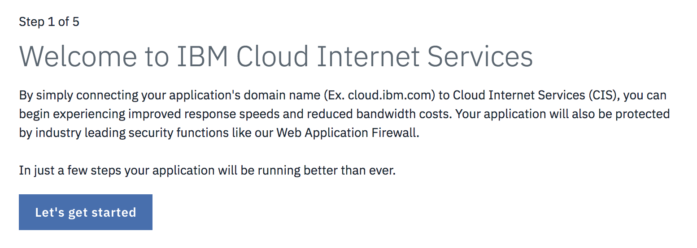

---

copyright:
  years: 2018, 2019
lastupdated: "2019-03-29"

keywords: IBM Cloud Internet Services, IBM CIS application, Authoritative DNS servers

subcollection: cis

---

{:shortdesc: .shortdesc}
{:new_window: target="_blank"}
{:DomainName: data-hd-keyref="DomainName"}
{:note: .note}
{:important: .important}
{:deprecated: .deprecated}
{:generic: data-hd-programlang="generic"}

# IBM Cloud Internet Services (CIS) 入门
{:#getting-started}

IBM Cloud Internet Services (CIS) 基于 Cloudflare 技术，提供了三种主要功能来增强工作流程：[安全性](/docs/infrastructure/cis?topic=cis-manage-your-ibm-cis-for-optimal-security)、[可靠性](/docs/infrastructure/cis?topic=cis-manage-your-ibm-cis-deployment-for-optimal-reliability)和[性能](/docs/infrastructure/cis?topic=cis-manage-your-cis-deployment-for-best-performance)。一旦您打开了 IBM CIS 应用程序，就会在屏幕的左侧导航栏中显示每个功能区域。

对于每个功能，IBM CIS 将帮助您调整其功能以满足您的特定需求，包括：

 * 授权 DNS 服务器
 * 全局负载均衡和局部负载均衡
 * Web 应用程序防火墙 (WAF)
 * DDoS 保护
 * 高速缓存和页面规则

## 开始之前
{:#before-you-begin}

开始使用 IBM CIS 之前，首先会需要 [IBMid](https://www.ibm.com/account/reg/us-en/signup?formid=urx-19776)。然后，可以根据您的偏好通过 IBM Cloud 帐户或者通过新 [IBM Cloud Internet Services 门户网站](https://{DomainName}/catalog/services/internet-services)订购服务。

如果在获取帐户以使用 IBM Cloud Internet Services 时需要帮助，请[联系您的 IBM 销售代表](https://{DomainName}/cloud/support)以获取其他入门指南。

如果具有现有 Softlayer 帐户，那么可以将[您的帐户链接](https://{DomainName}/docs/account?topic=account-unifyingaccounts) IBMid。 

## 流程概述
{:#process-overview}

只需几个步骤就可以开始将 IBM CIS 用于因特网流量。

 * 从 IBM Cloud 仪表板打开 IBM CIS 应用程序。
 * 添加要管理的域。
 * 使用我们提供的名称服务器来配置 DNS 信息。
 * 按照教程操作或者设置其他一些功能，以继续开始使用 IBM CIS。

### 步骤 1：打开 IBM CIS 应用程序
{:#open-cis-application}

打开 [IBM Cloud 仪表板](https://{DomainName}/catalog/)。然后，通过在仪表板的左侧导航栏中选择**基础架构 > 网络**类别，导航至 IBM CIS 应用程序图标。通过单击靠近屏幕中间的图标，打开 IBM Cloud Internet Services 应用程序。 

**概述屏幕**

IBM CIS 应用程序启动后，会显示 IBM CIS **概述**屏幕，可在 UI 显示屏左侧区域上找到**安全性**、**可靠性**和**性能**选项卡。

**我选择哪个套餐？**

有 4 个套餐可供选择： 
* **企业使用量** 
* **企业软件包** 
* **标准套餐** 
* **免费试用**。 

**免费试用**在 30 天后到期，此时您可以升级到**标准套餐**或**企业套餐**。单个**标准**实例可以管理一个域。您可以在单个帐户中创建所需任意数量的**标准**服务实例，每个实例管理单个域。 

**企业套餐**允许在单个服务实例中管理多个域。选择**概述**屏幕上的**创建**按钮以开始供应帐户。

**免费试用**限制为每个帐户一个实例。
{:note}

**开始供应**

将看到 IBM CIS 应用程序的第一个屏幕，可在其中选择**添加域**按钮以开始。

### 步骤 2. 添加并配置您的域。
{:#add-configure-your-domain}

从欢迎页面中选择**开始使用**以开始设置 CIS。

接下来，通过输入域或子域，开始保护和提高 Web Service 的性能。

请指定 DNS 区域。您可以在域的注册器或 DNS 提供者处配置这些域或子域的名称服务器。请勿使用 CNAME。
{:note}

“概述”屏幕将显示您的域处于`暂挂`状态。在完成步骤 4 之前，您的域将保持为`暂挂`状态。

添加域后，无法删除 IBM CIS 实例。要删除该实例，请您的域以及任何配置数先从实例中删除该域。
{:note}

### 步骤 3. 设置 DNS 记录（可选）。
{:#setup-your-dns-records}

在将域的流量转换到 CIS 之前，我们强烈建议您在 CIS 中导入或重新创建 DNS 记录。您可以选择跳过此步骤，但是如果未在 CIS 中正确配置 DNS 记录，那么可能会导致 Web 站点的一部分不可访问。

通过从当前 DNS 上传导出的记录或手动创建 DNS 记录来导入记录。要导入记录，请选择**导入记录**。

完成时或者如果想要跳过此步骤，请选择**下一步**。

### 步骤 4. 使用注册器或现有 DNS 提供者配置您的名称服务器。
{:#configure-your-name-servers-with-the-registrar-or-existing-dns-provider}

要开始利用 IBM CIS 的优势，请配置注册器或域名提供者以使用列出的名称服务器。如果您正在委派域（例如，`example.com`），请在域的设置中配置所列示的名称服务器，这些服务器由您的注册器（例如，在注册器的 Web 门户网站上）进行管理。如果您不确定自己的域的注册器，那么可以在 https://whois.icann.org/ 查看。如果您从另一个 DNS 提供者委派子域（例如，`subdomain.example.com`），那么必须为每个列出的名称服务器添加名称服务器 (NS) 记录。请参阅我们在 Cloudflare 的合作伙伴编写的[管理 DNS 记录 ](https://support.cloudflare.com/hc/en-us/articles/360019093151-Managing-DNS-records-in-Cloudflare){:new_window}，以获取提供者的详细指示信息。

配置注册器或 DNS 提供者后，可能需要最多 24 小时才能使更改生效。在我们验证为您的域或子域正确配置了指定的名称服务器后，该域的状态将从`暂挂`更改为`活动`。配置名称服务器后，单击`概述`页面中的“重新检查名称服务器”链接，可能会加速激活域（每小时只能提交此检查一次）。

您的域必须在 60 天内移至`活动`状态，否则将除去您的域以及任何配置数据。
{:note}

### 步骤 5. 确保 IBM Cloud Internet Services 解析应用程序、主机名或 Web 站点的域信息。
{:#ensure-cis-is-resolving-domain-info}

要继续，请从左侧导航栏中选择**可靠性**选项卡，然后选择 **DNS** 选项。确保添加适当的 _DNS 记录_。添加 **A 记录** 以及任何已填充的 **AAAA** 或 **MX** 条目。如果您忘记在注册器的委派完成之前添加这些记录，那么 IBM Cloud Internet Services 无法解析面向因特网的应用程序的域信息。

### 步骤 6. 在此期间，可以开始管理其他 IBM CIS 功能和功能部件。
{:#manage-other-cis-functions}

有关管理其他功能和功能部件的更多详细信息，请参阅[逐步指示信息](/docs/infrastructure/cis?topic=cis-manage-your-ibm-cloud-internet-services-cis-deployment)。
