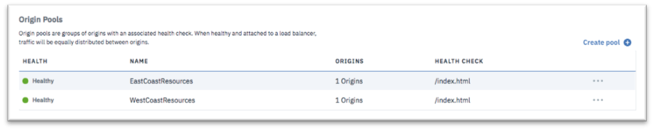

---

copyright:
  years: 2018, 2019
lastupdated: "2019-03-14"

keywords: origin pools, application resources, Origin Pools section

subcollection: cis

---

{:shortdesc: .shortdesc}
{:codeblock: .codeblock}
{:screen: .screen}
{:new_window: target="_blank"}
{:pre: .pre}
{:table: .aria-labeledby="caption"}

# 识别应用程序资源
{:#identify-your-application-resources}

识别应用程序的资源，例如源池和运行状况检查机制。
 
1. 导航至**源池**部分，然后单击**创建池**以定义新的源池。 

   源池是向客户交付应用程序的服务器资源。 
   
2. 为源池分配名称，然后选择先前定义的运行状况检查机制。添加应用程序服务器作为源。您可以通过单击**添加源**来添加一个或多个源。 

   如果应用程序服务器位于本地负载均衡器（例如，IBM Cloud Load Balancer）之后，那么请添加负载均衡器的 FQDN 或虚拟 IP 作为源，而不是添加单独的服务器。
   {:note}
   
3. 单击**供应资源**以完成“源池”的创建。  

   
   
   “源池”初始显示为**运行不正常**。在系统成功执行运行状况检查后，其状态将更改为**运行正常**。您可能需要刷新浏览器才能看到状态更改。 
   
   
   
   如果“源池”中有多个源，那么请使用运行正常的源的阈值来指定在声明池运行正常之前必须运行正常的最小源数。
   {:note}
   
4. 定义数量与您具有的应用程序群数量相同的源池。这些群可能位于相同或不同的地理区域中。在示例中，我们将创建两个源池，分别表示美国西海岸和东海岸的应用程序群。 

   
