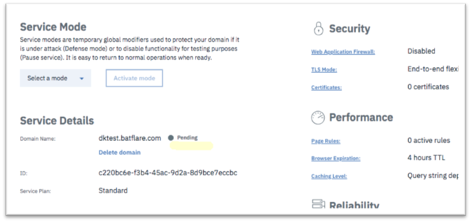

---

copyright:
  years: 2018, 2019
lastupdated: "2019-03-14"

keywords: domain Input information, IBM Cloud Internet Service, Domain Name

subcollection: cis

---

{:shortdesc: .shortdesc}
{:codeblock: .codeblock}
{:screen: .screen}
{:new_window: target="_blank"}
{:pre: .pre}
{:table: .aria-labeledby="caption"}

# 输入有关域的信息
{:#input-information-about-your-domain}

输入有关您要保护并为其提供全局负载均衡的域的信息。

1. 单击“入门”屏幕左侧的**概述**。输入域名（或子域名），并单击**添加域**。 
    
    
    
    IBM Cloud Internet Service 不是 DNS 注册器，因为必须先前已创建此域（或子域）。
    {:note}

    在“服务详细信息”部分下，您会注意到，新添加的域将初始显示为“暂挂”状态。 

        

2. 导航到具有相应 DNS 注册器的域的管理页面，通过定义 NS 记录，将域/子域委派给 IBM 名称服务器。

您可能必须等待最多 24 小时，信息才能在 DNS 数据库中完成复制。完成后，您的域状态将更改为“活动”。 

    
