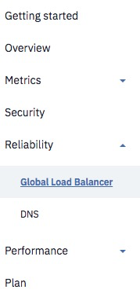

---

copyright:
  years: 2018, 2019
lastupdated: "2019-03-14"

keywords: Page Rules, web content, IBM CIS deployment

subcollection: cis

---

{:shortdesc: .shortdesc}
{:new_window: target="_blank"}
{:DomainName: data-hd-keyref="DomainName"}
{:note: .note}
{:important: .important}
{:deprecated: .deprecated}
{:generic: data-hd-programlang="generic"}

# 管理 IBM CIS 部署以实现最佳可靠性
{:manage-your-ibm-cis-deployment-for-optimal-reliability}

要实现 IBM CIS 部署的最佳可靠性，可以设置有用的 DNS 配置，也可以设置全局负载均衡器。为获取额外的可靠性，可以使用“页面规则”来确保将 Web 内容发送给客户，即使源服务器或高速缓存有问题也可发送。本文档提供了有关确保 IBM CIS 部署最佳可靠性的一些最佳实践的详细信息。

我们通常建议的最佳实践如下：

 * 设置 DNS 以利用 IBM CIS 代理服务器和其他功能
 * 使用一个或多个全局负载均衡器均匀分布站点流量
 * 设置适当的页面规则以管理高速缓存和其他选项

这些项中的每一项都提供了一些功能，可使用这些功能来创建更可靠的 CIS 部署。

请注意，CIS 界面会组织为三个部分：*安全性*、*可靠性*和*性能*。下图中显示了主导航菜单，其中显示了全局负载均衡器和 DNS 菜单项：




## 设置 DNS
{:#setting-up-dns}
 
 要开始设置 DNS 配置，请从导航菜单中选择 **DNS**，如上所示。
 
 有关设置和管理 DNS 以实现可靠性的详细信息，请[参阅此文档](/docs/infrastructure/cis?topic=cis-set-up-your-domain-name-system-dns-for-ibm-cis)。


## 设置全局负载均衡器
{:#setting-up-glb}


要开始设置全局负载均衡器，请从导航菜单中选择**全局负载均衡器**。

有关设置和管理全局负载均衡器的详细信息，请[参阅此文档](/docs/infrastructure/cis?topic=cis-global-load-balancer-glb-concepts)。

## 使用“页面规则”提高可靠性
{:#using-page-rules-to-increase-reliability}

以下是一些建议的“页面规则”设置，可实现站点的最佳可靠性：

 * 提供旧内容
 * 源高速缓存控制
 * 转发 URL

## 提供旧内容
{:#serve-stale-content}

如果服务器宕机，可以使用**提供旧内容**页面规则设置，以使站点的有限版本保持联机。

利用**提供旧内容**，在您的服务器宕机时，IBM CIS 会从我们的高速缓存中提供页面，让您的访问者仍可以看到他们尝试访问的某些页面。访问者将在页面顶部看到一条消息，告知他们处于脱机浏览方式。“提供旧内容”返回 HTTP 状态码 503，但是，很多其他 Web 应用程序也使用 503。当您的服务器恢复联机状态时，IBM CIS 会将用户无缝切换回正常浏览。

如果 IBM CIS 在其高速缓存中没有所请求的页面，那么访问者会看到错误页面，告知其正在请求的 Web 站点页面处于脱机状态。

### 如何设置“提供旧内容”
{:#setting-up-serve-stale-content}
要启用**提供旧内容**，请执行以下步骤：

 * 使用导航菜单，在“性能”下选择“页面规则”。
 * 使用域的 URL 模式创建页面规则。
 * 添加**提供旧内容**设置，状态为开启。
 * 选择“供应资源”。

### “提供旧内容”的限制
{limitations-serve-stale-content}

 * **提供旧内容**会高速缓存根 HTML 中的前 10 个链接，然后是来自其中每个页面的仅第一个链接，最后是来自每个后续页面的第一个链接。这意味着，当您的源服务器宕机时，站点上只有某些页面可供查看。

 * 最近添加的站点不会提供其站点的大型高速缓存，这就意味着，如果站点刚添加了几天，**提供旧内容**可能没什么用。

 * 服务器宕机时，CIS 不显示私有内容，也无法处理表单提交 (POST)。将向访问者显示`结帐时出错`页面或`项需要登录以查看`。

 * 要触发**提供旧内容**，Web 服务器必须返回标准的 HTTP 错误代码 502 或 504 超时。在发生下列情况时，“提供旧内容”也会生效：联系源时遇到问题（错误 521 和 523）、超时（522 和 524）、SSL 错误（525 和 526）或未知错误 (520)。对于其他 HTTP 响应代码（如 404、500 和 503）、数据库连接错误、内部服务器错误或服务器应答为空的情况，不会触发**提供旧内容**。

 * 如果启用了“高速缓存所有内容”页面规则，而“边缘高速缓存到期 TTL”低于高速缓存频率，那么**提供旧内容**不起作用。这是因为“边缘高速缓存到期 TTL”导致在相应时间间隔中清除**提供旧内容**高速缓存。

## 源高速缓存控制
{:#origin-cache-control}
您可以使用**源高速缓存控制**页面规则设置，确定从源高速缓存的内容以及更新内容的频率，这会影响可靠性和性能。缺省情况下，如果未更改任何设置，并且未从源服务器发送任何阻止高速缓存的头，那么 IBM CIS 会使用特定扩展名来高速缓存所有静态内容。这些类型的内容包括图像、CSS 和 JavaScript。此高速缓存主要用于提高性能。

要设置**源高速缓存控制**，请使用“页面规则”来打开特定头，头中指定了关于每个内容资源的所需行为。要了解如何使用**源高速缓存控制**，需要有“页面规则”和 CIS 总体高速缓存行为的更概括性的说明来提供上下文，接下来的几个部分中涵盖了这些内容。通常，可以使用三种方法来控制高速缓存，而**源高速缓存控制**是第二种方法。

设置**源高速缓存控制**会调用高速缓存规则，这些规则旨在严格遵守因特网最佳实践和 RFC，主要是在重新验证方面。例如，`max-age=0` 这一 CIS 缺省行为根本不会进行高速缓存，而设置**源高速缓存控制**则会高速缓存，但始终会重新验证。

### 如何设置源高速缓存控制
{:#setting-up-origin-cache-control}

 * 使用导航菜单，在“性能”下选择“页面规则”。
 * 使用引用域的 URL 模式创建页面规则。
 * 添加**源高速缓存控制**设置，状态为开启。
 * 选择“供应资源”。

### 页面规则优先顺序
{:#page-rule-precedence}

对于整个高速缓存，两个特定的页面规则优先：

 * 如果页面规则将**高速缓存级别**设置为`绕过`，那么不会高速缓存与该页面规则匹配的资源。IBM CIS 仍充当代理，其他性能功能部件保持活动状态。但是，将直接从源服务器访存内容，而不是从高速缓存提供。

 * 如果页面规则将**高速缓存级别**设置为`高速缓存所有内容`，那么会高速缓存与该页面规则匹配的资源。**只有使用此“页面规则”设置才能告知我们要高速缓存除我们认定的静态资源以外的资源（包括 HTML）。**

如果未设置任何页面规则，我们将根据资源扩展名使用`标准`高速缓存方式。我们只高速缓存静态资源。

### 源 cache-control 头
{:#origin-cache-control-headers}

改变 IBM CIS 高速缓存内容的第二种方法是高速缓存从源发送的头。CIS 遵循这些设置，但您可以通过指定**边缘高速缓存 TTL** 页面规则设置来覆盖这些设置。以下是我们在决定要高速缓存来自源的哪些资源时会考虑的头：

 * 如果 **Cache-Control** 头设置为 `private`、`no-store`、`no-cache` 或 `max-age=0`，或者如果响应中存在 cookie ，那么 IBM CIS 不会高速缓存该资源。请注意，不应该高速缓存敏感材料，所以如果是敏感材料，可以考虑使用这些头。

 * 如果 **Cache-Control** 头设置为 `public` 并且 `max-age` 大于 0，或者如果 `Expires` 头设置为将来的任何时间，那么将高速缓存该资源。

**注：**根据 RFC 规则，`Cache-Control: max-age` 优先于 `Expires` 头。如果两者同时出现，并且不一致，那么 `max-age` 优先。

### 使用“s-maxage”头
{:#using-the-s-maxage-header}

同时控制高速缓存行为和浏览器高速缓存行为的第三种方法是使用 `s-maxage` Cache-Control 头。

通常，遵循 `max-age` 指令：

`Cache-Control: max-age=1000`

但是，如果想要指定不同于浏览器的高速缓存超时，那么可以使用 `s-maxage`。以下是一个示例，告知 IBM CIS 将对象高速缓存 200 秒，并告知浏览器将对象高速缓存 60 秒。

`Cache-Control: s-maxage=200, max-age=60`

通常，`s-maxage` 后面只跟逆向代理（因此，浏览器应该忽略它）；而如果存在 `s-maxage`，IBM CIS 会优先处理 s-maxage。对于以下两者，将采用值更大的设置：浏览器高速缓存设置或 `max-age` 头。

### 有关高速缓存控制头和页面规则的可靠性摘要
{:#summary-cache-control-headers-page-rules}

关于高速缓存的可靠性，我们总结了以下一些要考虑的主要方面：

 * 检查源的高速缓存头，以确保不存在可高速缓存资源的覆盖头（`Cache-Control` 和 `Expires`）。

 * 缺省情况下，CIS 始终高速缓存静态内容，不同返回码的 TTL 如下：

```
200 301    120分钟；
302 303    20分钟；
403        5分钟；针对可靠性
404        5分钟；
任意       0秒；
```

 * 要对更多内容进行高速缓存，请针对所需 URL 创建将**高速缓存级别**设置为`高速缓存所有内容`的页面规则（如果请求此 URL 时 Web 服务器返回 404，那么会仅高速缓存此结果 5 分钟）。

 * 要避免对 URL 进行高速缓存，请创建将**高速缓存级别**设置为`绕过`的页面规则。


## 转发 URL
{:#forwarding-url}

要确保您的内容始终可用，请创建使用**转发 URL** 设置的页面规则，以便在您的站点不可用时使用。

启用**转发 URL** 时，会禁用所有其他设置，因为这会将所有流量发送到其他 URL。
{:note}

### 如何设置转发 URL
{:#setting-up-forwarding-url}

 * 使用导航菜单，在“性能”下选择“页面规则”。
 * 使用引用域的 URL 模式创建页面规则。
 * 添加**转发 URL** 设置。
 * 选择转发类型并输入目标 URL。
 * 选择“供应资源”。

### 转发示例
{:#forwarding-examples}

想象一下，您希望使任何人都可以轻松访问 URL，例如：

    *www.example.com/+

    *example.com/+

此模式匹配：

    http://example.com/+
    http://www.example.com/+
    https://www.example.com/+
    https://blog.example.com/+
    https://www.blog.example.com/+
    Etc...

它不匹配：

    http://www.example.com/blog/+  [extra directory before the +]
    http://www.example.com+  [no trailing slash]


一旦创建了与所需内容匹配的模式，请添加**转发 URL** 设置并选择转发类型，然后输入目标 URL。例如：


    https://plus.google.com/yourid

选择“供应资源”。在几秒钟内，与该模式匹配的任何请求都将转发到具有指定重定向的新 URL。

### 高级转发选项
{:#advanced-forwarding-options}

如果使用基本重定向（例如，将根域转发到 `www.yourdomain.com`），那么 URL 中的其他任何内容都将丢失。例如，可以设置模式：

    example.com

并将其转发至：

    `http://www.example.com`

但是，如果某位用户输入了以下内容：

    `example.com/some-particular-page.html`

那么会重定向到：

    `www.example.com`

而不是

    `www.example.com/some-particular-page.html`

解决方案是使用变量。每个通配符与可在转发地址中引用的变量对应。变量由 `$` 后跟一个数字表示。要引用第一个通配符，将使用 `$1`，要引用第二个通配符，将使用 `$2`，依此类推。要修复上一示例中从根域到 `www` 的转发，请使用相同的模式：

    `example.com/*`

然后设置以下 URL 作为流量转发目的地：

    `http://www.example.com/$1`

在此情况下，如果某位用户访问：

    `example.com/some-particular-page.html`

会重定向到：

    `http://www.example.com/some-particular-page.html`
