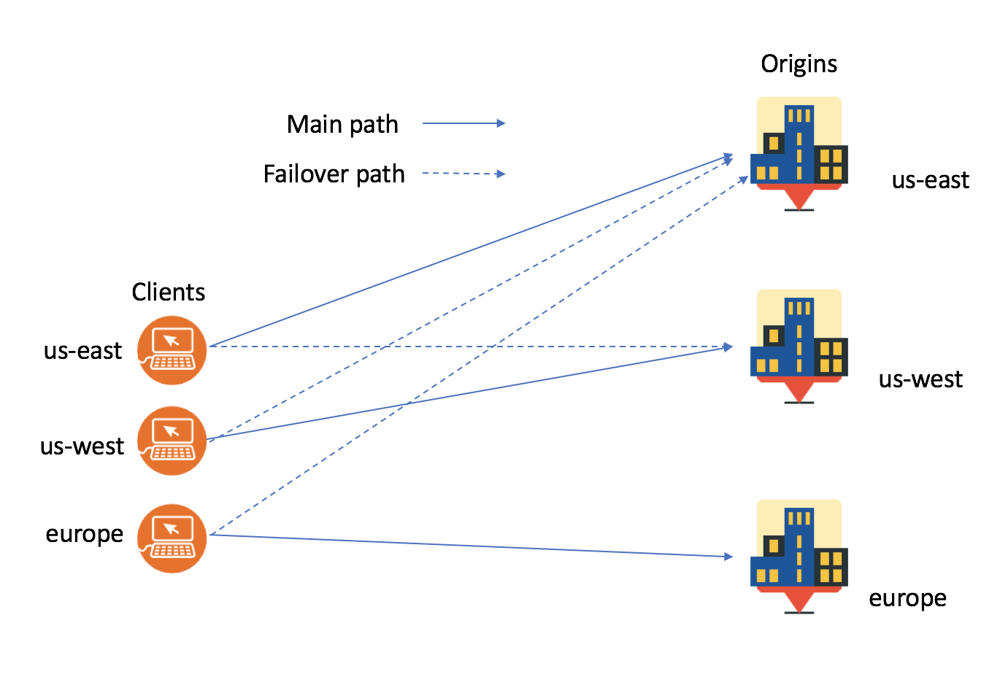

---
copyright:
  years: 2018
lastupdated: "2018-03-06"
---

{:shortdesc: .shortdesc}
{:new_window: target="_blank"}

# IBM Cloud Internet Services (CIS) 如何确保工作可靠性

IBM Cloud Internet Services (CIS) 帮助您提高 Web Service 和应用程序可靠性，因为其可帮助避免因应用程序和基础架构停运而导致的停机时间。例如，利用“全局负载均衡”，您可以在多个区域中部署 Web Service 和应用程序。在启用“全局负载均衡”时，IBM CIS 将客户请求路由至最近的可用区域。如果任何区域失败，那么会将请求路由到下一个最近的位置，从而使客户不会受停机影响。如果 Web 站点或 API 发生故障，IBM CIS 将自动向您发送通知，并在恢复时通知您。

以下是快速功能概述：

## 可靠性功能

 * 全局负载均衡 
 * 针对负载均衡的代理和非代理选项
 * 源池和运行状况监视器
 * DNS 管理
 
### 摘要
 
  * 运行状况监视器检查源池是否正常运行。
  * 如果运行状况监视器发生故障，那么会将您的请求重新路由到正常运行的源。
  * 在 Web Service 或 API 发生故障以及复原时，您会随时收到通知。
