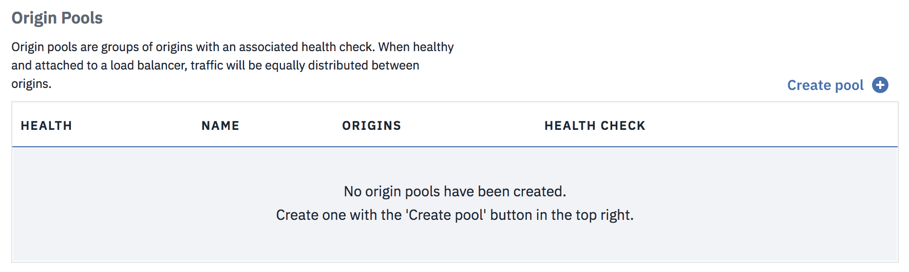

---

copyright:
  years: 2018, 2019
lastupdated: "2019-03-14"

keywords: health checks, origin pools, load balancers, IBM CIS

subcollection: cis

---

{:shortdesc: .shortdesc}
{:new_window: target="_blank"}
{:DomainName: data-hd-keyref="DomainName"}
{:note: .note}
{:important: .important}
{:deprecated: .deprecated}
{:generic: data-hd-programlang="generic"}

# 設定及配置負載平衡器
{:#set-up-and-configure-your-load-balancers}
 
 IBM CIS 提供廣域負載平衡作為服務。以下說明「GLB 儀表板」的外觀：

## GLB 儀表板
{:#glb-dashboard}

在儀表板上，您會看到三份顯示負載平衡器、原點儲存區及性能檢查的清單。在您佈建或更新新增或已更新的廣域負載平衡器或它的其中一個元件之後，這些清單就會顯示它。這些清單一開始是空的，而且在建立負載平衡器之前，您必須採取一些動作。

如果您已經知道自己需要做什麼，請參閱[快速入門手冊](/docs/infrastructure/cis?topic=cis-global-load-balancer-quick-setup)！

### 建立
{:#create-health-check}

`*` 指出此為選用步驟
{:note}

1) `*`建立性能檢查，按一下**建立性能檢查**。
  
    <ul>
      <li><b>路徑</b>：要進行性能檢查的端點路徑。</li> 
      <li><b>類型</b>：要用於性能檢查的通訊協定。</li>
      <li><b>說明</b>：使用者提供的說明。</li>
    </ul>

2) 建立儲存區，按一下**建立儲存區**。
  
    <ul>
      <li><b>性能</b>：儲存區的狀態。</li>
      <li><b>名稱</b>：使用者提供的名稱。</li>
      <li><b>原點</b>：儲存區中的性能良好原點計數。</li>
      <li><b>性能檢查</b>：所連接性能檢查的路徑（如果有的話）。</li>
    </ul>

3) 建立負載平衡器，按一下**建立負載平衡器**。
  
    <ul>
      <li><b>性能</b>：負載平衡器的狀態。</li>
      <li><b>主機名稱</b>：附加至網域名稱前面的名稱。</li>
      <li><b>可用的儲存區</b>：性能良好儲存區計數。</li>
      <li><b>TTL</b>：存活時間。</li>
      <li><b>Proxy</b>：啟用或停用 Proxy 資料傳輸流。</li>
      <li><b>狀態</b>：啟用或停用負載平衡器。</li>
    </ul>

IBM 的地理區域與 Cloudflare 的地區不同。如需 Cloudflare 使用之地理區域的詳細資料，請參閱[負載平衡：地理區域 ](https://support.cloudflare.com/hc/en-us/articles/115000540888-Load-Balancing-Geographic-Regions){:new_window}。  
{:note}

### 編輯/刪除
{:#edit-delete-load-balancer}
若要編輯或刪除負載平衡器或它的其中一個元件，請按一下位於每一列最右邊的溢位功能表按鈕。

溢位功能表按鈕：

下列是針對每一個清單所提供的選項。

* 性能檢查
    * **檢視性能檢查**：此選項顯示性能檢查的簡短摘要，其中含有可將您帶到編輯流程的鏈結。
    * **編輯性能檢查**：此選項會將使用者重新導向至編輯流程。 
    * **刪除性能檢查**：此選項會啟動刪除流程的確認對話框。

* 儲存區
    * **檢視儲存區詳細資料**：此選項會使用儲存區相關資訊來啟動限制模式的對話框。
    * **編輯儲存區**：此選項會將使用者重新導向至編輯流程。
    * **刪除儲存區**：此選項會啟動刪除流程的確認對話框。

* 負載平衡器
    * **停用/啟用**：啟用或停用負載平衡器。
    * **編輯負載平衡器**：重新導向至編輯流程。 
    * **刪除負載平衡器**：啟動刪除流程的確認對話框。

## 新增性能檢查
{:#add-a-health-check}

性能檢查是原點儲存區的選用附件。它們使用自訂重複間隔來探測特定回應內文或狀態碼，以監視儲存區的性能。建立之後，可以將性能檢查新增至新增或現有原點儲存區。

建立性能檢查時，只需要一個欄位：
 * **回應碼**：性能檢查的預期 HTTP 回應碼或回應碼範圍。此值必須介於 200-299 之間，含以 'x' 表示的萬用字元。

其他選用欄位：
 * **路徑**：對其執行性能檢查的端點路徑（預設值為 /）。
 * **類型**：要用於性能檢查的通訊協定（預設值為 HTTP）。
 * **說明**：性能檢查說明。
 * **間隔**：每一次性能檢查之間的間隔（以秒為單位）。較短的間隔可以改善失效接手時間，但從多個位置檢查時，會增加原點的負載（預設值為 60）。
 * **方法**：要用於性能檢查的 HTTP 方法（預設值為 GET）。
 * **逾時**：將性能檢查標示為失敗之前的時間（以秒為單位）（預設值為 5）。
 * **重試**：將原點標示為性能不佳之前，逾時的嘗試重試次數。會立即嘗試重試（預設值為 2）。
 * **回應內文**：回應內文中要比對的不區分大小寫子字串。如果找不到此字串，則會將原點標示為性能不佳。
 * **要求標頭**：要在性能檢查中傳送的 HTTP 要求標頭。依預設，會建議您設定「主機」標頭。無法置換 `User-Agent` 標頭。

## 新增儲存區
{:#add-a-pool}

每一個佈建的負載平衡器都至少需要一個儲存區。儲存區可將您的來源分組，以供負載平衡器使用。

建立儲存區時，需要兩個欄位：
 * **名稱**：儲存區的簡稱（標籤）。只允許英數字元、連字號及底線。
 * **原點**：此儲存區內的原點清單。在此儲存區導向的資料流量會平衡到所有目前性能良好的原點，但前提是儲存區本身性能良好。

其他選用欄位：
 * **說明**：儲存區的人類可讀說明。
 * **已啟用**：是否啟用（預設值）此儲存區。已停用的儲存區不會接收資料流量，而且會從性能檢查中排除。停用儲存區會讓任何負載平衡器使用它來失效接手至下一個儲存區（如果有的話）（預設值為 true）。
 * **性能良好原點臨界值**：此儲存區中必須性能良好才能提供資料流量的原點數目下限。如果性能良好原點數目低於此數目，則會將儲存區標示為性能不佳，而且會失效接手至下一個可用的儲存區。（預設值為 1）
 * **性能檢查地區**：性能檢查將從中執行監視的地區。**附註**：IBM 的地理區域與 Cloudflare 的地區不同。如需 Cloudflare 使用之地理區域的詳細資料，請參閱[負載平衡：地理區域 ](https://support.cloudflare.com/hc/en-us/articles/115000540888-Load-Balancing-Geographic-Regions){:new_window}。 
 * **性能檢查**：要用於檢查此儲存區內原點的性能檢查。（預設值為無性能檢查）
 * **通知電子郵件**：應該接收性能狀態通知的電子郵件位址。此位址可以是個別信箱或郵寄清單。

## 新增負載平衡器
{:#add-a-load-balancer}

負載平衡器可協助您使用循環式分配，將 Proxy 資料流量分配至多個原點儲存區。

建立負載平衡器時，必要欄位如下：
 * **名稱**：與「負載平衡器」相關聯的 DNS 主機名稱。如果此主機名稱已作為 IBM DNS 中的 DNS 記錄，則會優先使用「負載平衡器」，而且不會使用 DNS 記錄。
 * **預設儲存區**：儲存區 ID 的清單。清單會依其失效接手優先順序進行排序。依預設或未配置給定地區的地區儲存區時，會使用這裡定義的儲存區。

您可以選擇性地配置下列欄位：
 * **Proxy**：透過 IBM 的效能及度量值服務來遞送資料流量。
 * **階段作業親緣性**：一律透過相同的效能及度量值實例進行遞送。只有在啟用 Proxy 時，才能使用此選項。
 * **TTL**：此負載平衡器所傳回 IP 位址之 DNS 項目的存活時間 (TTL)。此選項僅適用於非 Proxy 負載平衡器，否則會預設為`自動`。
 * **地區儲存區**：給定地區之區碼或國碼與儲存區清單（依其失效接手優先順序排列）的對映。任何未明確定義的地區都會撤回為使用預設儲存區。**附註**：IBM 的地理區域與 Cloudflare 的地區不同。如需 Cloudflare 使用之地理區域的詳細資料，請參閱[負載平衡：地理區域 ](https://support.cloudflare.com/hc/en-us/articles/115000540888-Load-Balancing-Geographic-Regions){:new_window}。 
 
本文件所使用的術語通常是業界所使用的一般術語，如需這些術語的定義，請參閱[名詞解釋](/docs/infrastructure/cis?topic=cis-glossary)。
