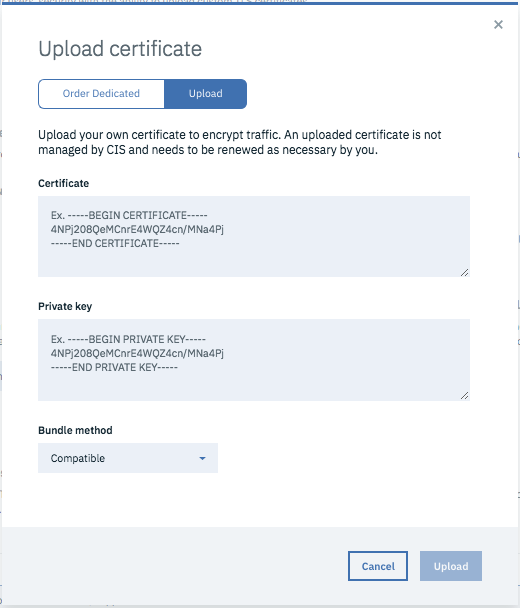
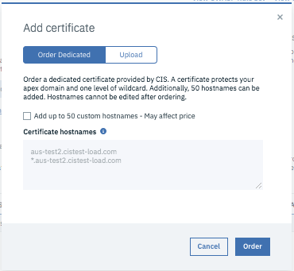

---

copyright:
  years: 2018, 2019
lastupdated: "2019-03-26"

keywords: IBM CIS, optimal security, Security Level

subcollection: cis

---

{:shortdesc: .shortdesc}
{:new_window: target="_blank"}
{:DomainName: data-hd-keyref="DomainName"}
{:note: .note}
{:important: .important}
{:deprecated: .deprecated}
{:generic: data-hd-programlang="generic"}

# 管理 IBM CIS 以取得最佳安全
{:#manage-your-ibm-cis-for-optimal-security}
IBM Cloud Internet Services (CIS) 安全設定包括安全預設值，其設計為避免對資料流量產生誤判及負面影響。不過，這些安全預設值不會為每位客戶提供最佳安全狀態。請採取下列步驟，確保使用安全的方式配置 CIS 帳戶。

**建議及最佳作法：**

* Proxy 處理及增加模糊化，以保護原點 IP 位址
* 選擇性地配置安全層次
* 安全地啟動「Web 應用程式防火牆 (WAF)」

## 最佳作法 1：保護原點 IP 位址
{:#best-practice-secure-origin-ip-address}

使用 IBM CIS 對子網域進行 Proxy 處理時，會保護所有資料流量，因為我們會主動回應 IBM CIS 特有的 IP 位址（例如，所有用戶端都會先連接至 CIS Proxy，再遮蔽原點 IP 位址）。

### 將 IBM CIS Proxy 用於來自您原點之 HTTP(S) 資料流量的所有 DNS 記錄
{:#use-cis-proxies-for-dns-records}

為了改善原點 IP 位址的安全，應該對所有 HTTP(S) 資料流量進行 Proxy 處理。

**請自行查看差異 - 查詢非 Proxy 及 Proxy 記錄：**

```
$ dig nonproxied.theburritobot.com +short
1.2.3.4 (The origin IP address)

$ dig proxied.theburritobot.com +short
104.16.22.6 , 104.16.23.6 (CIS IP addresses)
```

### 遮蔽具有非標準名稱的非 Proxy 原點記錄
{:#obsure-non-proxied-origin-records-with-non-standard-names}
建立其他模糊化，即可保護任何無法透過 IBM CIS 進行 Proxy 處理的記錄，以及任何仍使用原點 IP 的記錄（例如 FTP）。具體而言，如果您需要 IBM CIS 無法進行 Proxy 處理之原點的記錄，則請使用非標準名稱。例如，使用 `[random word or-random characters].example.com`，而非 `ftp.example.com`。此模糊化會對 DNS 記錄進行字典掃描，而且不太可能會公開您的原點 IP 位址。

### 可能的話，針對 HTTP 及非 HTTP 資料流量使用個別 IP 範圍
{:#use-separate-ipranges-for-traffic}
有些客戶會針對 HTTP 及非 HTTP 資料流量使用個別 IP 範圍，進而讓他們可以 Proxy 處理所有指向其 HTTP IP 範圍的記錄，並使用不同的 IP 子網路來遮蔽所有非 HTTP 資料流量。

## 最佳作法 2：選擇性地配置安全層次
{:#best-practice-configure-security-level-selectively}
您的**安全層次**會建立 **IP 信譽資料庫**的靈敏度。若要防止負面互動或誤判，請依網域配置**安全層次**以在必要時加強安全，並在適當時予以減少。

### 將機密區域的安全層次增加為「高」
{:#increase-security-level-for-sensitive-areas}
您可以從網域的「進階安全」頁面或是透過新增管理頁面或登入頁面的**頁面規則**來增加這項設定，以減少強制入侵嘗試：

1. 使用 API 的 URL 型樣來建立**頁面規則**（例如，`www.example.com/wp-login`）。 
2. 識別**安全層次**設定。
3. 將設定標示為**高**。
4. 選取**佈建資源**。

### 減少非機密路徑或 API 的安全層次，以降低誤判
{:#decrease-security-level-non-sensitive-paths-reduce-false-positives}
可以減少一般頁面及 API 資料流量的這個設定： 

1. 使用您 API 的 URL 型樣來建立**頁面規則**（例如，`www.example.com/api/*`）。
2. 識別**安全層次**設定。
3. 將「安全層次」設為**低**或**基本上關閉**。
4. 選取**佈建資源**。

### 「安全層次」設定的意義為何？
{:#what-do-security-level-settings-mean}
我們的「安全層次」設定是與特定 IP 位址從網路上惡意行為獲得的威脅評分一致。高於 10 的威脅評分會視為高。

* **高**：會盤查大於 0 的威脅評分。
* **中**：會盤查大於 14 的威脅評分。
* **低**：會盤查大於 24 的威脅評分。
* **基本上關閉**：會盤查大於 49 的威脅評分。
* **關閉**：*僅限企業* 
* **受到攻擊**：只有在網站受到 DDoS 攻擊時才能使用。當 CIS 分析資料流量及行為，以確保合法訪客嘗試存取您的網站時，訪客會看到插頁式畫面大約持續 5 秒。**受到攻擊**可能會影響網域上的部分動作，例如使用 API。您可以建立該區段的頁面規則，為您的 API 或網域的任何其他部分設定自訂安全層次。

建議您定期檢閱「安全層次」設定，而且您可以在 [CIS 設定最佳作法文件](/docs/infrastructure/cis?topic=cis-best-practices-for-cis-setup)中找到指示

## 最佳作法 3：安全地啟動 Web 應用程式防火牆 (WAF)
{:#best-practice-activate-waf-safely}
您的 WAF 可在**安全**區段中找到。我們將以相反順序逐步完成這些設定，確保先盡可能安全地配置您的 WAF，再針對整個網域開啟它。這些起始設定可藉由移入**安全事件**做進一步調整，來減少誤判。會自動更新您的 WAF，以在識別到新漏洞時進行處理。

WAF 會保護您免於遭受到下列類型的攻擊：
* SQL 注入攻擊
* 跨網站 Script
* 跨網站偽造

WAF 會包含預設規則集，其中包括停止最常見攻擊的規則。目前，我們容許您啟用或停用 WAF，並細部調整 WAF 規則集的特定規則。如需預設規則集及每一個規則之行為的詳細資料，請參閱 [WAF 預設規則集](/docs/infrastructure/cis?topic=cis-waf-default-rule-set)文件。

如需 WAF 的相關資訊，請參閱 [WAF 概念文件](/docs/infrastructure/cis?topic=cis-web-application-firewall-concepts-q-a)

## 最佳作法 4：配置 TLS 設定
{:#best-practice-configure-tls-settings}
IBM CIS 提供部分選項來加密資料流量。作為反向 Proxy，我們在資料中心關閉 TLS 連線，並開啟通往原點伺服器的新 TLS 連線。

TLS 提供四種作業模式：
* **關閉**：在此模式下會停用 TLS，不建議使用。
* **用戶端到邊緣**：TLS 會加密從 CIS 到您用戶端的資料流量，而不是從 CIS 到您原點伺服器的資料流量。
* **端對端彈性**：TLS 會加密所有資料流量；不過，您可以使用自簽憑證來保護 CIS 與您原點伺服器之間的資料流量。
* **端對端 CA 簽章**：TLS 會加密所有資料流量；您必須使用 CA 簽章憑證。

如需 TLS 選項的詳細資料，請參閱[此文件](/docs/infrastructure/cis?topic=cis-tls-options)。

IBM CIS 可讓您使用自訂憑證，您也可以使用 CIS 為您佈建的萬用字元憑證。

### 上傳自訂憑證
{:#upload-custom-certs}
您可以按一下**新增憑證**按鈕，並輸入憑證、私密金鑰及組合方法，來上傳自訂憑證。如果您上傳自己的憑證，則會立即與加密資料流量相容，並且可以維護對憑證（例如，「延伸驗證 (EV)」憑證）的控制。請記住，如果您上傳自訂憑證，則將負責管理憑證。例如，IBM CIS 不會追蹤憑證到期日。 



### 訂購專用憑證
{:#order-dedicated-certs}
CIS 透過提供專用憑證，使管理憑證變得容易。您不再需要產生私密金鑰、建立憑證簽署要求 (CSR)，或記得更新憑證。您可以訂購專用憑證，方法是按一下**新增憑證**按鈕，並訂購萬用字元憑證或輸入主機名稱，來訂購專用的自訂憑證。憑證的類型如下：

 * 使用 P-256 金鑰的 SHA-2/ECDSA 簽章憑證 
 * 使用 RSA 2048 位元金鑰的 SHA-2/RSA 簽章憑證 
 * 使用 RSA 2048 位元金鑰的 SHA-1/RSA 簽章憑證 
 
CIS 可以針對所有 TLD 發出，但 `.cu`、`.iq`、`.ir`、`.kp`、`.sd`、`.ss` 及 `.ye` 除外。CIS 能管理到期日。若要編輯專用自訂憑證上的主機名稱，您必須先重新訂購再刪除。例如，您使用主機名稱 `alpha.yourdomain.com` 來訂購專用的自訂憑證。若要將主機名稱 `beta.yourdomain.com` 新增至您的專用自訂憑證，請使用主機名稱 `alpha.yourdomain.com` 及 `beta.yourdomain.com` 訂購另一個專用的自訂憑證。然後，您_必須_ 刪除原始的專用自訂憑證。

第一次訂購專用憑證時，會發生「網域控制驗證 (DCV)」處理程序，它會產生相對應的 TXT 記錄。如果您刪除 TXT 記錄，則當您訂購另一個專用憑證時，DCV 處理程序會再次發生。如果您刪除專用憑證，則不會刪除對應於 DCV 處理程序的 TXT 記錄。
{:note}

以下是訂購專用憑證時看到的常見錯誤：
* `連接至憑證服務時發生錯誤。`
* `從憑證服務發出要求時發生錯誤。`
{:note}

如果您在訂購憑證時發生錯誤，請重新整理頁面，然後再試一次。



### 利用已佈建的憑證
{:#utilize-provisioned-certificate}
IBM 已與數個「憑證管理中心 (CA)」合作，提供客戶的網域萬用字元憑證。設定這些憑證時，可能需要手動驗證。您的支援團隊可以協助您執行這些額外的步驟。

### 我們邊緣伺服器的憑證優先順序
{:#certificate-prioirity-at-our-edge}
我們邊緣伺服器顯示憑證的優先順序如下：
1. 上傳自訂
2. 專用自訂
3. 專用萬用字元
4. 通用

### 最低 TLS 版本
{:#security-minimum-tls-version}
請參閱[最低 TLS 版本](/docs/infrastructure/cis?topic=cis-tls-options#minimum-tls-version)。更高層次的 TLS 提供更多安全，但可能會讓客戶無法連接至您的網站。
