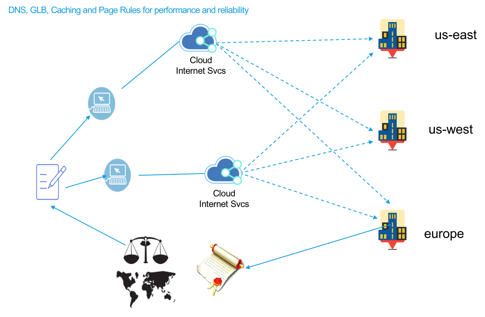

---
copyright:
  years: 2018
lastupdated: "2018-03-16"
---

{:shortdesc: .shortdesc}
{:new_window: target="_blank"}

# IBM Cloud Internet Services (CIS) 如何最佳化效能

IBM Cloud Internet Services (CIS) 可協助您利用三個主要特性來改善 Web 服務及應用程式的效能：「廣域負載平衡」、透過「頁面規則」的「內容最佳化」，以及「快取」。卓越的 Web 效能不只是將靜態檔案移至更接近訪客的位置；這表示您必須確定每個頁面都會以最快速且最具效率的方式呈現。透過保護原點伺服器讓濫發垃圾郵件者、機器人及惡意搜索器無法使用，即可保護原點的資源以獲得應用程式效能，進而改善客戶體驗。

以下是快速特性概觀：

## 效能特性

 * 廣域負載平衡 
 * 細部調整快取行為並建立內容最佳化的「頁面規則」
 * 快取

## 摘要

 * 使用「廣域負載平衡」，您的客戶可收到最接近之原點伺服器中的資料，進而減少延遲以及改善客戶體驗。
 * 使用「快取」及「頁面規則」設定，您可以加強 Web 服務及應用程式的效能。
